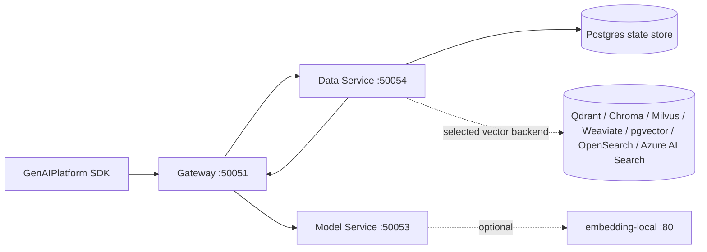
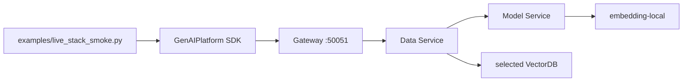

# Data-focused GenAI Platform Boilerplate

This boilerplate keeps only the services needed to develop the Data/RAG path:

- Gateway
- Data Service
- Model Service
- PostgreSQL with pgvector

Optional local embedding serving and external VectorDBs are available through
Docker Compose profiles.

## Architecture



The default stack has four containers:

```text
postgres
models
data
gateway
```

For local embeddings, start the optional profile:

```text
embedding-local
```

## Setup

```bash
uv sync
```

For external model and embedding providers, add API keys to `.env`:

```bash
cat > .env <<'EOF'
OPENAI_API_KEY=your-key
ANTHROPIC_API_KEY=your-key
EOF
```

## Run

The `axe-suite` CLI wraps Docker Compose so the stack can be started from one command.

Install the command once:

```bash
uv tool install -e .
```

Default four-container stack:

```bash
axe-suite up
```

`up` runs in the background by default. It asks which VectorDB candidate to use,
then asks whether to include the optional local embedding container.

The VectorDB menu lists all research candidates:

```text
1) Qdrant
2) Chroma
3) Milvus
4) Weaviate
5) pgvector
6) OpenSearch
7) Azure AI Search
```

LanceDB is intentionally excluded because the OSS path is embedded-first rather
than a separate service container. For non-pgvector choices, Postgres still stores
index metadata, document metadata, ingest jobs, and keyword-search text. The
selected backend stores vector records and serves vector search.

Hybrid search uses backend-native search when the selected backend supports it:

```text
pgvector        Postgres full-text + pgvector
OpenSearch      OpenSearch BM25 + kNN
Azure AI Search Azure keyword + vector query
Weaviate        Weaviate hybrid
Qdrant          vector search + Postgres keyword fallback
Chroma          vector search + Postgres keyword fallback
Milvus          vector search + Postgres keyword fallback
```

Run in the current terminal:

```bash
axe-suite up --foreground
```

Skip the local embedding prompt:

```bash
axe-suite up --no-local-embedding
```

Skip the VectorDB prompt:

```bash
axe-suite up --vector-db pgvector
axe-suite up --vector-db qdrant
axe-suite up --vector-db chroma
axe-suite up --vector-db milvus
axe-suite up --vector-db weaviate
axe-suite up --vector-db opensearch
```

Azure AI Search is a managed service adapter, not a local Docker service. Set
these environment variables before selecting it:

```bash
export AZURE_SEARCH_SERVICE_ENDPOINT="https://your-search.search.windows.net"
export AZURE_SEARCH_API_KEY="your-key"
axe-suite up --vector-db azure-ai-search
```

With local embedding server:

```bash
axe-suite up --local-embedding
```

The local embedding profile uses Hugging Face Text Embeddings Inference:

```text
ghcr.io/huggingface/text-embeddings-inference:cpu-1.9
```

On Apple Silicon, this container runs with Docker's `linux/amd64` emulation
because the selected TEI image does not publish a native arm64 manifest.

Override the local embedding model:

```bash
axe-suite up --local-embedding-model bge-m3
```

The researched local embedding aliases are `minilm`, `bge-m3`, `qwen3-0.6b`,
`e5-large`, and `arctic-l-v2`. `minilm` remains the fast smoke-test default;
`bge-m3` is the first recommended local model for Korean/multilingual RAG.

Operational commands:

```bash
axe-suite status
axe-suite logs --follow gateway data models
axe-suite down
```

Ask questions from the terminal against the default RAG index:

```bash
axe-suite ask "VectorDB 후보 중에 뭐가 제일 단순해?"
axe-suite ask "embedding model 후보와 선택 기준은?" --top-k 5
axe-suite ask "OCR image table 처리 후보는 무엇인가?" --hybrid
```

The default index is `rag-pipeline-research-summary`. Override it when needed:

```bash
axe-suite ask "질문" --index your-index-name
```

## Use

```python
from genai_platform import GenAIPlatform
from services.data.models import IndexConfig

platform = GenAIPlatform()

config = IndexConfig(
    name="company-docs",
    embedding_model="text-embedding-3-small",
    chunking_strategy="fixed",
    chunk_size=512,
)
platform.data.create_index(config, owner="team-a")

job = platform.data.ingest(
    "company-docs",
    "handbook.txt",
    b"Vacation policy is ...",
    metadata={"dept": "hr"},
)

results = platform.data.search("company-docs", query="vacation policy", top_k=5)
```

For the optional local embedding container, create indexes with the local model name:

```python
config = IndexConfig(
    name="local-docs",
    embedding_model="sentence-transformers/all-MiniLM-L6-v2",
)
```

## Verify

Run the SDK-to-Gateway smoke test:

```bash
uv run pytest tests/test_sdk_gateway_smoke.py -q
```

This starts local gRPC services and a tiny TEI-compatible embedding endpoint,
then verifies Python SDK calls route through Gateway into Data and Model services.

With Docker running, the same SDK path can be checked against the live stack at
`localhost:50051`.

Run the live Docker stack smoke test after `axe-suite up`:

```bash
uv run python examples/live_stack_smoke.py
```

This creates a disposable index, ingests `chapter-5.md`, searches it through
Gateway, prints the indexed document's first 10 lines, question, and retrieved response,
and removes the index unless `--keep-index` is passed.



## Remaining Services

```text
services/data
services/models
services/gateway
services/shared
```

The Data Service owns parsing, chunking, ingestion jobs, vector search orchestration,
Postgres-backed state, and the selected vector adapter. The Model Service owns
chat completions and embedding providers.
