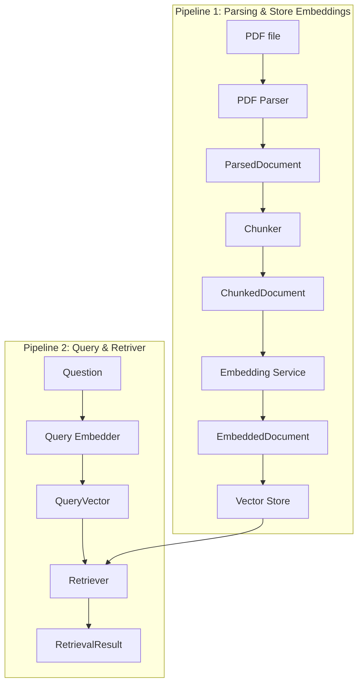

# Basic RAG Architecture and Interface Design

작성일: 2026-05-27

## 1. Purpose

- component가 서로 어떤 데이터를 주고받는지 명확히 한다.
- 각 component가 자기 책임을 넘어서지 않도록 boundary를 잡는다.

현재 scope는 다음까지만 포함한다.

- PDF parsing
- text chunking
- embedding 생성
- vector store 저장
- query embedding
- vector search result 반환

현재 scope에 포함하지 않는 것:

- OCR
- table extraction
- image extraction
- citation 문장 생성

## 2. High-level Architecture

Basic RAG는 두 개의 큰 pipeline으로 나눈다.



쉽게 말하면:

```text
Pipeline 1은 문서를 검색 가능한 기억으로 저장한다.
Pipeline 2는 질문으로 그 기억을 검색한다.
```

## 3. Pipeline 1 Parsing & Store Embeddings

### Interface 1: PDF Parser

PDF Parser는 PDF 파일을 읽고 page 단위의 text를 반환한다.

```python
class PdfParser:
    def parse(self, request: PdfParseRequest) -> ParsedDocument:
        ...
```

#### Input

```python
@dataclass(frozen=True)
class PdfParseRequest:
    document_id: str
    source_path: str
```

#### Output

```python
@dataclass(frozen=True)
class ParsedDocument:
    document_id: str
    source_path: str
    pages: list[ParsedPage]
```

```python
@dataclass(frozen=True)
class ParsedPage:
    page_number: int
    text: str
```

#### Example Output

```json
{
  "document_id": "doc_001",
  "source_path": "/docs/sample.pdf",
  "pages": [
    {
      "page_number": 1,
      "text": "This agreement is made between..."
    },
    {
      "page_number": 2,
      "text": "The payment terms are..."
    }
  ]
}
```

#### Contract

- PDF Parser는 PDF file path를 입력으로 받는다.
- PDF Parser는 page number와 text를 보존한다.

### Interface 2: Chunker

Chunker는 parsed page text를 검색 가능한 chunk로 나눈다.

```python
class Chunker:
    def chunk(self, request: ChunkRequest) -> ChunkedDocument:
        ...
```

#### Input

```python
@dataclass(frozen=True)
class ChunkRequest:
    document: ParsedDocument
    chunk_size: int = 900
    chunk_overlap: int = 150
```

#### Output

```python
@dataclass(frozen=True)
class ChunkedDocument:
    document_id: str
    source_path: str
    chunks: list[TextChunk]
```

```python
@dataclass(frozen=True)
class TextChunk:
    chunk_id: str
    document_id: str
    text: str
    page_number: int
    chunk_index: int
    source_path: str
```

#### Example Output

```json
{
  "document_id": "doc_001",
  "source_path": "/docs/sample.pdf",
  "chunks": [
    {
      "chunk_id": "doc_001:page:1:chunk:0",
      "document_id": "doc_001",
      "text": "This agreement is made between...",
      "page_number": 1,
      "chunk_index": 0,
      "source_path": "/docs/sample.pdf"
    }
  ]
}
```

#### Contract

- Chunker는 `ParsedDocument`를 입력으로 받는다.
- Chunker는 PDF 파일을 직접 열지 않는다.
- Chunker는 embedding을 만들지 않는다.

### Interface 3: Chunk Embedder

Chunk Embedder는 chunk text를 vector로 바꾼다.

```python
class ChunkEmbedder:
    def embed_chunks(self, request: EmbedChunksRequest) -> EmbeddedDocument:
        ...
```

#### Input

```python
@dataclass(frozen=True)
class EmbedChunksRequest:
    document: ChunkedDocument
    model_name: str
```

#### Output

```python
@dataclass(frozen=True)
class EmbeddedDocument:
    document_id: str
    source_path: str
    model_name: str
    chunks: list[EmbeddedChunk]
```

```python
@dataclass(frozen=True)
class EmbeddedChunk:
    chunk: TextChunk
    vector: list[float]
```

#### Example Output

```json
{
  "document_id": "doc_001",
  "source_path": "/docs/sample.pdf",
  "model_name": "sentence-transformers/all-MiniLM-L6-v2",
  "chunks": [
    {
      "chunk": {
        "chunk_id": "doc_001:page:1:chunk:0",
        "document_id": "doc_001",
        "text": "This agreement is made between...",
        "page_number": 1,
        "chunk_index": 0,
        "source_path": "/docs/sample.pdf"
      },
      "vector": [0.0123, -0.0456, 0.0789]
    }
  ]
}
```

#### Contract

- Chunk Embedder는 text를 vector로 바꾸는 것만 책임진다.
- Chunk Embedder는 vector store에 저장하지 않는다.
- 같은 embedding model로 chunk와 query를 embedding해야 한다.

### Interface 4: Vector Store Writer

Vector Store Writer는 embedded chunk를 vector DB에 저장한다.

```python
class VectorStoreWriter:
    def upsert_document(self, request: StoreEmbeddingsRequest) -> StoreEmbeddingsResult:
        ...
```

#### Input

```python
@dataclass(frozen=True)
class StoreEmbeddingsRequest:
    document: EmbeddedDocument
    collection_name: str
```

#### Output

```python
@dataclass(frozen=True)
class StoreEmbeddingsResult:
    document_id: str
    collection_name: str
    stored_chunk_count: int
```

#### Stored Metadata

Vector store에는 최소한 다음 metadata가 저장되어야 한다.

```json
{
  "document_id": "doc_001",
  "source_path": "/docs/sample.pdf",
  "page_number": 1,
  "chunk_index": 0,
  "embedding_model": "sentence-transformers/all-MiniLM-L6-v2"
}
```

#### Contract

- Vector Store Writer는 embedded chunk를 저장한다.
- 같은 `chunk_id`가 들어오면 update 또는 overwrite 가능해야 한다.
- 검색 결과를 만들지는 않는다.

## 4. Pipeline 2 Query & Retriver

Query pipeline은 저장된 vector를 이용해 질문과 가까운 chunk를 찾는다.

### Interface 5: Query Embedder

Query Embedder는 사용자의 질문을 vector로 바꾼다.

```python
class QueryEmbedder:
    def embed_query(self, request: EmbedQueryRequest) -> QueryVector:
        ...
```

#### Input

```python
@dataclass(frozen=True)
class EmbedQueryRequest:
    question: str
    model_name: str
```

#### Output

```python
@dataclass(frozen=True)
class QueryVector:
    question: str
    model_name: str
    vector: list[float]
```

#### Contract

- Query Embedder는 question text를 vector로 바꾼다.
- Query Embedder는 chunk를 검색하지 않는다.
- Query Embedder는 ingestion에서 사용한 embedding model과 같은 model을 써야 한다.

### Interface 6: Retriever

Retriever는 query vector로 vector store를 검색한다.

```python
class Retriever:
    def retrieve(self, request: RetrieveRequest) -> RetrievalAnswer:
        ...
```

#### Input

```python
@dataclass(frozen=True)
class RetrieveRequest:
    query: QueryVector
    collection_name: str
    top_k: int = 5
```

#### Output

```python
@dataclass(frozen=True)
class RetrievalAnswer:
    question: str
    results: list[RetrievedChunk]
```

```python
@dataclass(frozen=True)
class RetrievedChunk:
    chunk_id: str
    text: str
    score: float
    metadata: RetrievedChunkMetadata
```

```python
@dataclass(frozen=True)
class RetrievedChunkMetadata:
    document_id: str
    source_path: str
    page_number: int
    chunk_index: int
    embedding_model: str
```

#### Example Output

```json
{
  "question": "What are the payment terms?",
  "results": [
    {
      "chunk_id": "doc_001:page:2:chunk:0",
      "text": "The payment terms are...",
      "score": 0.2314,
      "metadata": {
        "document_id": "doc_001",
        "source_path": "/docs/sample.pdf",
        "page_number": 2,
        "chunk_index": 0,
        "embedding_model": "sentence-transformers/all-MiniLM-L6-v2"
      }
    }
  ]
}
```

#### Contract

- Retriever는 query vector를 사용해 vector store를 검색한다.
- Retriever는 LLM answer를 생성하지 않는다.
- Retriever는 검색된 chunk text와 source metadata를 함께 반환한다.
- `top_k`는 반환할 최대 chunk 수다.

## 5. End-to-end Interface Chains

### Pipeline 1: Parsing & Store Embeddings

```text
PdfParseRequest
-> ParsedDocument
-> ChunkRequest
-> ChunkedDocument
-> EmbedChunksRequest
-> EmbeddedDocument
-> StoreEmbeddingsRequest
-> StoreEmbeddingsResult
```

### Pipeline 2: Query & Retriver

```text
EmbedQueryRequest
-> QueryVector
-> RetrieveRequest
-> RetrievalAnswer
```

## 6. Component Responsibility Summary

| Component | Owns | Does Not Own |
| --- | --- | --- |
| PDF Parser | PDF text extraction | chunking, embedding, storage |
| Chunker | chunk creation | PDF parsing, embedding, storage |
| Chunk Embedder | chunk vector creation | parsing, chunking, storage |
| Vector Store Writer | vector persistence | parsing, embedding, retrieval logic |
| Query Embedder | question vector creation | vector search, answer generation |
| Retriever | vector search result | LLM answer generation |

## 7. 설계 원칙

- 각 component는 명확한 입력 객체 하나를 받고, 명확한 출력 객체 하나를 반환한다.
- component들은 서로의 내부 구현이 아니라 data contract를 통해 연결된다.
- source metadata는 parsing 단계부터 retrieval 단계까지 유지되어야 한다.
- embedding model metadata는 반드시 보존한다. embedding model이 바뀌면 보통 re-embedding이 필요하기 때문이다.
- retrieval result는 LLM 답변 생성 없이도 사용할 수 있어야 한다. 최소한 text, score, source path, page number, chunk index를 포함한다.
- OCR, table extraction, reranking은 이후에 추가한다.
