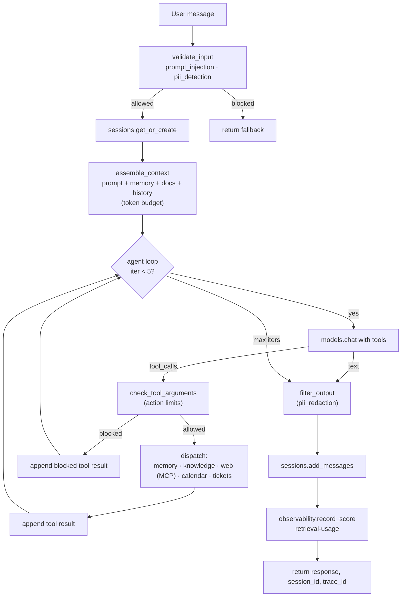

# Claw — Chapter 9 reference application

Claw is the personal AI assistant from **Chapter 9: Putting it all
together — building a complete AI assistant** in *Designing AI
Systems*. This folder contains the **final** application from
Listing 9.16 — every other listing in the chapter is wired in as a
dependency of that workflow.

## What's here

| File | Purpose |
| --- | --- |
| `claw.py` | The whole assistant in one module: prompt + tool registration, guardrails, context engineering, agent loop, observability scoring, and the `@workflow`-decorated entry point. |
| `__init__.py` | Re-exports `claw_assistant` and `register_claw_assets` for callers. |
| `run_local.py` | Local driver: registers Claw's assets, seeds the knowledge index from the bundled Markdown docs, then runs a one-shot message or a small REPL. |
| `knowledge_base/company-handbook.md` | Sample company policies (vacation, expenses, etc.) used to ground RAG demos. |
| `knowledge_base/engineering-runbook.md` | Sample engineering operational doc (deploys, on-call, severities). |

## Architecture



## Components used

| Step in `claw_assistant` | Platform service | Listing | SDK call |
| --- | --- | --- | --- |
| Versioned system prompt | Model Service | 9.14 | `platform.models.register_prompt` / `get_prompt` |
| Long-term memory tool | Tool Service + Session Service | 9.4 | `platform.tools.register("claw.memory.save_fact", …)`, `platform.sessions.save_memory` |
| Agentic RAG tool | Tool Service + Data Service | 9.7 | `platform.tools.register("claw.knowledge.search", …)`, `platform.data.search` |
| Calendar / ticket / web tools | Tool Service (+ MCP) | 9.9 | `platform.tools.register(...)`, `platform.tools.register_mcp_server` |
| Input safety check | Guardrails Service | 9.11 | `platform.guardrails.validate_input` |
| Tool-argument validation | In-app helper (`_check_tool_arguments`) | 9.11 / 9.13 | n/a |
| Output filtering | Guardrails Service | 9.11 | `platform.guardrails.filter_output` |
| Context assembly | Composite (Models · Sessions · Data) | 9.15 | `assemble_context()` orchestrating the above |
| Agent loop | Model Service · Tool Service · Observability | 9.10 / 9.16 | `platform.models.chat(... tools=...)` inside `platform.observability.trace_operation(...)` |
| Conversation memory | Session Service | 9.16 | `platform.sessions.get_or_create`, `add_messages`, `get_messages` |
| Per-turn quality scoring | Observability Service | 9.18 | `platform.observability.record_score("retrieval-usage", …)` |
| Deployable HTTP entry point | Workflow Service | 9.16 / Ch. 8 | `@workflow(name="claw-assistant", api_path="/claw/chat", …)` |

## Prerequisites

1. Python 3.10+ and [`uv`](https://github.com/astral-sh/uv).
2. Project dependencies installed: `uv sync` from the repository root.
3. The platform stack running locally (see top-level `README.md`):

   ```bash
   docker compose up -d --build
   ```

   This brings up the API gateway plus all nine backing services
   (Model, Sessions, Data, Tools, Guardrails, Observability,
   Experiments, Cost, Workflow).
4. `OPENAI_API_KEY` exported in your shell so the Model Service can
   make real OpenAI calls. The agent loop will not produce useful
   output without it.
5. *(Optional)* `CLAW_MCP_WEB_URL` if you want Claw to register a real
   streamable-HTTP MCP server (see *Testing with a real MCP server*
   below for a public, no-auth URL). Without this var, `claw.web.*`
   tools simply aren't registered.

## Running locally

```bash
# One-shot message:
uv run python -m claw.run_local \
    --message "What's our vacation policy?" \
    --user-id sarah

# Interactive REPL (Ctrl-D / empty line to exit):
uv run python -m claw.run_local --user-id sarah
```

`run_local.py` is idempotent: each invocation re-registers the prompt
and tools, ensures the `company-knowledge` index exists, and
re-ingests the bundled Markdown docs.

After a turn completes, the response dictionary contains the
`trace_id`. You can inspect the trace and the recorded
`retrieval-usage` score from a Python REPL:

```python
from genai_platform import GenAIPlatform

platform = GenAIPlatform(gateway_url="localhost:50051")
trace = platform.observability.get_trace("<trace_id from response>")
print(trace.total_duration_ms, len(trace.spans))
print(platform.observability.query_scores(trace_id=trace.trace_id))
```

## Deploying via the Workflow Service

Because `claw.py` is decorated with `@workflow(...)`, you can deploy it
through the Workflow Service exactly as shown in Chapter 8:

```bash
genai-platform deploy claw/claw.py
```

That builds the workflow image, registers `claw-assistant` with the
runtime, and exposes it at `POST /claw/chat`:

```bash
curl -X POST http://localhost:8080/claw/chat \
    -H "Content-Type: application/json" \
    -d '{"message":"How many vacation days do I get?","user_id":"sarah"}'
```

## Testing with a real MCP server (DeepWiki)

The platform's Tool Service connects to MCP servers over **streamable
HTTP** (see `services/tools/mcp_client.py`). The easiest way to verify
the MCP integration end-to-end is the public
[DeepWiki](https://mcp.deepwiki.com/) MCP server maintained by
Cognition — it's read-only, requires no credentials, and exposes
`ask_question`, `read_wiki_structure`, and `read_wiki_contents` for
any public GitHub repo. (`examples/quickstart_mcp.py` already wires
the same URL.)

```bash
export CLAW_MCP_WEB_URL=https://mcp.deepwiki.com/mcp
uv run python -m claw.run_local \
    --message "Use the web tool to look up: what does the modelcontextprotocol/python-sdk repo do?" \
    --user-id sarah
```

Claw's namespace prefix for MCP-imported tools is `claw.web`, so
DeepWiki's `ask_question` tool lands as `claw.web.ask_question`. The
agent loop discovers it via `platform.tools.build_model_tools(namespace="claw.*")`
and routes the call through `platform.tools.execute(...)` (real MCP
network round-trip — see step 4b in `_execute_tool`).

To watch the MCP call fire, look at the trace returned by Claw:

```python
from genai_platform import GenAIPlatform
p = GenAIPlatform(gateway_url="localhost:50051")
trace = p.observability.get_trace("<trace_id>")
for span in trace.spans:
    print(span.service, span.operation, span.duration_ms)
```

You should see a `sdk/claw.agent_loop` span whose duration includes
the MCP round-trip (DeepWiki responses typically take 5–20s for
`ask_question`), plus a `retrieval-usage = 1.0` score.
