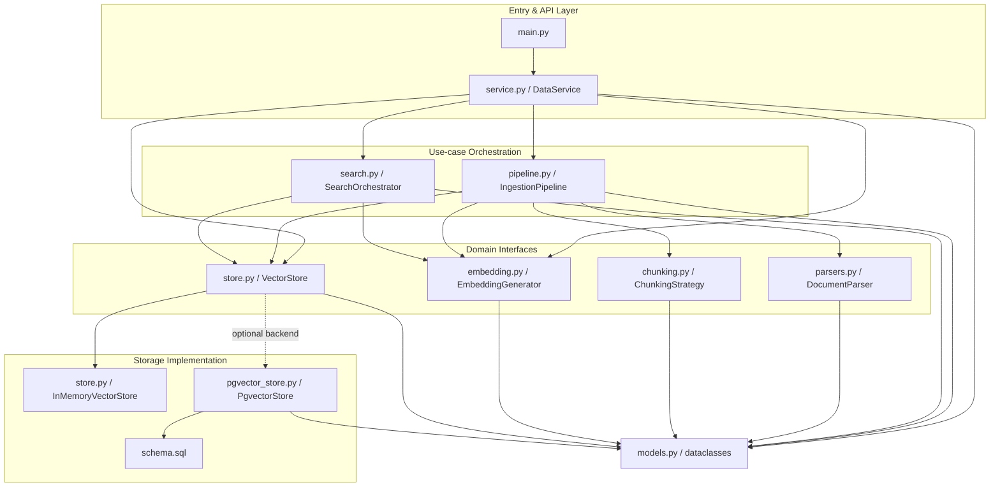
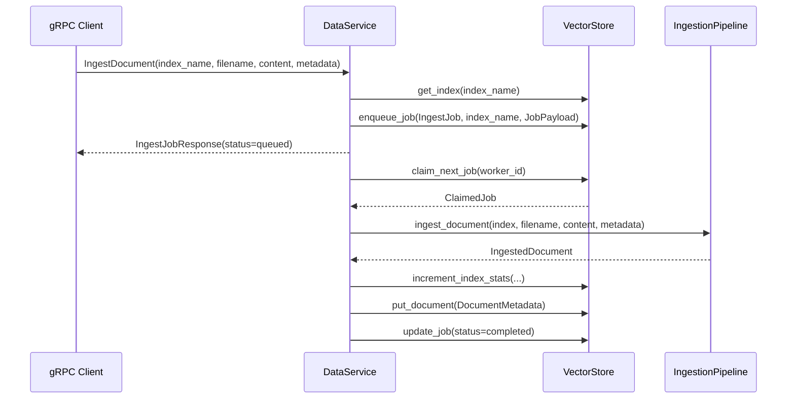
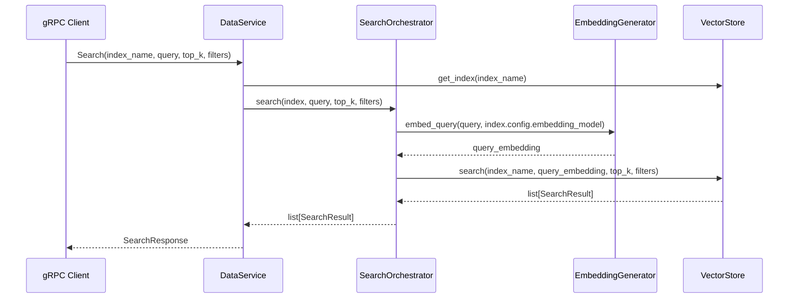

# Data Service RAG Architecture and Interface Design

작성일: 2026-05-27

참고 대상:

- GitHub source: <https://github.com/designing-ai-systems/designing_ai_systems_repo/tree/main/services/data>
- Local reference style: `basic-rag-arch-and-interface-design.md`

## 1. Purpose

- `services/data` 폴더 안의 module들이 서로 어떤 data contract로 연결되는지 명확히 한다.
- ingestion, search, storage, plugin extension의 책임 경계를 분리한다.
- 실제 코드의 class/function 이름을 기준으로 interface를 설명한다.

현재 scope는 다음까지만 포함한다.

- index 생성/조회/삭제
- document ingestion job 등록
- worker 기반 asynchronous ingestion
- document parsing
- text chunking
- embedding 생성
- vector store 저장
- vector search
- hybrid search
- parser/chunking strategy plugin 등록

현재 scope에 포함하지 않는 것:

- LLM answer generation
- reranking model
- PDF/DOCX/HTML 전용 parser 구현
- external Model Service 상세 구현
- proto schema 전체 상세

## 2. High-level Architecture

`services/data`는 크게 네 개의 layer로 나눌 수 있다.



쉽게 말하면:

```text
DataService는 외부 gRPC 요청을 받고,
IngestionPipeline은 문서를 chunk/vector로 저장하며,
SearchOrchestrator는 query를 vector로 바꿔 검색하고,
VectorStore는 memory 또는 pgvector backend 뒤에 저장소 계약을 숨긴다.
```

## 3. Core Data Contracts

`models.py`는 다른 module들이 공유하는 data contract를 정의한다.

```python
@dataclass
class IndexConfig:
    name: str
    embedding_model: str = "text-embedding-3-small"
    embedding_dimensions: int = 1536
    chunking_strategy: str = "fixed"
    chunk_size: int = 512
    chunk_overlap: int = 50
    metadata_schema: Optional[Dict] = None
```

```python
@dataclass
class Index:
    name: str
    config: IndexConfig
    owner: str = ""
    document_count: int = 0
    total_chunks: int = 0
    created_at: datetime = field(default_factory=datetime.utcnow)
    last_ingested_at: Optional[datetime] = None
```

```python
@dataclass
class ExtractedDocument:
    sections: list[DocumentSection]
    metadata: dict[str, str] = field(default_factory=dict)
```

```python
@dataclass
class Chunk:
    text: str
    start_offset: int
    end_offset: int
    heading: Optional[str] = None
    metadata: dict[str, str] = field(default_factory=dict)
```

```python
@dataclass
class SearchResult:
    chunk_id: str
    document_id: str
    text: str
    score: float
    metadata: dict[str, str] = field(default_factory=dict)
```

```python
@dataclass
class IngestJob:
    job_id: str
    status: str
    document_id: Optional[str] = None
    progress: float = 0.0
    error: Optional[str] = None
```

```python
@dataclass
class JobPayload:
    filename: str
    content: bytes
    caller_metadata: dict[str, str] = field(default_factory=dict)
    requested_document_id: Optional[str] = None
```

#### Contract

- `models.py`는 business object의 shape만 정의한다.
- parsing, chunking, embedding, storage 구현을 직접 알지 않는다.
- module 간 연결은 대부분 `Index`, `ExtractedDocument`, `Chunk`, `SearchResult`, `IngestJob`을 통해 이루어진다.

## 4. Pipeline 1: Index Management

Index management는 검색 가능한 knowledge index의 설정과 통계를 관리한다.

### Interface 1: DataService Index API

`service.py`는 proto request를 domain object로 바꾼 뒤 `VectorStore`에 위임한다.

```python
class DataService:
    def CreateIndex(self, request, context):
        ...

    def GetIndex(self, request, context):
        ...

    def ListIndexes(self, request, context):
        ...

    def DeleteIndex(self, request, context):
        ...
```

#### Input

```python
IndexConfig(
    name=request.config.name,
    embedding_model=request.config.embedding_model or "text-embedding-3-small",
    embedding_dimensions=request.config.embedding_dimensions or 1536,
    chunking_strategy=request.config.chunking_strategy or "fixed",
    chunk_size=request.config.chunk_size or 512,
    chunk_overlap=request.config.chunk_overlap or 50,
    metadata_schema=dict(request.config.metadata_schema) or None,
)
```

#### Output

```python
data_pb2.IndexResponse(
    name=index.name,
    config=config_proto,
    owner=index.owner,
    document_count=index.document_count,
    total_chunks=index.total_chunks,
    created_at=index.created_at.isoformat(),
    last_ingested_at=index.last_ingested_at.isoformat(),
)
```

#### Example Output

```json
{
  "name": "support_docs",
  "config": {
    "name": "support_docs",
    "embedding_model": "text-embedding-3-small",
    "embedding_dimensions": 1536,
    "chunking_strategy": "structure_aware",
    "chunk_size": 512,
    "chunk_overlap": 50
  },
  "owner": "team-data",
  "document_count": 0,
  "total_chunks": 0,
  "created_at": "2026-05-27T09:15:00.000000",
  "last_ingested_at": ""
}
```

#### Contract

- `DataService`는 gRPC/proto 변환을 책임진다.
- `DataService`는 index persistence를 직접 구현하지 않는다.
- `VectorStore`는 index 이름 중복을 감지하고 `ValueError`를 낼 수 있다.

### Interface 2: VectorStore Index API

```python
class VectorStore(ABC):
    def create_index(self, index: Index) -> None:
        ...

    def get_index(self, name: str) -> Optional[Index]:
        ...

    def list_indexes(self) -> list[Index]:
        ...

    def delete_index(self, index_name: str) -> int:
        ...

    def increment_index_stats(
        self,
        name: str,
        documents_delta: int,
        chunks_delta: int,
        last_ingested_at: datetime,
    ) -> None:
        ...
```

#### Example Output

```python
store.get_index("support_docs")
```

```json
{
  "name": "support_docs",
  "config": {
    "name": "support_docs",
    "embedding_model": "text-embedding-3-small",
    "chunking_strategy": "structure_aware",
    "chunk_size": 512,
    "chunk_overlap": 50
  },
  "owner": "team-data",
  "document_count": 3,
  "total_chunks": 42,
  "created_at": "2026-05-27T09:15:00.000000",
  "last_ingested_at": "2026-05-27T09:35:22.000000"
}
```

```python
store.delete_index("support_docs")
```

```json
{
  "chunks_deleted": 42
}
```

#### Contract

- `create_index`는 새 index metadata를 저장한다.
- `delete_index`는 index와 관련 chunk/document/job state를 삭제한다.
- `increment_index_stats`는 worker concurrency를 고려해 atomic update가 되어야 한다.

## 5. Pipeline 2: Asynchronous Document Ingestion

Ingestion은 request 시점에 바로 처리하지 않고, job queue에 넣은 뒤 worker가 claim해서 처리한다.



### Interface 3: DataService Ingest API

```python
class DataService:
    def IngestDocument(self, request, context):
        ...

    def GetIngestJob(self, request, context):
        ...
```

#### Input

```python
JobPayload(
    filename=request.filename,
    content=request.content,
    caller_metadata=dict(request.metadata),
    requested_document_id=request.document_id or None,
)
```

#### Output

```python
data_pb2.IngestJobResponse(
    job_id=job.job_id,
    status=job.status,
    document_id=job.document_id or "",
    progress=job.progress,
    error=job.error or "",
)
```

#### Example Output

```json
{
  "job_id": "6f4d9d90-70be-4f38-92b0-0fb8d8e7c4b5",
  "status": "queued",
  "document_id": "",
  "progress": 0.0,
  "error": ""
}
```

After the worker finishes the job:

```json
{
  "job_id": "6f4d9d90-70be-4f38-92b0-0fb8d8e7c4b5",
  "status": "completed",
  "document_id": "annual_report_2026",
  "progress": 1.0,
  "error": ""
}
```

#### Contract

- `IngestDocument`는 job을 생성하고 queued 상태로 반환한다.
- 실제 parsing/chunking/embedding/store 작업은 worker가 수행한다.
- index가 없으면 job을 만들지 않고 `NOT_FOUND`를 반환한다.

### Interface 4: Durable Job Queue

```python
class VectorStore(ABC):
    def enqueue_job(self, job: IngestJob, index_name: str, payload: JobPayload) -> None:
        ...

    def get_job(self, job_id: str) -> Optional[IngestJob]:
        ...

    def update_job(
        self,
        job_id: str,
        *,
        status: Optional[str] = None,
        progress: Optional[float] = None,
        document_id: Optional[str] = None,
        error: Optional[str] = None,
    ) -> None:
        ...

    def claim_next_job(self, worker_id: str) -> Optional[ClaimedJob]:
        ...

    def release_stale_claims(self, stale_after: timedelta) -> int:
        ...
```

#### Example Output

```python
store.claim_next_job("worker-01")
```

```json
{
  "job": {
    "job_id": "6f4d9d90-70be-4f38-92b0-0fb8d8e7c4b5",
    "status": "processing",
    "document_id": null,
    "progress": 0.0,
    "error": null
  },
  "index_name": "support_docs",
  "payload": {
    "filename": "refund_policy.md",
    "content": "<bytes>",
    "caller_metadata": {
      "source": "help-center",
      "department": "support"
    },
    "requested_document_id": "refund_policy"
  },
  "attempt_count": 1
}
```

#### Contract

- `enqueue_job`은 job state와 payload를 함께 저장해야 한다.
- `claim_next_job`은 하나의 worker만 특정 job을 가져가도록 atomic해야 한다.
- `release_stale_claims`는 오래 processing 상태로 멈춘 job을 다시 queued로 돌린다.

## 6. Pipeline 3: Parse, Chunk, Embed, Store

`pipeline.py`의 `IngestionPipeline`은 document ingestion의 실제 domain flow를 조립한다.

```mermaid
flowchart LR
    A[filename + file_bytes] --> B[detect_format]
    B --> C[DocumentParser]
    C --> D[ExtractedDocument]
    D --> E[ChunkingStrategy]
    E --> F[List[Chunk]]
    F --> G[EmbeddingGenerator]
    G --> H[List[vector]]
    H --> I[VectorStore.insert]
```

### Interface 5: IngestionPipeline

```python
class IngestionPipeline:
    def register_parser(self, format_name: str, parser: DocumentParser) -> None:
        ...

    def register_chunking_strategy(self, name: str, strategy: ChunkingStrategy) -> None:
        ...

    def detect_format(self, filename: str, file_bytes: bytes) -> str:
        ...

    def extract(self, filename: str, file_bytes: bytes) -> ExtractedDocument:
        ...

    def ingest_document(
        self,
        index: Index,
        filename: str,
        file_bytes: bytes,
        metadata: dict[str, str],
        document_id: Optional[str] = None,
    ) -> IngestedDocument:
        ...
```

#### Input

```python
index: Index
filename: str
file_bytes: bytes
metadata: dict[str, str]
document_id: Optional[str]
```

#### Output

```python
IngestedDocument(
    document_id=document_id,
    chunk_count=len(chunks),
    index_name=index.name,
)
```

#### Example Output

```json
{
  "document_id": "refund_policy",
  "chunk_count": 4,
  "index_name": "support_docs"
}
```

#### Contract

- `IngestionPipeline`은 orchestration만 담당한다.
- parser/chunking strategy/embedding/vector store 구현을 직접 hard-code하지 않는다.
- 같은 `document_id`를 다시 ingest하면 기존 chunk를 먼저 삭제한다.
- chunk가 없으면 embedding과 insert를 수행하지 않는다.

### Interface 6: DocumentParser

```python
class DocumentParser(ABC):
    def parse(self, file_bytes: bytes, filename: str) -> ExtractedDocument:
        ...
```

기본 구현:

- `PlainTextParser`
- `MarkdownParser`

#### Input

```python
file_bytes: bytes
filename: str
```

#### Output

```python
ExtractedDocument(
    sections=[
        DocumentSection(
            content="...",
            heading=None,
            level=0,
            page_number=None,
        )
    ],
    metadata={},
)
```

#### Example Output

Markdown input:

```markdown
# Refund Policy

Customers can request a refund within 30 days.

## Exceptions

Enterprise contracts follow the signed agreement.
```

Parsed output:

```json
{
  "sections": [
    {
      "content": "Customers can request a refund within 30 days.",
      "heading": "Refund Policy",
      "level": 1,
      "page_number": null
    },
    {
      "content": "Enterprise contracts follow the signed agreement.",
      "heading": "Exceptions",
      "level": 2,
      "page_number": null
    }
  ],
  "metadata": {}
}
```

#### Contract

- parser는 file bytes를 `ExtractedDocument`로 바꾼다.
- parser는 chunking, embedding, storage를 수행하지 않는다.
- markdown parser는 heading 정보를 `DocumentSection.heading`과 `level`에 보존한다.

### Interface 7: Format Detection

```python
def detect_format(filename: str, file_bytes: bytes) -> str:
    ...
```

#### Output

```text
text | markdown | pdf | docx | html
```

#### Example Output

```json
[
  {
    "filename": "refund_policy.md",
    "magic_bytes": "2320526566756e64",
    "detected_format": "markdown"
  },
  {
    "filename": "contract.pdf",
    "magic_bytes": "255044462d",
    "detected_format": "pdf"
  },
  {
    "filename": "notes.unknown",
    "magic_bytes": "48656c6c6f",
    "detected_format": "text"
  }
]
```

#### Contract

- magic bytes를 먼저 확인한다.
- magic bytes로 판단할 수 없으면 filename extension을 사용한다.
- 등록된 parser가 없으면 pipeline은 text parser로 fallback한다.

### Interface 8: ChunkingStrategy

```python
class ChunkingStrategy(ABC):
    def chunk(self, document: ExtractedDocument) -> list[Chunk]:
        ...
```

기본 구현:

- `FixedSizeChunking`
- `RecursiveChunking`
- `StructureAwareChunking`

#### Input

```python
ExtractedDocument(
    sections=list[DocumentSection],
    metadata=dict[str, str],
)
```

#### Output

```python
[
    Chunk(
        text="...",
        start_offset=0,
        end_offset=512,
        heading=None,
        metadata={},
    )
]
```

#### Example Output

```json
[
  {
    "text": "Refund Policy\n\nCustomers can request a refund within 30 days.",
    "start_offset": 0,
    "end_offset": 62,
    "heading": "Refund Policy",
    "metadata": {}
  },
  {
    "text": "Exceptions\n\nEnterprise contracts follow the signed agreement.",
    "start_offset": 0,
    "end_offset": 59,
    "heading": "Exceptions",
    "metadata": {}
  }
]
```

#### Contract

- chunking strategy는 `ExtractedDocument`를 `list[Chunk]`로 바꾼다.
- chunking strategy는 file bytes를 직접 읽지 않는다.
- chunking strategy는 embedding을 만들지 않는다.
- `StructureAwareChunking`은 section heading을 chunk에 유지한다.

### Interface 9: EmbeddingGenerator

```python
EmbedFn = Callable[[list[str], str], list[list[float]]]

class EmbeddingGenerator:
    def __init__(self, embed_fn: Optional[EmbedFn] = None, model_client=None):
        ...

    def embed_chunks(
        self,
        chunks: list[Chunk],
        model: str,
        batch_size: int = 100,
    ) -> list[list[float]]:
        ...

    def embed_query(self, query: str, model: str) -> list[float]:
        ...
```

#### Input

```python
chunks: list[Chunk]
model: str
```

#### Output

```python
embeddings: list[list[float]]
```

#### Example Output

```json
[
  [0.0123, -0.0456, 0.0789, "..."],
  [0.0182, -0.0301, 0.0644, "..."]
]
```

For a query:

```json
{
  "query": "How long is the refund window?",
  "model": "text-embedding-3-small",
  "embedding": [0.0201, -0.0412, 0.0555, "..."]
}
```

#### Contract

- `EmbeddingGenerator`는 text를 vector로 바꾸는 wrapper다.
- 실제 embedding backend는 `embed_fn` 또는 `model_client.embed`로 주입된다.
- chunk embedding과 query embedding은 같은 model 이름을 사용해야 한다.
- `embed_chunks`의 출력 순서는 입력 chunk 순서와 같아야 한다.

### Interface 10: VectorStore Write API

```python
class VectorStore(ABC):
    def insert(
        self,
        index_name: str,
        document_id: str,
        chunks: list[Chunk],
        embeddings: list[list[float]],
        metadata: dict[str, str],
    ) -> int:
        ...

    def delete_by_document(self, index_name: str, document_id: str) -> int:
        ...

    def put_document(self, doc: DocumentMetadata) -> None:
        ...
```

#### Example Output

```python
store.insert(
    index_name="support_docs",
    document_id="refund_policy",
    chunks=[chunk_1, chunk_2],
    embeddings=[vector_1, vector_2],
    metadata={"source": "help-center", "department": "support"},
)
```

```json
{
  "inserted_chunk_count": 2
}
```

Document metadata stored after ingestion:

```json
{
  "document_id": "refund_policy",
  "index_name": "support_docs",
  "filename": "refund_policy.md",
  "chunk_count": 2,
  "page_count": null,
  "word_count": null,
  "custom_metadata": {
    "source": "help-center",
    "department": "support"
  },
  "ingested_at": "2026-05-27T09:35:22.000000"
}
```

#### Contract

- `insert`는 chunk와 embedding을 같은 순서로 저장한다.
- `metadata`는 각 chunk에 함께 저장된다.
- `delete_by_document`는 chunk와 document metadata를 함께 삭제한다.
- `put_document`는 ingestion 완료 후 document-level metadata를 저장한다.

## 7. Pipeline 4: Vector Search and Hybrid Search

Search pipeline은 query text를 embedding한 뒤 vector store에서 가까운 chunk를 찾는다.



### Interface 11: SearchOrchestrator

```python
class SearchOrchestrator:
    def search(
        self,
        index: Index,
        query: str,
        top_k: int = 5,
        metadata_filters: Optional[dict[str, str]] = None,
        score_threshold: float = 0.0,
    ) -> list[SearchResult]:
        ...

    def hybrid_search(
        self,
        index: Index,
        query: str,
        top_k: int = 5,
        metadata_filters: Optional[dict[str, str]] = None,
        score_threshold: float = 0.0,
    ) -> list[SearchResult]:
        ...
```

#### Example Output

```json
[
  {
    "chunk_id": "chunk_01",
    "document_id": "refund_policy",
    "text": "Refund Policy\n\nCustomers can request a refund within 30 days.",
    "score": 0.87,
    "metadata": {
      "source": "help-center",
      "department": "support"
    }
  },
  {
    "chunk_id": "chunk_02",
    "document_id": "refund_policy",
    "text": "Exceptions\n\nEnterprise contracts follow the signed agreement.",
    "score": 0.72,
    "metadata": {
      "source": "help-center",
      "department": "support"
    }
  }
]
```

#### Contract

- `search`는 query embedding을 만든 뒤 vector search만 수행한다.
- `hybrid_search`는 vector search와 keyword search를 합친다.
- hybrid merge는 `reciprocal_rank_fusion`을 사용한다.
- `SearchOrchestrator`는 proto response를 만들지 않는다.

### Interface 12: VectorStore Search API

```python
class VectorStore(ABC):
    def search(
        self,
        index_name: str,
        query_embedding: list[float],
        top_k: int = 5,
        metadata_filters: Optional[dict[str, str]] = None,
        score_threshold: Optional[float] = None,
    ) -> list[SearchResult]:
        ...

    def keyword_search(
        self,
        index_name: str,
        query: str,
        top_k: int = 5,
        metadata_filters: Optional[dict[str, str]] = None,
    ) -> list[SearchResult]:
        ...
```

#### Output

```python
SearchResult(
    chunk_id="...",
    document_id="...",
    text="...",
    score=0.82,
    metadata={"source": "..."},
)
```

#### Example Output

```json
{
  "query_embedding": [0.0201, -0.0412, 0.0555, "..."],
  "top_k": 2,
  "metadata_filters": {
    "department": "support"
  },
  "results": [
    {
      "chunk_id": "chunk_01",
      "document_id": "refund_policy",
      "text": "Refund Policy\n\nCustomers can request a refund within 30 days.",
      "score": 0.87,
      "metadata": {
        "source": "help-center",
        "department": "support"
      }
    },
    {
      "chunk_id": "chunk_02",
      "document_id": "refund_policy",
      "text": "Exceptions\n\nEnterprise contracts follow the signed agreement.",
      "score": 0.72,
      "metadata": {
        "source": "help-center",
        "department": "support"
      }
    }
  ]
}
```

#### Contract

- `search`는 query vector와 가까운 chunk를 반환한다.
- `metadata_filters`가 있으면 matching metadata만 반환한다.
- `score_threshold`가 있으면 기준 미만 결과는 제외한다.
- `keyword_search`는 optional capability다. 지원하지 않는 backend는 `NotImplementedError`를 낼 수 있다.

## 8. Storage Backends

### Interface 13: InMemoryVectorStore

`store.py`의 `InMemoryVectorStore`는 development/test용 backend다.

#### Owns

- `_chunks`
- `_indexes`
- `_documents`
- `_jobs`
- `_job_payloads`
- `_queue`

#### Contract

- process memory 안에서만 상태를 유지한다.
- vector search는 cosine similarity로 계산한다.
- worker queue는 thread lock과 deque를 사용한다.
- process가 종료되면 data는 사라진다.

#### Example Stored State

```json
{
  "_indexes": ["support_docs"],
  "_documents": {
    "support_docs": ["refund_policy"]
  },
  "_chunks": [
    {
      "chunk_id": "chunk_01",
      "index_name": "support_docs",
      "document_id": "refund_policy",
      "text": "Refund Policy\n\nCustomers can request a refund within 30 days.",
      "embedding": [0.0123, -0.0456, 0.0789, "..."],
      "metadata": {
        "source": "help-center"
      }
    }
  ],
  "_queue": []
}
```

### Interface 14: PgvectorStore

`pgvector_store.py`의 `PgvectorStore`는 PostgreSQL + pgvector backend다.

```python
class PgvectorStore(VectorStore):
    def __init__(self, connection_string: Optional[str] = None):
        ...
```

#### Owns

- PostgreSQL connection
- `schema.sql` table creation
- vector similarity search
- PostgreSQL full-text keyword search
- durable ingest job queue

#### Tables

```text
chunks
data_indexes
documents
ingest_jobs
```

#### Contract

- `schema.sql`을 실행해 필요한 table과 index를 만든다.
- `chunks.embedding`은 pgvector `vector` type으로 저장된다.
- `chunks.search_vector`는 full-text search용 generated column이다.
- `claim_next_job`은 `FOR UPDATE SKIP LOCKED` 기반으로 동시 worker 충돌을 막는다.

#### Example Stored Rows

`chunks` row:

```json
{
  "chunk_id": "chunk_01",
  "document_id": "refund_policy",
  "index_name": "support_docs",
  "chunk_text": "Refund Policy\n\nCustomers can request a refund within 30 days.",
  "embedding": [0.0123, -0.0456, 0.0789, "..."],
  "metadata": {
    "source": "help-center",
    "department": "support"
  },
  "search_vector": "'30':9 'custom':1 'refund':2 'request':6"
}
```

`ingest_jobs` row while processing:

```json
{
  "job_id": "6f4d9d90-70be-4f38-92b0-0fb8d8e7c4b5",
  "index_name": "support_docs",
  "status": "processing",
  "progress": 0.1,
  "filename": "refund_policy.md",
  "requested_document_id": "refund_policy",
  "claimed_by": "worker-01",
  "attempt_count": 1
}
```

### Interface 15: Vector Store Factory

```python
def create_vector_store() -> VectorStore:
    store_type = os.getenv("VECTOR_STORE", "memory")
    if store_type == "pgvector":
        return PgvectorStore(os.getenv("DB_CONNECTION_STRING", ""))
    return InMemoryVectorStore()
```

#### Contract

- default backend는 memory다.
- `VECTOR_STORE=pgvector`이면 PostgreSQL backend를 사용한다.
- `DataService`는 concrete backend를 직접 선택하지 않고 factory를 사용한다.

#### Example Output

```json
{
  "VECTOR_STORE": "pgvector",
  "created_backend": "PgvectorStore",
  "connection_source": "DB_CONNECTION_STRING"
}
```

## 9. Plugin Extension Interfaces

`service.py`는 runtime source upload 방식으로 parser와 chunking strategy를 등록할 수 있다.

### Interface 16: RegisterParser

```python
class DataService:
    def RegisterParser(self, request, context):
        parser = self._load_plugin(
            request.source_code,
            request.class_name,
            DocumentParser,
        )
        self._pipeline.register_parser(request.format, parser)
```

#### Example Output

```json
{
  "success": true,
  "message": "Parser 'HtmlParser' registered for format 'html'"
}
```

#### Contract

- plugin class는 `DocumentParser`의 subclass여야 한다.
- instance는 `IngestionPipeline.parsers[format]`에 등록된다.
- 등록 후 해당 format ingest에서 parser routing에 사용된다.

### Interface 17: RegisterChunkingStrategy

```python
class DataService:
    def RegisterChunkingStrategy(self, request, context):
        strategy = self._load_plugin(
            request.source_code,
            request.class_name,
            ChunkingStrategy,
        )
        self._pipeline.register_chunking_strategy(request.name, strategy)
```

#### Example Output

```json
{
  "success": true,
  "message": "Strategy 'SentenceChunking' registered as 'sentence'"
}
```

#### Contract

- plugin class는 `ChunkingStrategy`의 subclass여야 한다.
- instance는 `IngestionPipeline.chunking_strategies[name]`에 등록된다.
- index config의 `chunking_strategy` 값과 이름이 맞으면 ingest에 사용된다.

## 10. End-to-end Interface Chains

### Index Management

```text
CreateIndexRequest
-> IndexConfig
-> Index
-> VectorStore.create_index
-> IndexResponse
```

### Ingestion Job Submission

```text
IngestDocumentRequest
-> JobPayload
-> IngestJob(status="queued")
-> VectorStore.enqueue_job
-> IngestJobResponse
```

### Worker Ingestion

```text
VectorStore.claim_next_job
-> ClaimedJob
-> IngestionPipeline.ingest_document
-> ExtractedDocument
-> list[Chunk]
-> list[list[float]]
-> VectorStore.insert
-> IngestedDocument
-> DocumentMetadata
-> VectorStore.update_job(status="completed")
```

### Vector Search

```text
SearchRequest
-> VectorStore.get_index
-> SearchOrchestrator.search
-> EmbeddingGenerator.embed_query
-> VectorStore.search
-> list[SearchResult]
-> SearchResponse
```

### Hybrid Search

```text
SearchRequest
-> SearchOrchestrator.hybrid_search
-> EmbeddingGenerator.embed_query
-> VectorStore.search
-> VectorStore.keyword_search
-> reciprocal_rank_fusion
-> list[SearchResult]
-> SearchResponse
```

## 11. Component Responsibility Summary

| Component | Owns | Does Not Own |
| --- | --- | --- |
| `main.py` | server startup | ingestion/search logic |
| `service.py` | gRPC translation, worker lifecycle, orchestration wiring | parser/chunker/vector backend implementation |
| `models.py` | shared data contracts | business flow |
| `pipeline.py` | ingestion flow composition | proto handling, search flow |
| `parsers.py` | file bytes to `ExtractedDocument` | chunking, embedding, storage |
| `chunking.py` | `ExtractedDocument` to `list[Chunk]` | parsing, embedding, storage |
| `embedding.py` | embedding backend wrapper | vector search, storage |
| `search.py` | search/hybrid search flow composition | proto handling, storage implementation |
| `store.py` | `VectorStore` contract, in-memory backend, factory | pgvector SQL implementation details |
| `pgvector_store.py` | PostgreSQL/pgvector backend | gRPC translation, parser/chunker logic |
| `schema.sql` | PostgreSQL table/index shape | Python orchestration |

## 12. 설계 원칙

- `DataService`는 proto boundary를 담당하고 domain logic은 pipeline/search/store에 위임한다.
- `IngestionPipeline`은 parse, chunk, embed, insert의 순서를 조립하지만 각 단계 구현에 깊게 의존하지 않는다.
- `SearchOrchestrator`는 query embedding과 vector search를 연결하지만 response formatting은 하지 않는다.
- `VectorStore`는 chunk, index, document, job queue를 하나의 durable dependency로 제공한다.
- `models.py`의 dataclass는 module 간의 shared vocabulary다.
- embedding model 이름은 `IndexConfig`에서 시작해 chunk embedding과 query embedding에 동일하게 사용된다.
- parser와 chunking strategy는 runtime plugin으로 확장 가능하지만, 각각의 abstract contract를 지켜야 한다.
- memory backend와 pgvector backend는 같은 `VectorStore` contract를 만족해야 한다.
