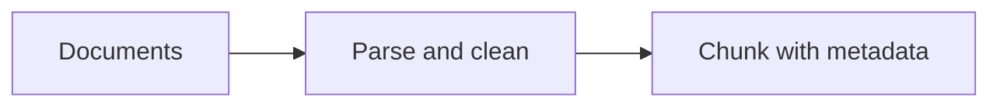
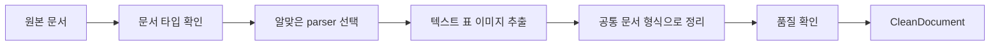
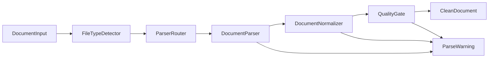
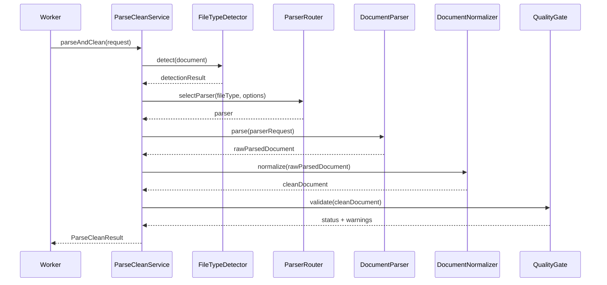

# Interface Design: Documents to Parse and Clean

작성일: 2026-05-20  
참고 문서: [rag-pipeline-research.md](research/rag-pipeline-research.md)

## 1. Purpose

이 문서는 RAG pipeline의 첫 번째 흐름인 `Documents -> Parse and clean` 구간에 대한 내부 인터페이스 설계서다.

목적은 API endpoint를 정의하는 것이 아니라, 문서 ingestion 이후 parsing/cleaning 컴포넌트들이 어떤 입력과 출력을 주고받아야 하는지 명확히 하는 것이다.



이 설계의 출력물은 다음 단계인 `Chunk with metadata`가 안정적으로 사용할 수 있는 표준 문서 표현이다.

## 2. How to Read This Document

인터페이스 설계서가 익숙하지 않다면, 이 문서를 “코드 구현 문서”가 아니라 “컴포넌트끼리 주고받는 약속을 정리한 문서”로 보면 된다.

하이레벨에서 보면 이 구간은 다음 일을 한다.



여기서 가장 중요한 질문은 하나다.

> 다음 단계인 chunker가 parser 종류를 몰라도 처리할 수 있는 표준 문서 형태는 무엇인가?

그 표준 문서 형태가 이 문서에서 말하는 `CleanDocument`다.

## 3. High-level Concept

`Documents -> Parse and clean`은 원본 파일을 “검색 가능한 문서 재료”로 바꾸는 단계다.

예를 들어 사용자가 `contract.pdf`를 업로드하면 이 단계는 다음처럼 일한다.

1. 이 파일이 진짜 PDF인지 확인한다.
2. PDF parser를 선택한다.
3. page별 텍스트, 표, 이미지, OCR 필요 여부를 추출한다.
4. parser마다 다른 결과 모양을 하나의 공통 모양으로 바꾼다.
5. 텍스트가 비어 있거나 OCR confidence가 낮은 경우 warning을 남긴다.
6. 다음 단계가 사용할 수 있는 `CleanDocument`를 반환한다.

중요한 점은 이 단계가 chunk를 만들거나 embedding을 만들지 않는다는 것이다. 여기서는 “문서를 잘 읽고 정리하는 것”까지만 책임진다.

## 4. Level-by-level Explanation

### Level 1. Pipeline Step

가장 큰 관점에서는 다음 한 줄이다.

```text
DocumentInput -> Parse and clean -> CleanDocument
```

`DocumentInput`은 원본 문서의 위치와 기본 정보다.

```text
sourceId, originalFilename, contentType, sizeBytes, storageUri
```

`CleanDocument`는 다음 단계에서 사용할 정리된 문서다.

```text
sourceId, fileType, units, metadata, warnings
```

### Level 2. Components

이 한 줄을 조금 더 나누면 다음 컴포넌트들이 나온다.

| 순서 | Component | 쉬운 설명 |
| --- | --- | --- |
| 1 | `FileTypeDetector` | “이 파일이 진짜 무슨 타입이지?”를 확인한다. |
| 2 | `ParserRouter` | “이 파일은 어떤 parser에게 맡길까?”를 결정한다. |
| 3 | `DocumentParser` | 실제로 문서를 열고 text/table/image를 뽑는다. |
| 4 | `DocumentNormalizer` | parser마다 다른 결과를 공통 형식으로 바꾼다. |
| 5 | `QualityGate` | 결과가 downstream에서 쓸 수 있는 품질인지 확인한다. |

### Level 3. Interface

인터페이스는 “이 컴포넌트는 이런 입력을 받으면 이런 출력을 돌려준다”는 약속이다.

예를 들어 `DocumentParser`는 다음 약속을 가진다.

```text
ParserRequest를 받으면 RawParsedDocument를 반환한다.
```

이 약속 덕분에 parser 구현체를 바꿀 수 있다.

```text
PyMuPDFParser -> RawParsedDocument
DoclingParser -> RawParsedDocument
TikaParser -> RawParsedDocument
```

parser가 무엇이든 다음 단계인 `DocumentNormalizer`는 같은 형태의 입력을 받을 수 있다.

### Level 4. Data Contract

마지막으로 데이터 계약이다. 데이터 계약은 “field 이름과 의미를 고정하는 것”이다.

예를 들어 `CleanDocumentUnit`은 이런 의미를 가진다.

| Field | 쉬운 설명 |
| --- | --- |
| `unitId` | page, slide, sheet 같은 단위의 고유 ID |
| `unitType` | 이 단위가 page인지, slide인지, section인지 |
| `unitIndex` | page number, slide number, sheet name 같은 위치 |
| `text` | 검색과 embedding에 쓸 텍스트 |
| `tables` | 표 구조 |
| `images` | 이미지와 OCR 결과 |
| `sourceLocation` | citation에 필요한 원문 위치 |
| `warnings` | 이 단위에서 생긴 품질 이슈 |

이렇게 field를 고정하면 chunker는 parser 구현체를 몰라도 안전하게 동작할 수 있다.

## 5. Concrete Example

### Input

문서 업로드 이후 parser worker는 대략 이런 입력을 받는다.

```json
{
  "requestId": "parse_req_001",
  "document": {
    "sourceId": "doc_123",
    "originalFilename": "contract.pdf",
    "contentType": "application/pdf",
    "sizeBytes": 1200345,
    "storageUri": "s3://bucket/raw/contract.pdf"
  },
  "options": {
    "enableOcr": true,
    "enableTableExtraction": true,
    "enableImageExtraction": true
  }
}
```

### Output

이 단계의 최종 출력은 이런 느낌이다.

```json
{
  "sourceId": "doc_123",
  "fileType": "pdf",
  "units": [
    {
      "unitType": "page",
      "unitIndex": "1",
      "text": "계약의 목적...",
      "tables": [],
      "images": [],
      "sourceLocation": {
        "pageNumber": 1
      }
    }
  ],
  "warnings": []
}
```

이 출력은 아직 chunk가 아니다. 하지만 chunker가 page/slide/sheet/section 위치를 잃지 않고 chunk를 만들 수 있게 충분히 정리된 재료다.

## 6. Boundary

### In Scope

- 업로드된 문서의 파일 정보와 저장 위치를 입력으로 받는다.
- 파일 타입을 탐지한다.
- 파일 타입에 맞는 parser를 선택한다.
- 텍스트, 표, 이미지, OCR 후보 정보를 추출한다.
- RAG에 적합한 표준 중간 표현으로 정규화한다.
- parsing 실패, OCR 필요, 암호화 파일 같은 상태를 warning/error로 표현한다.

### Out of Scope

- chunking 전략
- embedding 생성
- VectorDB 저장
- 검색 API
- LLM 답변 생성
- 외부 HTTP API endpoint 설계

## 7. Component View



| Component | 역할 |
| --- | --- |
| `FileTypeDetector` | extension, MIME type, magic bytes로 실제 파일 타입 판단 |
| `ParserRouter` | 파일 타입과 옵션에 따라 parser 후보 선택 |
| `DocumentParser` | 원본 파일에서 text/table/image/source location 추출 |
| `DocumentNormalizer` | parser별 출력을 공통 schema로 정규화 |
| `QualityGate` | 빈 텍스트, OCR 필요, 암호화, 깨진 파일, 과대 파일 상태 검출 |
| `ParseCleanService` | 위 단계를 묶어서 호출하는 application service |

## 8. Main Interface

이 인터페이스는 worker나 application service 내부에서 호출되는 계약이다. TypeScript 형태로 표현했지만, Python `Pydantic` model이나 Rust `serde` struct로도 같은 구조를 사용할 수 있다.

```ts
interface ParseCleanService {
  parseAndClean(request: ParseCleanRequest): Promise<ParseCleanResult>;
}
```

### Request

```ts
interface ParseCleanRequest {
  requestId: string;
  document: DocumentInput;
  options: ParseCleanOptions;
  requestedBy?: ActorContext;
}

interface DocumentInput {
  sourceId: string;
  originalFilename: string;
  declaredFileType?: string;
  contentType?: string;
  sizeBytes: number;
  storageUri: string;
  checksum?: string;
}

interface ParseCleanOptions {
  enableOcr: boolean;
  enableTableExtraction: boolean;
  enableImageExtraction: boolean;
  preferredParser?: string;
  maxPages?: number;
  timeoutSeconds?: number;
}

interface ActorContext {
  tenantId?: string;
  projectId?: string;
  userId?: string;
}
```

### Response

```ts
type ParseStatus = "succeeded" | "succeeded_with_warnings" | "failed" | "needs_manual_review";

interface ParseCleanResult {
  requestId: string;
  sourceId: string;
  status: ParseStatus;
  document?: CleanDocument;
  warnings: ParseWarning[];
  error?: ParseError;
  metrics: ParseMetrics;
}
```

## 9. Core Data Contracts

### CleanDocument

`CleanDocument`는 parser별 결과를 통합한 표준 출력이다. 다음 단계인 chunker는 parser가 Docling인지, PyMuPDF인지, Tika인지 몰라도 이 구조만 보면 된다.

```ts
interface CleanDocument {
  sourceId: string;
  fileType: SupportedFileType;
  title?: string;
  units: CleanDocumentUnit[];
  metadata: DocumentMetadata;
  storeLocation?: StoreLocation;
}

type SupportedFileType = "hwp" | "hwpx" | "doc" | "docx" | "ppt" | "pptx" | "xls" | "xlsx" | "xlsb" | "csv" | "pdf" | "md" | "html" | "unknown";

interface DocumentMetadata {
  originalFilename: string;
  mimeType?: string;
  title?: string;
  author?: string;
  createdAt?: string;
  modifiedAt?: string;
  tenantId?: string;
  projectId?: string;
}

interface StoreLocation {
  rawDocumentUri?: string;
  parsedDocumentUri?: string;
  extractedAssetPrefix?: string;
}

interface RawParsedDocument {
  sourceId: string;
  parserName: string;
  fileType: SupportedFileType;
  rawUnits: unknown[];
  metadata: Record<string, unknown>;
  warnings: ParseWarning[];
}
```

### CleanDocumentUnit

문서를 바로 하나의 긴 텍스트로 만들지 않고, page/slide/sheet/section/table 같은 단위로 보존한다. 이 단위는 chunking 이전의 안정적인 source unit이다.

```ts
interface CleanDocumentUnit {
  unitId: string;
  unitType: DocumentUnitType;
  unitIndex: string;
  headingPath?: string[];
  text: string;
  tables: ParsedTable[];
  images: ParsedImage[];
  sourceLocation: SourceLocation;
  metadata: Record<string, string | number | boolean>;
  warnings: ParseWarning[];
}

type DocumentUnitType = "page" | "slide" | "sheet" | "section" | "table" | "paragraph" | "html_heading";
```

### Table Contract

표는 단순 문자열로만 합치지 않고, 가능한 경우 구조를 보존한다.

```ts
interface ParsedTable {
  tableId: string;
  caption?: string;
  markdown?: string;
  cells?: ParsedTableCell[];
  sourceLocation: SourceLocation;
}

interface ParsedTableCell {
  rowIndex: number;
  columnIndex: number;
  rowSpan: number;
  columnSpan: number;
  text: string;
  isHeader?: boolean;
}
```

### Image Contract

이미지는 embedding 대상 텍스트와 별도로 참조, OCR 결과, caption 정보를 보존한다.

```ts
interface ParsedImage {
  imageId: string;
  storageUri?: string;
  altText?: string;
  caption?: string;
  ocrText?: string;
  ocrConfidence?: number;
  sourceLocation: SourceLocation;
}
```

### Source Location

citation을 위해 원문 위치를 최대한 보존한다.

```ts
interface SourceLocation {
  pageNumber?: number;
  slideNumber?: number;
  sheetName?: string;
  cellRange?: string;
  sectionPath?: string[];
  charStart?: number;
  charEnd?: number;
  boundingBox?: BoundingBox;
}

interface BoundingBox {
  pageNumber?: number;
  x: number;
  y: number;
  width: number;
  height: number;
  unit: "px" | "pt" | "normalized";
}
```

## 10. Warning and Error Model

warning은 parsing이 완전히 실패하지는 않았지만 downstream 품질에 영향을 줄 수 있는 상태다.

```ts
type ParseWarningCode =
  | "file_type_mismatch"
  | "ocr_required"
  | "low_ocr_confidence"
  | "table_structure_uncertain"
  | "image_extraction_failed"
  | "metadata_missing"
  | "partial_content"
  | "unsupported_embedded_object";

interface ParseWarning {
  code: ParseWarningCode;
  message: string;
  severity: "info" | "warning" | "error";
  unitId?: string;
  sourceLocation?: SourceLocation;
}

interface ParseError {
  code: "unsupported_file_type" | "encrypted_file" | "corrupted_file" | "file_too_large" | "parser_timeout" | "parser_internal_error";
  message: string;
  retryable: boolean;
}
```

## 11. Supporting Interfaces

### FileTypeDetector

```ts
interface FileTypeDetector {
  detect(document: DocumentInput): Promise<FileTypeDetectionResult>;
}

interface FileTypeDetectionResult {
  declaredFileType?: string;
  detectedFileType: SupportedFileType;
  mimeType?: string;
  confidence: number;
  warnings: ParseWarning[];
}
```

### ParserRouter

```ts
interface ParserRouter {
  selectParser(input: ParserSelectionInput): DocumentParser;
}

interface ParserSelectionInput {
  fileType: SupportedFileType;
  options: ParseCleanOptions;
  fallbackAttempt: number;
}
```

### DocumentParser

```ts
interface DocumentParser {
  name: string;
  supportedFileTypes: SupportedFileType[];

  parse(request: ParserRequest): Promise<RawParsedDocument>;
}

interface ParserRequest {
  document: DocumentInput;
  detectedFileType: SupportedFileType;
  options: ParseCleanOptions;
}
```

### DocumentNormalizer

```ts
interface DocumentNormalizer {
  normalize(raw: RawParsedDocument): Promise<CleanDocument>;
}
```

### QualityGate

```ts
interface QualityGate {
  validate(document: CleanDocument): Promise<QualityGateResult>;
}

interface QualityGateResult {
  status: ParseStatus;
  warnings: ParseWarning[];
}
```

## 12. Sequence



## 13. Full Example Result

```json
{
  "requestId": "parse_req_001",
  "sourceId": "doc_123",
  "status": "succeeded_with_warnings",
  "document": {
    "sourceId": "doc_123",
    "fileType": "pdf",
    "title": "계약서",
    "units": [
      {
        "unitId": "doc_123_page_1",
        "unitType": "page",
        "unitIndex": "1",
        "text": "계약의 목적...",
        "tables": [],
        "images": [],
        "sourceLocation": { "pageNumber": 1 },
        "metadata": { "parser": "pymupdf" },
        "warnings": []
      }
    ],
    "metadata": {
      "originalFilename": "contract.pdf",
      "mimeType": "application/pdf"
    }
  },
  "warnings": [
    {
      "code": "low_ocr_confidence",
      "message": "일부 이미지 OCR confidence가 낮습니다.",
      "severity": "warning"
    }
  ],
  "metrics": {
    "pageCount": 12,
    "unitCount": 12,
    "tableCount": 3,
    "imageCount": 5,
    "warningCount": 1,
    "elapsedMs": 1842
  }
}
```

## 14. Metrics Contract

```ts
interface ParseMetrics {
  pageCount?: number;
  slideCount?: number;
  sheetCount?: number;
  unitCount: number;
  tableCount: number;
  imageCount: number;
  warningCount: number;
  elapsedMs: number;
  parserName?: string;
}
```

## 15. API Design Contrast

이 문서는 내부 인터페이스 설계다. 만약 이 기능을 외부 API로 노출한다면 별도 API 설계가 필요하다.

예를 들면 API 설계는 다음처럼 표현된다.

```http
POST /documents/{documentId}/parse
```

```json
{
  "enableOcr": true,
  "enableTableExtraction": true
}
```

하지만 내부 인터페이스 설계에서는 endpoint보다 다음 질문이 더 중요하다.

- parser가 어떤 구조의 입력을 받는가?
- parser 결과가 chunker에게 충분한 source location을 제공하는가?
- OCR 필요, table 불확실, 파일 타입 mismatch 같은 상태를 어떻게 표현하는가?
- parser 후보를 바꿔도 다음 단계가 같은 schema를 사용할 수 있는가?

## 16. Design Principles

- parser 구현체가 바뀌어도 `CleanDocument` schema는 유지한다.
- downstream chunker는 parser별 raw output에 의존하지 않는다.
- citation을 위해 source location을 필수 계약으로 취급한다.
- OCR, table, image 결과는 원문 텍스트와 별도 field로 보존한다.
- 실패와 부분 성공을 구분한다.
- warning은 버리지 않고 chunking/evaluation 단계까지 전달한다.
