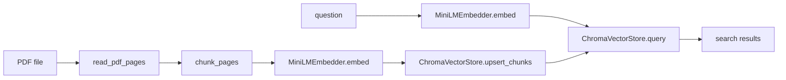
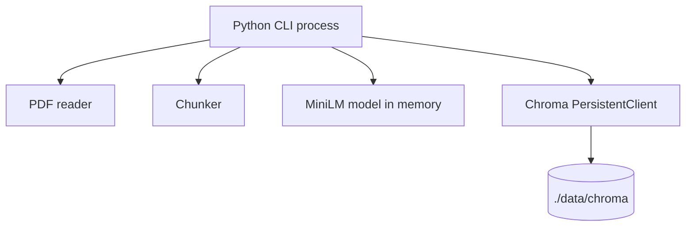
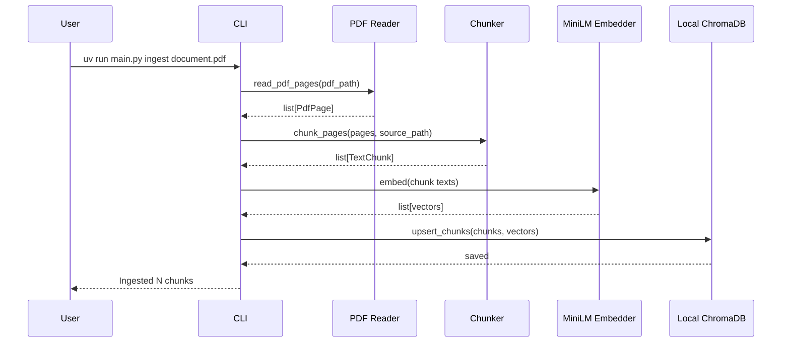
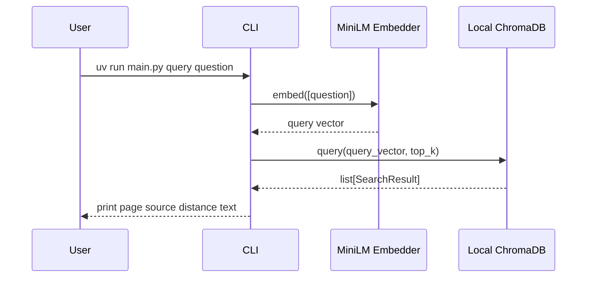

# Interface Design: PDF RAG MVP

작성일: 2026-05-22  
기준 구현: `main.py`, `src/axe_suite_rag/`

## 1. Purpose

이 문서는 현재 구현된 PDF RAG MVP의 인터페이스 설계서다.

중요한 점은 이 문서가 먼저 설계하고 구현한 결과물이 아니라, 이미 만든 작은 구현을 보고 거꾸로 정리한 문서라는 것이다. 그래서 추상적인 미래 구조보다 지금 코드에서 실제로 주고받는 값에 집중한다.

현재 MVP는 다음 6단계를 구현한다.

1. PDF 읽기
2. 텍스트 chunk 만들기
3. `all-MiniLM-L6-v2`로 embedding 만들기
4. ChromaDB local persistent store에 저장하기
5. 질문을 같은 embedding 모델로 vector화하기
6. ChromaDB에서 비슷한 chunk 찾기



## 2. Runtime Shape

첫 번째 MVP는 서버를 여러 개 띄우지 않는다.



실행 중인 것은 Python process 하나다.

- MiniLM embedding model은 Python process 안에서 로드된다.
- ChromaDB는 별도 server가 아니라 local folder를 사용하는 `PersistentClient`로 열린다.
- 저장 위치 기본값은 `./data/chroma`다.

## 3. Command Interface

사용자가 직접 만나는 인터페이스는 CLI 명령이다.

### Ingest

```bash
uv run main.py ingest path/to/document.pdf
```

옵션:

```bash
uv run main.py ingest path/to/document.pdf --chunk-size 900 --chunk-overlap 150
```

역할:

- PDF를 읽는다.
- page별 텍스트를 뽑는다.
- chunk를 만든다.
- chunk를 embedding한다.
- ChromaDB에 저장한다.

### Query

```bash
uv run main.py query "검색할 질문"
```

옵션:

```bash
uv run main.py query "검색할 질문" --top-k 5
```

역할:

- 질문을 embedding한다.
- ChromaDB에서 가까운 chunk를 찾는다.
- page number, source path, distance, chunk text를 출력한다.

## 4. Component Map

| Component | File | Input | Output |
| --- | --- | --- | --- |
| CLI | `src/axe_suite_rag/cli.py` | command line args | ingest/query 실행 |
| PDF Reader | `src/axe_suite_rag/pdf_reader.py` | PDF path | `list[PdfPage]` |
| Chunker | `src/axe_suite_rag/chunker.py` | `list[PdfPage]` | `list[TextChunk]` |
| Embedder | `src/axe_suite_rag/embedder.py` | `list[str]` | `list[list[float]]` |
| Vector Store | `src/axe_suite_rag/vector_store.py` | chunks and vectors | ChromaDB 저장 |
| Vector Search | `src/axe_suite_rag/vector_store.py` | query vector | `list[SearchResult]` |

## 5. Core Data Contracts

### PdfPage

`PdfPage`는 PDF에서 page 단위로 뽑은 텍스트다.

```python
@dataclass(frozen=True)
class PdfPage:
    page_number: int
    text: str
```

예시:

```json
{
  "page_number": 1,
  "text": "계약의 목적은 ..."
}
```

### TextChunk

`TextChunk`는 ChromaDB에 저장할 검색 단위다.

```python
@dataclass(frozen=True)
class TextChunk:
    chunk_id: str
    text: str
    source_path: str
    page_number: int
    chunk_index: int
```

예시:

```json
{
  "chunk_id": "/abs/path/contract.pdf:page:1:chunk:0",
  "text": "계약의 목적은 ...",
  "source_path": "/abs/path/contract.pdf",
  "page_number": 1,
  "chunk_index": 0
}
```

`chunk_id`는 같은 PDF를 다시 ingest했을 때 같은 chunk를 덮어쓸 수 있도록 만든다. 현재 구현은 ChromaDB `upsert`를 사용한다.

### Embedding Vector

`MiniLMEmbedder.embed()`는 문자열 목록을 vector 목록으로 바꾼다.

```python
texts: list[str] -> vectors: list[list[float]]
```

현재 모델은 `sentence-transformers/all-MiniLM-L6-v2`다. 이 모델은 384차원 embedding을 만든다.

예시:

```json
[
  [0.0123, -0.0456, 0.0789]
]
```

실제 vector는 384개의 float 값을 가진다.

### Chroma Metadata

ChromaDB에는 chunk text, embedding, metadata가 함께 저장된다.

```json
{
  "source_path": "/abs/path/contract.pdf",
  "page_number": 1,
  "chunk_index": 0
}
```

metadata는 검색 결과에서 출처를 보여주기 위해 사용한다.

### SearchResult

검색 결과는 다음 형태로 CLI에 반환된다.

```python
class SearchResult(TypedDict):
    text: str
    metadata: dict[str, str | int]
    distance: float
```

예시:

```json
{
  "text": "계약의 목적은 ...",
  "metadata": {
    "source_path": "/abs/path/contract.pdf",
    "page_number": 1,
    "chunk_index": 0
  },
  "distance": 0.2314
}
```

## 6. Main Function Interfaces

### read_pdf_pages

```python
def read_pdf_pages(pdf_path: Path) -> list[PdfPage]:
    ...
```

계약:

- `.pdf` 파일만 받는다.
- 존재하지 않는 파일이면 실패한다.
- 텍스트가 하나도 추출되지 않으면 실패한다.
- OCR은 수행하지 않는다.

### chunk_pages

```python
def chunk_pages(
    pages: Iterable[PdfPage],
    source_path: Path,
    chunk_size: int = 900,
    chunk_overlap: int = 150,
) -> list[TextChunk]:
    ...
```

계약:

- page text를 일정 길이의 chunk로 자른다.
- chunk마다 source path, page number, chunk index를 보존한다.
- `chunk_overlap`은 `chunk_size`보다 작아야 한다.

### MiniLMEmbedder.embed

```python
def embed(self, texts: list[str]) -> list[list[float]]:
    ...
```

계약:

- 같은 모델로 PDF chunk와 질문을 모두 embedding한다.
- normalize된 embedding을 반환한다.
- 첫 실행 시 모델 다운로드가 필요할 수 있다.

### ChromaVectorStore.upsert_chunks

```python
def upsert_chunks(self, chunks: list[TextChunk], vectors: list[list[float]]) -> None:
    ...
```

계약:

- chunk 개수와 vector 개수는 같아야 한다.
- ChromaDB에 id, document text, embedding, metadata를 저장한다.
- 같은 id가 들어오면 덮어쓴다.

### ChromaVectorStore.query

```python
def query(self, query_vector: list[float], top_k: int = 5) -> list[SearchResult]:
    ...
```

계약:

- query vector와 가까운 chunk를 최대 `top_k`개 반환한다.
- 반환값에는 text, metadata, distance가 포함된다.

## 7. Ingest Sequence



## 8. Query Sequence



## 9. Boundary

### In Scope

- PDF text extraction
- Text chunking
- Local MiniLM embedding
- Local ChromaDB persistent storage
- Vector similarity search
- Basic source metadata in search results

### Out of Scope

- OCR
- Table extraction
- Image extraction
- LLM answer generation
- Citation formatting beyond page/source metadata
- Web API server
- Chroma server mode
- Multi-user or permission model

## 10. Failure Cases

| Case | Current behavior |
| --- | --- |
| non-PDF file | `ValueError` |
| missing file | `FileNotFoundError` |
| scanned PDF with no text | `ValueError` |
| invalid chunk size or overlap | `ValueError` |
| chunk/vector count mismatch | `ValueError` |
| no search result | CLI prints `No matching chunks found.` |

## 11. Design Notes

- `cli.py` is the orchestration layer. It connects the pieces but does not own PDF parsing, chunking, embedding, or Chroma logic.
- `pdf_reader.py` only reads text from PDFs. It does not know about chunking or vector search.
- `chunker.py` only creates `TextChunk` objects. It does not call MiniLM or Chroma.
- `embedder.py` only turns text into vectors.
- `vector_store.py` only handles ChromaDB persistence and vector search.

This separation keeps the implementation small while still making each boundary visible.

## 12. Why This Interface Matters

This MVP is intentionally simple, but these interfaces make future changes easier.

For example:

- PDF parser can change while keeping `PdfPage`.
- Chunking strategy can change while keeping `TextChunk`.
- Embedding model can change while keeping `list[str] -> list[list[float]]`.
- ChromaDB can change to another vector store while keeping `upsert_chunks` and `query`.

That is the main value of this design document: it names the small contracts already present in the code.

