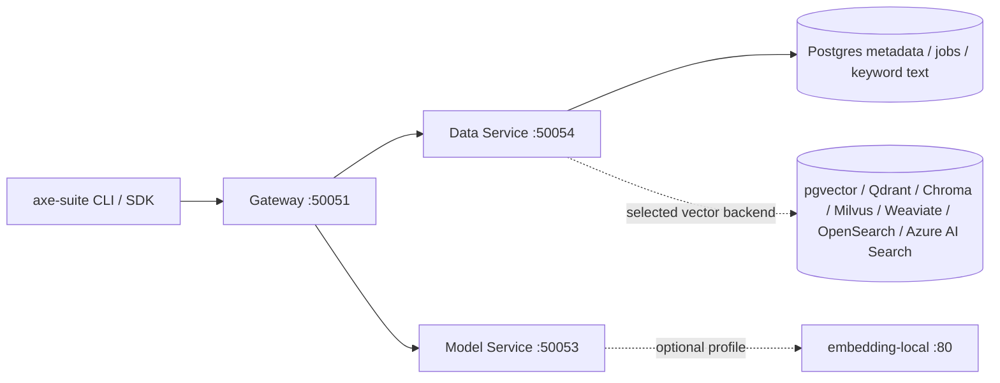

# PRD

- python을 언어로 활용한다
- research/rag-pipeline-research-summary.md를 참고해서 개발합니다.
- vectorDB는 후보 중에서 가장 간단한 DB로 구성합니다.
- embedding 모델도 후보 중에서 가장 간단한 것으로 구성합니다.
- ocr은 구현하지 않습니다.
- table 처리하는 프로세스는 구현하지 않습니다.
- 문서의 종류는 pdf로 한정해서 구현합니다.

## 현재 구현 범위

2026-06-02 기준으로 standalone `src/axe_suite_rag/` MVP 코드는 제거하고, 기존
`boilerplate/`의 data-focused GenAI platform 코드를 repository root로 flatten한다.

기본 runtime 구성은 다음 4개 container로 제한한다.

1. `gateway`
2. `data`
3. `models`
4. `postgres`

local embedding model serving은 기본 4-container 구조를 깨지 않도록 Compose profile로 제공한다.
VectorDB는 CLI에서 후보를 선택하고, 선택된 backend가 chunk vector 저장과 vector search를 담당한다.



## 실행 방식

Repository root에서 실행한다.

```bash
uv sync
uv tool install -e .
axe-suite up
axe-suite status
axe-suite down
```

터미널 질문은 `axe-suite ask "<질문>"`으로 보낸다. 기본 index는
`rag-pipeline-research-summary`이며, 필요하면 `--index`로 변경한다.

```bash
axe-suite ask "VectorDB 후보 중에 뭐가 제일 단순해?" --top-k 3
```

## CI / Codecheck

GitHub Actions workflow를 codecheck gate로 사용한다. Pull request와 `main` push에서 다음 검증을 수행한다.

1. `uv sync --frozen --extra postgres`
2. `uv run ruff check`
3. `uv run ruff format --check .`
4. `uv run pytest -q`
5. `docker compose config --quiet`
6. `uv run python main.py --help`

## Live Stack Smoke Test

실행 중인 Docker stack은 `examples/live_stack_smoke.py`로 end-to-end 확인한다.

```bash
axe-suite up --vector-db qdrant --local-embedding
uv run python examples/live_stack_smoke.py
```

이 script는 기본적으로 `chapter-5.md`를 index하여 SDK가 Gateway를 통해 Data Service와 Model
Service에 접근하고, local embedding 결과가 선택된 VectorDB backend에 저장/검색되는지 확인한다.
embedding model은 hard-code하지 않고 Model Service의 `ListEmbeddingModels` 응답에서 우선 local
provider model을 선택한다. 알 수 없는 custom model은 `--embedding-dimensions`를 명시해야 한다.
Qwen CPU smoke run처럼 embedding이 느린 경우를 위해 ingest timeout 기본값은 300초로 둔다.
출력에는 indexed document 첫 10 lines, question, retrieved response가 포함된다. 검색 결과는 step
number와 헷갈리지 않도록 `Result N:` 형식으로 표시한다. 기본적으로 test index를 삭제하며, 수동 확인이
필요하면 `--keep-index`를 사용한다.

## 관련 문서

- [PDF RAG MVP 인터페이스 설계서](pdf-rag-mvp-interface-design.md)
- [Basic RAG Architecture and Interface Design](basic-rag-arch-and-interface-design.md)
- [Data Service RAG Architecture and Interface Design](data-rag-arch-and-interface-design.md)
- [VectorDB Tuning Parameters Guide](research/vector-db-tuning-parameters.md)
- [OCR and Embedding Technical Research Guide](research/ocr-embedding-technical-research.md)

## Root Platform 방향

이 repository는 `designing_ai_systems_repo`를 data service 개발용으로 축소한 root project로 사용한다.

기본 Docker Compose 구성은 다음 4개 container로 제한한다.

1. `gateway`
2. `data`
3. `models`
4. `postgres`

local embedding model serving은 기본 4-container 구조를 깨지 않도록 Compose profile로 제공한다.
Apple Silicon에서는 선택한 TEI image가 arm64 manifest를 제공하지 않으므로 Docker의 `linux/amd64`
emulation으로 실행한다.

```bash
axe-suite up --local-embedding
```

platform 실행은 Docker Compose 직접 실행 대신 얇은 CLI wrapper를 기본 진입점으로 둔다.

기본 CLI 진입점은 `axe-suite`이며, root `main.py`는 같은 CLI를 호출하는 얇은 wrapper로 둔다.

`axe-suite up`은 기본적으로 background 실행이며, 먼저 VectorDB 후보를 선택하고 local embedding
container를 함께 띄울지 물어본다. VectorDB 선택지는 LanceDB를 제외한 7개
`Qdrant`, `Chroma`, `Milvus`, `Weaviate`, `pgvector`, `OpenSearch`, `Azure AI Search`를
보여준다. LanceDB는 OSS 사용 방식이 embedded-first라 별도 service container 후보에서 제외한다.
local embedding container를 선택하면 research 문서의 local 후보 중 `minilm`, `bge-m3`,
`qwen3-0.6b`, `e5-large`, `arctic-l-v2` alias를 선택할 수 있다. `minilm`은 빠른 plumbing smoke
기본값으로 유지하고, 실제 한국어/다국어 RAG 1차 local 후보는 `bge-m3`로 둔다.
Mac/CPU Docker 환경에서 Qwen/BGE 같은 큰 embedding model warmup이 OOM으로 실패할 수 있으므로
local TEI container는 conservative default
`LOCAL_EMBEDDING_TOKENIZATION_WORKERS=1`, `LOCAL_EMBEDDING_MAX_CONCURRENT_REQUESTS=1`,
`LOCAL_EMBEDDING_MAX_BATCH_TOKENS=2048`, `LOCAL_EMBEDDING_MAX_CLIENT_BATCH_SIZE=1`로 시작한다.
Model Service는 같은 client batch size에 맞춰 local embedding request를 split한다. production-like
Linux/GPU 환경에서는 env override로 높인다.

VectorDB adapter 구조는 `Postgres state store + selected vector backend`로 둔다. Postgres는
index metadata, document metadata, ingest jobs, keyword-search text를 유지하고, 선택된 backend는
chunk vector 저장과 vector search를 담당한다. `pgvector` 선택 시에는 Postgres가 state와 vector를
함께 처리한다. Azure AI Search는 local Docker service가 아니라 SDK 기반 managed service adapter로
구현하며 `AZURE_SEARCH_SERVICE_ENDPOINT`, `AZURE_SEARCH_API_KEY`가 필요하다.

Hybrid search는 backend capability에 따라 분기한다.

```text
Native hybrid:
- pgvector: Postgres full-text + pgvector
- OpenSearch: OpenSearch BM25 + kNN
- Azure AI Search: Azure keyword + vector query
- Weaviate: Weaviate hybrid

Vector-only with fallback:
- Qdrant: vector search + Postgres keyword fallback
- Chroma: vector search + Postgres keyword fallback
- Milvus: vector search + Postgres keyword fallback
```

자동화 환경에서는 `axe-suite up --vector-db pgvector --no-local-embedding`,
`axe-suite up --vector-db qdrant --no-local-embedding`처럼 질문 없이 실행한다.

Python SDK 통신 경로는 Docker image pull 없이도 `tests/test_sdk_gateway_smoke.py`에서 검증한다.
이 테스트는 SDK가 Gateway gRPC를 통해 Data Service와 Model Service에 접근하고, ingest/search가
local embedding provider 경로를 사용하는지 확인한다.

터미널 질문은 `axe-suite ask "<질문>"`으로 보낸다. 기본 index는
`rag-pipeline-research-summary`이며, 필요하면 `--index`로 변경한다.
