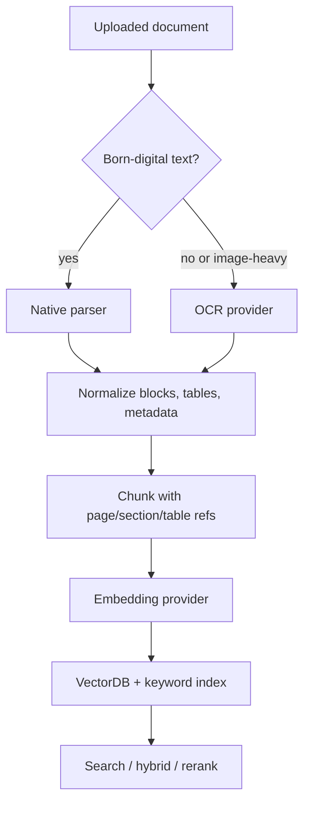

# OCR and Embedding Technical Research Guide

Research date: 2026-05-28

이 문서는 `rag-pipeline-research-summary.md`의 OCR/image/table 후보와 embedding model 후보를
나중에 개발에 적용하기 쉽게 정리한 기술 조사 문서다. VectorDB tuning 문서와 같은 의도로,
각 후보의 튜닝 파라미터, serving best practice, use case, 한국어 문서 케이스를 중심으로 본다.

현재 Axe Suite 방향과 연결하면 다음 범위다.

- OCR은 기본 data service scope 밖이지만, 스캔 PDF와 이미지/표 중심 문서가 들어오면 별도 worker나 provider로 붙일 수 있다.
- Embedding은 `models` service가 external provider와 local provider를 모두 지원하는 방향이다.
- Local embedding container는 현재 빠른 PoC용이며, 한국어/운영 품질 모델은 별도 평가가 필요하다.
- OCR/embedding 모두 모델이나 옵션이 바뀌면 downstream index 품질이 달라진다. 작은 eval set으로 먼저 비교해야 한다.

## Quick Recommendation

| 영역 | 먼저 볼 후보 | 이유 |
| --- | --- | --- |
| 스캔 PDF searchable layer | `OCRmyPDF + Tesseract` | Docker/CLI batch가 단순하고 searchable PDF 생성에 좋다. |
| 한국어 OCR baseline | `PaddleOCR`, `PaddleOCR-VL-1.6`, `Azure AI Document Intelligence`, `Tesseract kor+eng` | 한글/영문/숫자 혼합 문서, layout/table 처리까지 비교 가능하다. |
| 표와 layout-heavy 문서 | `PaddleOCR-VL-1.6`, `Azure AI Document Intelligence`, `PaddleOCR PP-Structure`, `Surya` | table, formula, chart, reading order, bbox를 보존하기 좋다. Surya는 license 확인 필수다. |
| OCR/layout localization | `LocateAnything-3B`, `LayoutParser`, `PaddleOCR-VL-1.6` | 특정 텍스트, 표, UI/문서 영역을 box/point로 찾는 grounding 후보. LocateAnything은 non-commercial research license라 production 적용 전 검토가 필요하다. |
| 빠른 OCR PoC | `EasyOCR`, `Tesseract` | 설치와 실험이 단순하다. 단 table structure는 별도 처리해야 한다. |
| 한국어 embedding baseline | `BAAI/bge-m3`, `Qwen3-Embedding-0.6B`, `multilingual-e5-large`, `OpenAI text-embedding-3-small/large` | multilingual retrieval 후보이며 한국어 corpus eval을 시작하기 좋다. |
| local CPU embedding baseline | `all-MiniLM-L6-v2` | 작고 빠르지만 한국어 품질 baseline으로만 본다. |
| 품질 우선 self-host embedding | `Qwen3-Embedding-4B/8B`, `BGE-M3` | GPU 비용을 감수할 때 다국어/긴 문서 retrieval에 강하다. |
| managed embedding | `text-embedding-3-small`, `text-embedding-3-large` | 운영이 단순하고 batch ingestion, dimension 축소가 쉽다. |



## OCR Tuning Concepts

| 개념 | 흔한 파라미터 | 의미 | 조절 기준 |
| --- | --- | --- | --- |
| Language hint | `kor`, `eng`, `ko`, `-l kor+eng`, `langs` | OCR engine이 쓸 언어 모델 | 한국어 문서는 한글+영문+숫자 혼합이 많으므로 `kor+eng` 또는 `ko,en` 조합을 우선 본다. |
| DPI / render scale | `--image-dpi`, `dpi`, `mag_ratio`, page render scale | PDF page를 이미지로 변환할 때 해상도 | 300 DPI부터 시작한다. 작은 글자/스캔 품질이 나쁘면 올리되 latency와 memory를 측정한다. |
| Deskew / rotation | `--deskew`, `--rotate-pages`, `use_doc_orientation_classify`, `detect_orientation` | 기울어진 scan과 잘못 돌아간 page 보정 | 스캔 PDF에는 기본 적용 후보. 이미 깨끗한 문서에는 과보정 위험이 있다. |
| Binarization / cleanup | thresholding, `--clean`, `--remove-background`, denoise | 배경 노이즈와 흐릿한 글자 보정 | Tesseract/OCRmyPDF 계열에서 OCR 품질에 영향이 크다. 원본 보존이 필요한 문서는 output을 검토한다. |
| Page segmentation | Tesseract `--psm`, layout region detection | 페이지를 문단/줄/단어/블록으로 나누는 방식 | 단일 crop, 표 cell, 전체 page마다 적합한 segmentation이 다르다. |
| Detection threshold | `text_threshold`, `low_text`, `link_threshold`, layout score threshold | 글자/박스 후보를 얼마나 엄격하게 잡을지 | 낮추면 recall은 오르지만 노이즈가 증가한다. |
| Recognition batch | `batch_size`, `rec_batch_num`, `det_bs`, `reco_bs`, `--jobs` | OCR batch와 병렬 처리량 | GPU/CPU memory에 맞춰 올린다. online request는 낮게, batch job은 높게. |
| Reading order | reading order model, layout sort | OCR 결과를 사람이 읽는 순서로 정렬 | multi-column, 표, header/footer가 있는 PDF에서 RAG 품질에 중요하다. |
| Table structure | table recognition, cell bbox, HTML/Markdown table | 표의 row/column/cell span 보존 | 단순 OCR text만으로는 표 질의응답이 약하므로 table-heavy 문서에서는 별도 평가한다. |
| Document VLM task | `ocr`, `table`, `chart`, `formula`, `spotting`, prompt template | OCR을 텍스트 추출이 아니라 문서 요소 인식/구조화 task로 수행 | table, formula, chart, seal, spotting처럼 요소별 품질이 중요하면 PaddleOCR-VL 계열을 별도 route로 둔다. |
| Visual grounding | text/layout request, box/point output, fast/hybrid/slow decoding | 자연어로 문서/이미지 영역을 찾는다 | OCR text 추출보다 bbox localization, citation highlight, GUI/document grounding에 적합하다. |
| Confidence gate | word/line confidence threshold | 낮은 신뢰도 OCR을 warning 처리 | threshold 이하는 chunk metadata에 warning을 남기고 재처리 후보로 둔다. |
| Timeout / page limit | per-page timeout, max pages | 오래 걸리는 문서 격리 | worker queue를 보호한다. 대용량 PDF는 page 단위 retry가 좋다. |

## OCR Candidate Matrix

| Candidate | Best use case | Main tuning knobs | Serving best practice | Korean notes |
| --- | --- | --- | --- | --- |
| Tesseract | offline OCR baseline, simple scanned pages | `-l`, `--psm`, `--oem`, DPI, preprocessing | CLI/worker로 page 단위 실행. `tessdata_fast`와 `tessdata_best`를 비교. | `kor`, `kor_vert`, `eng` language data 설치. `kor+eng` 혼합 테스트. |
| OCRmyPDF | scanned PDF에 OCR text layer 추가 | `--language`, `--deskew`, `--rotate-pages`, `--skip-text`, `--redo-ocr`, `--jobs`, timeout | batch worker로 사용. 원본 PDF 보존과 sidecar text를 함께 저장. | Tesseract language pack 의존. 한글 PDF는 `-l kor+eng`부터. |
| PaddleOCR / PP-Structure | OCR + layout + table recognition | model size, doc orientation, unwarping, textline orientation, table/formula switches, batch size | GPU worker 권장. model cache를 image/volume에 고정. | Korean 지원 모델이 있어 한국어 OCR 후보 우선순위가 높다. |
| PaddleOCR-VL-1.6 | document parsing VLM, table/formula/chart/seal/text spotting | `pipeline_version`, task mode, backend, page/element route, output format | 공식 PaddleOCR path 또는 vLLM server로 serving. JSON/Markdown을 함께 저장. | multilingual 문서 parsing 후보. 한국어 샘플은 PaddleOCR/DI와 별도 비교. |
| EasyOCR | 빠른 OCR PoC, 이미지 crop OCR | `lang_list`, `gpu`, `batch_size`, `decoder`, `beamWidth`, detection thresholds, `rotation_info` | Reader를 process 시작 시 1회 load. GPU면 batch를 올린다. | `ko` + `en` 조합 실험. table structure는 별도 필요. |
| docTR | deep learning OCR pipeline 실험 | `det_arch`, `reco_arch`, `assume_straight_pages`, `straighten_pages`, `batch_size` | GPU-ready Python worker. JSON export를 normalize layer에 연결. | 한국어 강점 후보는 아니다. 실제 한글 샘플 검증 전 production 후보로 보지 않는다. |
| LayoutParser | OCR 전 layout region 분리 | model type, label mapping, score threshold, crop padding, OCR agent language | OCR engine과 조합하는 orchestration layer로 사용. | 한글 OCR 자체보다 table/text/title region crop에 유용하다. |
| Surya | OCR + layout + reading order + table 비교 | language list, task switches, batch size, GPU/CPU mode | PoC 품질 비교 후보. production은 license 검토 후. | 90+ language OCR 후보지만 한글과 license를 모두 검증해야 한다. |
| LocateAnything-3B | OCR/text/layout localization, visual grounding | prompt template, output type, image resolution, decoding mode | vLLM/SGLang/Transformers로 research serving. box/point 결과를 citation/debug에 사용. | 주 언어는 English task prompt 중심. 한글 OCR text 인식보다는 영역 찾기 후보로 평가. |
| Azure AI Document Intelligence | managed layout/table/OCR, Markdown output | `prebuilt-layout`, pages, locale, output format, retry/rate limit | async polling worker. raw JSON/Markdown/bbox를 모두 저장. | 한국어 지원과 table/paragraph output을 실제 corpus로 검증. 비용과 region 확인. |

## Tesseract

### Recommended Start

```yaml
ocr_provider: tesseract
languages: ["kor", "eng"]
render_dpi: 300
oem: 1
psm: 3
preprocess:
  deskew: true
  denoise: true
  binarize: true
```

### Tuning Notes

| Parameter | 추천 시작값 | Range / alternatives | 언제 바꾸나 |
| --- | --- | --- | --- |
| `-l` | `kor+eng` | `kor`, `eng`, `kor_vert`, domain custom data | 한글/영문/숫자 혼합 문서에서 언어를 명시한다. |
| `--oem` | `1` | `0`, `1`, `3` | 보통 LSTM engine을 쓴다. legacy data가 필요한 경우만 다른 값을 본다. |
| `--psm` | `3` | `4`, `6`, `7`, `11`, `13` | 전체 page, single block, single line, sparse text 등 입력 형태에 맞춘다. |
| DPI | 300 | 200 to 600 | 작은 글자나 흐린 스캔은 400 이상을 비교한다. |
| Preprocessing | deskew + denoise | thresholding, morphology, border crop | skew, dark border, noisy background가 있으면 먼저 보정한다. |
| User words/patterns | off | domain glossary | 제품명, 약어, 부품번호가 반복될 때 후보. |

### Use Cases

- 비용 없는 offline OCR baseline
- OCRmyPDF backend
- 개인정보나 내부 문서라 외부 managed service를 피해야 할 때

### Korean Case

- `kor.traineddata`와 `eng.traineddata`를 image에 포함한다.
- 세로쓰기 문서가 있으면 `kor_vert`를 별도 route로 실험한다.
- 한글 OCR은 띄어쓰기 오류가 retrieval 품질에 바로 영향을 준다. OCR 후 normalization에서 연속 공백, 자모 분리, 이상 문자 비율을 기록한다.

## OCRmyPDF

### Recommended Start

```yaml
ocr_provider: ocrmypdf
language: "kor+eng"
options:
  skip_text: true
  deskew: true
  rotate_pages: true
  clean: true
  jobs: 4
outputs:
  searchable_pdf: true
  sidecar_text: true
```

### Tuning Notes

| Parameter | 추천 시작값 | Range / alternatives | 언제 바꾸나 |
| --- | --- | --- | --- |
| `--skip-text` | true | true/false | born-digital text가 이미 있는 page는 OCR을 피한다. |
| `--redo-ocr` | false | true/false | 기존 OCR layer 품질이 낮을 때 재처리한다. |
| `--force-ocr` | false | true/false | 잘못된 text layer를 무시하고 새로 OCR해야 할 때만. |
| `--deskew` | true for scans | true/false | 기울어진 page 보정. |
| `--rotate-pages` | true for scans | threshold 조절 | 가로/세로가 섞인 스캔 묶음에 유용하다. |
| `--jobs` | CPU cores 이하 | 1 to CPU cores | batch throughput과 host load를 조절한다. |
| `--tesseract-timeout` | per-page timeout | 문서 SLA 기반 | 오래 걸리는 page가 worker를 점유하지 않게 한다. |

### Use Cases

- 스캔 PDF를 searchable PDF로 보존해야 할 때
- RAG ingest 전에 PDF text layer를 표준화하고 싶을 때
- 법무/회계 PDF처럼 원본 파일을 그대로 열람해야 할 때

### Korean Case

- Tesseract와 같은 language pack 제약을 받는다.
- 한국어+영문+숫자 문서에서는 sidecar text의 깨진 문자율과 검색 hit rate를 같이 본다.
- 표 구조를 직접 뽑는 도구는 아니므로 table-heavy 문서는 PaddleOCR/Azure Document Intelligence와 비교한다.

## PaddleOCR / PP-Structure

### Recommended Start

```yaml
ocr_provider: paddleocr
pipeline: pp_structure_v3
language: korean
options:
  use_doc_orientation_classify: true
  use_doc_unwarping: false
  use_textline_orientation: true
  use_general_ocr: true
  use_table_recognition: true
  use_formula_recognition: false
serving:
  device: gpu
  batch_size: benchmark
```

### Tuning Notes

| Parameter | 추천 시작값 | Range / alternatives | 언제 바꾸나 |
| --- | --- | --- | --- |
| OCR model family | server accuracy model | mobile/server | latency가 중요하면 mobile, 품질이 중요하면 server. |
| `use_doc_orientation_classify` | true for scans | true/false | 잘못 회전된 page가 많을 때 켠다. |
| `use_doc_unwarping` | false | true/false | 스마트폰 촬영 문서처럼 휘어진 page에서만 실험한다. |
| `use_textline_orientation` | true | true/false | 회전된 text line이 섞인 문서에서 유용하다. |
| Table recognition | true for table docs | true/false | 표 질의응답이 중요하면 켠다. |
| Formula recognition | false | true/false | 수식 문서가 아니면 비용만 늘 수 있다. |
| Batch size | GPU memory 기반 | 1 to memory limit | throughput 향상 후보지만 OOM을 주의한다. |

### Use Cases

- 한국어 OCR 품질을 OSS로 먼저 평가하고 싶을 때
- 표, 레이아웃, reading order가 중요한 문서
- GPU self-host OCR worker를 운영할 수 있을 때

### Korean Case

- 한국어 문서의 첫 번째 OSS 후보로 둔다.
- 행정 문서, 매뉴얼, 계약서처럼 한글+영문+숫자+표가 섞인 corpus를 최소 20 to 50 page sample로 평가한다.
- OCR text만 보지 말고 table HTML/Markdown과 cell bbox 품질을 별도 평가한다.

## PaddleOCR-VL-1.6

### Recommended Start

```yaml
ocr_provider: paddleocr_vl
model: PaddlePaddle/PaddleOCR-VL-1.6
pipeline_version: v1.6
tasks:
  page_parsing: true
  ocr: true
  table: true
  chart: true
  formula: false
  spotting: true
outputs:
  json: true
  markdown: true
serving:
  backend: paddleocr
  vl_rec_backend: local_or_vllm_server
```

### Tuning Notes

| Parameter | 추천 시작값 | Range / alternatives | 언제 바꾸나 |
| --- | --- | --- | --- |
| `pipeline_version` | `v1.6` | `v1.5`, `v1.6` | v1.6은 v1.5와 architecture 호환이라 migration 후보로 둔다. |
| Task mode | page parsing first | `ocr`, `table`, `chart`, `formula`, `spotting`, `seal` | 필요한 요소만 켜 latency와 hallucination risk를 줄인다. |
| Backend | official PaddleOCR path | Paddle dynamic/static, vLLM server, Transformers element-level | page-level parsing은 공식 PaddleOCR path를 우선한다. |
| Output format | JSON + Markdown | JSON, Markdown, DOCX | RAG chunking은 Markdown, citation/debug는 JSON/bbox가 필요하다. |
| Image/page route | scanned or layout-heavy only | all pages, selected pages | born-digital simple text에는 과할 수 있어 page text coverage로 route를 나눈다. |
| GPU serving | required for serious eval | single GPU, vLLM server | 0.9B급 VLM이라 OCRmyPDF/Tesseract보다 무겁다. |

### Use Cases

- 표, 수식, 차트, seal, text spotting이 섞인 복잡한 문서 parsing
- OCR text만이 아니라 Markdown/JSON 구조화 결과가 필요한 RAG
- Azure Document Intelligence 같은 managed Document AI와 OSS/self-host 후보를 비교할 때

### Korean Case

- PaddleOCR 계열이 multilingual/document parsing을 강조하므로 한국어 문서 평가 후보에 넣을 가치가 높다.
- 다만 공식 성능 강조가 OmniDocBench와 Chinese rare characters/table/formula 쪽에 많이 맞춰져 있으므로, 한국어 계약서/행정문서/매뉴얼 샘플로 별도 평가해야 한다.
- 한글 OCR 자체보다 표 구조, reading order, chart/table caption 보존 품질을 중점적으로 본다.

## EasyOCR

### Recommended Start

```yaml
ocr_provider: easyocr
languages: ["ko", "en"]
gpu: true
options:
  batch_size: 8
  decoder: greedy
  paragraph: false
  rotation_info: [0, 90, 180, 270]
```

### Tuning Notes

| Parameter | 추천 시작값 | Range / alternatives | 언제 바꾸나 |
| --- | --- | --- | --- |
| `lang_list` | `["ko", "en"]` | language combinations | 문서 언어를 명시한다. |
| `gpu` | true if available | true/false | CPU도 가능하지만 batch 처리량은 낮다. |
| `batch_size` | 4 to 16 | memory 기반 | GPU memory 여유가 있으면 올린다. |
| `decoder` | `greedy` | `greedy`, `beamsearch`, `wordbeamsearch` | 정확도 우선이면 beam 계열을 비교한다. |
| `text_threshold` | default first | 낮추거나 높임 | 누락이 많으면 낮추고, 노이즈가 많으면 높인다. |
| `rotation_info` | off or 0/90/180/270 | angles list | 회전된 crop이 많을 때 켠다. |

### Use Cases

- 이미지 crop OCR 빠른 PoC
- Tesseract보다 deep learning OCR baseline이 필요할 때
- full document layout보다 OCR text 자체만 먼저 확인할 때

### Korean Case

- `ko` 지원이 있어 실험하기 쉽지만, 표 구조와 reading order는 별도 pipeline이 필요하다.
- 스캔 PDF 전체 page보다 crop 단위 OCR fallback으로 쓰는 편이 다루기 쉽다.

## docTR

### Recommended Start

```yaml
ocr_provider: doctr
det_arch: db_resnet50
reco_arch: crnn_vgg16_bn
options:
  pretrained: true
  assume_straight_pages: true
  preserve_aspect_ratio: true
  symmetric_pad: true
  detect_orientation: false
  straighten_pages: false
```

### Tuning Notes

| Parameter | 추천 시작값 | Range / alternatives | 언제 바꾸나 |
| --- | --- | --- | --- |
| `det_arch` | robust detector | fast/accurate variants | detection 누락이 많으면 정확도 모델을 쓴다. |
| `reco_arch` | CRNN baseline | SAR/VITSTR variants | recognition 품질과 latency를 비교한다. |
| `assume_straight_pages` | true | true/false | 회전/휘어짐이 많으면 false나 straighten을 비교한다. |
| `straighten_pages` | false | true/false | 촬영 문서처럼 휘어진 page에서만 켠다. |
| Batch size | GPU memory 기반 | 1 to memory limit | detection/recognition 처리량 조정. |

### Use Cases

- Python OCR pipeline을 JSON/bbox 중심으로 조립할 때
- layout/table 도구와 결합할 OCR 후보가 필요할 때

### Korean Case

- 한국어 OCR 1차 후보로 보기는 어렵다.
- 한글 실사용은 pretrained model 지원 범위와 샘플 품질 확인 후 판단한다.

## LayoutParser

### Recommended Start

```yaml
layout_provider: layoutparser
layout_model: pubLayNet_or_domain_model
ocr_agent:
  provider: tesseract
  languages: ["kor", "eng"]
options:
  score_threshold: 0.5
  crop_padding_px: 8
```

### Tuning Notes

| Parameter | 추천 시작값 | Range / alternatives | 언제 바꾸나 |
| --- | --- | --- | --- |
| Layout model | closest domain model | PubLayNet, PrimaLayout, custom | 문서 도메인과 label이 맞아야 한다. |
| Score threshold | 0.5 | 0.3 to 0.8 | region 누락과 false positive를 조절한다. |
| Crop padding | 4 to 16 px | image DPI 기반 | 글자 경계가 잘리는 것을 막는다. |
| OCR agent | Tesseract first | Tesseract, Google Vision, custom | OCR 품질과 비용에 맞춘다. |

### Use Cases

- OCR 전에 title/text/table/figure region을 나누고 싶을 때
- multi-column 문서의 reading order를 개선하고 싶을 때
- table region만 별도 OCR/table extractor로 보내고 싶을 때

### Korean Case

- LayoutParser 자체보다 연결하는 OCR engine의 한국어 품질이 중요하다.
- 한글 학술논문/보고서처럼 layout이 복잡한 문서에서 region crop 용도로 평가한다.

## LocateAnything-3B

### Recommended Start

```yaml
visual_grounding_provider: locateanything
model: nvidia/LocateAnything-3B
tasks:
  text_detection: true
  text_grounding: true
  layout_grounding: true
  document_understanding: true
outputs:
  boxes: true
  points: false
serving:
  runtime: vllm_or_sglang
  precision: bf16
  license_gate: non_commercial_research
```

### Tuning Notes

| Parameter | 추천 시작값 | Range / alternatives | 언제 바꾸나 |
| --- | --- | --- | --- |
| Prompt template | task-specific English prompt | detect text, locate region, point to target | OCR text 추출보다 "어디에 있는지"가 중요할 때 쓴다. |
| Output type | box | box, point | citation highlight는 box, click/GUI agent는 point가 유용하다. |
| Image resolution | source resolution within serving limit | resize to 1K to 2.5K class | 작은 글자 localization이면 resolution을 높이고 latency를 본다. |
| Decoding mode | hybrid | fast, hybrid, slow | hybrid를 기본으로 두고, 형식 오류가 많으면 slow를 비교한다. |
| Runtime | vLLM/SGLang | Transformers, vLLM, SGLang | production serving보다 research validation을 먼저 한다. |

### Use Cases

- OCR 결과에 bbox가 없거나 citation highlight가 약할 때 보조 localization
- 특정 문구, 도장, 서명, 표, 그림 영역을 자연어로 찾는 visual grounding
- GUI/document grounding, dataset annotation, OCR/layout detection benchmark

### Korean Case

- 모델 카드 기준 task prompt와 학습 언어는 English 중심이다. 한글 OCR text recognition 자체를 기대하기보다, 이미 OCR된 텍스트/설명과 이미지 영역을 맞추는 보조 후보로 본다.
- NVIDIA license가 non-commercial research 용도라 상용 product path에 넣기 전에 법무 검토가 필수다.

## Surya

### Recommended Start

```yaml
ocr_provider: surya
tasks:
  ocr: true
  layout: true
  reading_order: true
  table_recognition: true
serving:
  mode: gpu
license_gate: required
```

### Tuning Notes

| Parameter | 추천 시작값 | Range / alternatives | 언제 바꾸나 |
| --- | --- | --- | --- |
| Language list | document language explicit | language combinations | 자동 추정보다 명시가 안전하다. |
| Batch size | default first | CPU/GPU memory 기반 | throughput과 memory를 함께 본다. |
| Task switches | OCR + layout first | table, reading order, latex | 필요한 task만 켜 latency를 줄인다. |
| CPU/GPU mode | GPU for benchmark | CPU, GPU, Apple Silicon path | production cost와 latency를 비교한다. |

### Use Cases

- OCR, layout, table, reading order를 한 번에 비교하고 싶을 때
- 연구/PoC에서 cloud Document AI 대안을 검토할 때
- 복잡한 문서 이미지에 대한 품질 상한선을 확인할 때

### Korean Case

- 한글 지원 여부와 품질은 실제 문서로 확인해야 한다.
- code는 GPL 계열, model weights는 별도 license 조건이 있으므로 상용/제품 배포 전에 반드시 법무 검토가 필요하다.

## Azure AI Document Intelligence

### Recommended Start

```yaml
ocr_provider: azure-document-intelligence
model_id: prebuilt-layout
output_content_format: markdown
options:
  pages: null
  locale: ko-KR
  include_bounding_regions: true
serving:
  async_polling: true
  retry: exponential_backoff
```

### Tuning Notes

| Parameter | 추천 시작값 | Range / alternatives | 언제 바꾸나 |
| --- | --- | --- | --- |
| Model | `prebuilt-layout` | read/layout/custom model | RAG chunking에는 layout이 유리하다. 단순 OCR만 필요하면 read 계열과 비용 비교. |
| Output format | Markdown + JSON | text, json, markdown | Markdown은 RAG chunking에 유리하고 JSON은 citation/bbox에 필요하다. |
| Pages | all | page range | 대용량 문서나 부분 재처리에 사용한다. |
| Locale | `ko-KR` if Korean | locale hints | 한국어 문서면 명시 후보. |
| Retry/rate limit | required | service quota 기반 | managed service이므로 throttling 처리가 필요하다. |

### Use Cases

- 표, paragraph, heading, selection mark, bounding region이 중요한 문서
- Azure AI Search, Blob Storage, Azure OpenAI와 같은 cloud RAG pipeline
- self-host OCR 운영 부담을 줄이고 싶을 때

### Korean Case

- 한국어 문서에서는 Markdown output의 heading/table 보존 품질을 중점 평가한다.
- 비용이 page 단위로 커질 수 있으므로 스캔 여부 감지 후 필요한 문서만 보내는 route가 좋다.

## OCR Serving Best Practices

| Practice | 권장 |
| --- | --- |
| OCR route 분리 | born-digital PDF는 native parser로 처리하고, text가 거의 없는 page만 OCR로 보낸다. |
| VLM route 분리 | PaddleOCR-VL/LocateAnything 같은 VLM 계열은 table-heavy, chart-heavy, bbox grounding이 필요한 page에만 우선 적용한다. |
| Page-level job | 긴 PDF는 page 단위로 timeout, retry, partial failure를 관리한다. |
| Raw artifact 저장 | 원본 PDF, rendered page image, OCR JSON, Markdown, confidence, bbox를 저장해 디버깅 가능하게 한다. |
| Language explicit | 자동 언어 감지는 비용과 오류가 있다. 문서 metadata나 user 선택으로 언어 hint를 주는 편이 안정적이다. |
| Table 별도 chunk | 표는 일반 문단과 같은 chunker로 섞지 말고 table block, caption, surrounding paragraph를 함께 보존한다. |
| Quality gate | OCR confidence, 빈 텍스트율, 깨진 문자율, bbox 없는 텍스트 비율을 metadata로 남긴다. |
| GPU worker pool | PaddleOCR/Surya/docTR 계열은 GPU worker와 CPU parser worker를 분리한다. |
| License gate | Surya 같은 후보는 개발 옵션과 production 옵션을 분리한다. |

## OCR Evaluation Checklist

| Metric | 설명 |
| --- | --- |
| CER / WER | 문자/단어 오류율. 한국어는 띄어쓰기와 자모 분리 오류를 별도 집계한다. |
| Page text coverage | page별 추출된 글자 수, 빈 page 비율. |
| Reading order accuracy | multi-column, header/footer, footnote가 섞인 문서에서 사람이 읽는 순서와 맞는지. |
| Table cell F1 | cell row/column/span, header, caption 복원 품질. |
| Layout region F1 | title/text/table/figure/list detection 품질. |
| OCR confidence distribution | 낮은 confidence page를 재처리 후보로 찾는다. |
| RAG retrieval impact | OCR 품질이 최종 Recall@k, citation hit rate에 주는 영향. |
| Cost per 1k pages | cloud API 비용 또는 GPU/CPU worker 비용. |

## Embedding Tuning Concepts

| 개념 | 흔한 파라미터 | 의미 | 조절 기준 |
| --- | --- | --- | --- |
| Input max tokens | max sequence length, context length | 한 chunk가 모델에 들어갈 수 있는 최대 token 수 | 넘치면 truncate되거나 실패한다. chunker와 함께 설계한다. |
| Output dimension | `dimensions`, MRL dimension, dense layer | vector 길이 | dimension이 커질수록 저장 공간, index memory, search latency가 증가한다. |
| Prompt / prefix | `query:`, `passage:`, instruction, `default_prompt_name` | query와 document embedding을 구분하는 prefix | E5, Qwen3, nomic, mxbai 등 prompt 규칙이 있는 모델은 반드시 지킨다. |
| Pooling | mean, CLS, last-token | token embedding을 sentence embedding으로 합치는 방식 | model card 설정을 우선 사용한다. 임의 변경은 품질 저하 가능. |
| Normalization | L2 normalize | cosine/dot product 계산 안정화 | cosine search면 normalize가 일반적이다. OpenAI embedding은 L2-normalized로 제공된다. |
| Truncation | `truncate`, `auto_truncate`, max length | 긴 입력을 자르는 방식 | 조용히 truncate되면 품질 이슈가 숨는다. production은 warning을 남긴다. |
| Batch size | request batch, `max_batch_tokens`, client batch | throughput 제어 | GPU memory와 p95 latency를 기준으로 조절한다. |
| Dtype | fp32, fp16, bf16, int8 | inference speed/memory | GPU serving은 fp16/bf16, CPU는 int8/ONNX/OpenVINO 후보. |
| Matryoshka / MRL | 64/128/256/512/1024d 등 | 같은 embedding에서 앞쪽 dimension만 써도 품질을 유지하도록 학습 | storage/cost 절감 후보. 반드시 full dimension baseline과 비교. |
| Sparse/multi-vector | sparse weights, colbert-style vectors | dense vector 외 검색 표현 | hybrid 품질은 좋지만 index/query pipeline이 복잡해진다. |

## Embedding Candidate Matrix

| Model | Language fit | Dimension / context | Main tuning knobs | Serving best practice | Korean notes |
| --- | --- | --- | --- | --- | --- |
| `text-embedding-3-small` | multilingual managed baseline | 1536d default, 8192 token class | `dimensions`, batch, retry/rate limit | API managed, ingestion batch worker | 한국어 baseline으로 무난. 비용/품질 균형. |
| `text-embedding-3-large` | quality-first managed | 3072d default, 8192 token class | `dimensions`, batch, retry/rate limit | API managed, dimension 축소 검토 | 한국어 품질 우선 후보. storage 비용 큼. |
| `text-embedding-ada-002` | legacy compatibility | 1536d, 8192 token class | batch only | 신규보다 legacy index 유지용 | 신규 구축 후보 우선순위 낮음. |
| Qwen3-Embedding-0.6B | multilingual, long-context | up to 1024d, 32K context | instruction, dimension, max tokens, batch | TEI/GPU preferred, CPU PoC 가능 | 한국어 self-host 1차 후보 중 하나. |
| Qwen3-Embedding-4B/8B | quality-first multilingual | 4B up to 2560d, 8B up to 4096d, 32K context | instruction, dimension, dtype, batch | GPU serving, offline ingestion 분리 | 품질 후보지만 GPU/storage 비용 큼. |
| BAAI/bge-m3 | multilingual dense+sparse+multi-vector | 1024d, 8192 tokens | dense/sparse mode, normalize, batch | FlagEmbedding/TEI/sentence-transformers | 한국어 RAG 후보 우선순위 높음. |
| Snowflake Arctic Embed L v2.0 | multilingual enterprise retrieval | 1024d, 8192 token class | MRL dimension, query prefix, batch | TEI/sentence-transformers GPU | `ko` 포함 multilingual 후보. |
| multilingual-e5-large | multilingual baseline | 1024d, 512 token class | `query:`/`passage:` prefix, chunk length | TEI/sentence-transformers | 한국어 가능하나 긴 chunk에는 불리. |
| mxbai-embed-large-v1 | English-focused strong baseline | 1024d class, MRL/quantization | prompt, MRL dimension, quantization | TEI/Infinity/Ollama/GGUF options | 한국어 중심이면 우선순위 낮음. |
| nomic-embed-text-v1.5 | English-focused, long-context | 768d, 8192 tokens, MRL | task prefix, MRL dimension | CPU/GPU/GGUF options | 한국어 중심이면 제한적. |
| all-MiniLM-L6-v2 | English, tiny CPU baseline | 384d, 256 word pieces | batch size, normalize | CPU local PoC | 한국어 품질 기대 낮음. |

## OpenAI Embedding Models

### Recommended Start

```yaml
embedding_provider: openai
model: text-embedding-3-small
dimensions: 1536
batching:
  max_inputs_per_request: benchmark
  retry_on_rate_limit: true
storage:
  normalize: already_normalized
```

### Tuning Notes

| Parameter | 추천 시작값 | Range / alternatives | 언제 바꾸나 |
| --- | --- | --- | --- |
| Model | `text-embedding-3-small` | `3-small`, `3-large`, `ada-002` | 품질 우선은 large, 비용/속도 우선은 small. ada는 legacy. |
| `dimensions` | default | 256, 512, 1024, 1536, 3072 후보 | VectorDB memory/cost를 줄일 때 축소 실험. |
| Batch size | API limit과 latency 기준 | workload 기반 | ingestion throughput 향상. rate limit과 payload size를 함께 본다. |
| Token limit | chunker에서 제한 | model max 이하 | 초과 입력은 실패하므로 token count를 사전 계산한다. |
| Retry | exponential backoff | rate-limit aware | managed API 운영 필수. |

### Korean Case

- OpenAI 3세대 embedding은 non-English task 품질 baseline으로 쓰기 좋다.
- 한국어와 영어가 섞인 업무 문서에서는 `3-small`을 비용 baseline, `3-large`를 품질 baseline으로 비교한다.
- `dimensions`를 줄이면 storage/search cost가 줄지만, 한국어 retrieval 품질 하락이 있는지 별도 측정한다.

## Qwen3 Embedding

### Recommended Start

```yaml
embedding_provider: local
model: Qwen/Qwen3-Embedding-0.6B
serving: tei
options:
  dtype: float16
  max_batch_tokens: 8192
  max_client_batch_size: 16
  auto_truncate: false
prompts:
  query: use_model_card_instruction
  document: use_model_card_instruction
```

### Tuning Notes

| Parameter | 추천 시작값 | Range / alternatives | 언제 바꾸나 |
| --- | --- | --- | --- |
| Model size | 0.6B | 0.6B, 4B, 8B | GPU budget과 품질 목표에 따라 올린다. |
| Dimension | max or 1024 | model별 supported dimension | 저장 비용을 줄일 때 MRL dimension 축소를 비교한다. |
| Instruction/prompt | model card 규칙 | task별 query instruction | instruction-aware 모델이므로 query/document 입력 규칙을 고정한다. |
| Max tokens | chunker와 맞춤 | up to long-context limit | 긴 chunk를 그대로 넣기보다 retrieval eval로 결정한다. |
| Batch tokens | 8192 to 32768 | GPU memory 기반 | throughput과 latency 균형. |
| Dtype | fp16/bf16 on GPU | fp32 CPU, fp16 GPU | GPU memory 절감과 속도 향상. |

### Use Cases

- 한국어/영어/코드가 섞인 self-host retrieval
- 긴 문서 chunk를 실험하고 싶을 때
- 같은 Qwen 계열 reranker와 조합하고 싶을 때

### Korean Case

- 0.6B는 한국어 self-host PoC 1차 후보로 좋다.
- 4B/8B는 품질 상한선 확인용으로 좋지만, embedding 전용 GPU 비용과 vector dimension 비용이 커진다.

## BGE-M3

### Recommended Start

```yaml
embedding_provider: local
model: BAAI/bge-m3
mode: dense
dimensions: 1024
options:
  normalize_embeddings: true
  max_tokens: 8192
serving:
  runtime: tei_or_flagembedding
```

### Tuning Notes

| Parameter | 추천 시작값 | Range / alternatives | 언제 바꾸나 |
| --- | --- | --- | --- |
| Retrieval mode | dense first | dense, sparse, multi-vector | 현재 architecture는 dense부터. hybrid 고도화 시 sparse/multi-vector 검토. |
| Max tokens | chunker와 맞춤 | up to 8192 class | 긴 문서 chunk 평가. |
| Normalize | true | true/false | cosine/dot product와 맞춘다. |
| Batch size | GPU memory 기반 | 1 to memory limit | ingestion throughput 조절. |

### Use Cases

- 한국어를 포함한 multilingual RAG
- dense + sparse hybrid를 한 모델 계열에서 실험하고 싶을 때
- 긴 chunk와 일반 chunk를 같이 비교하고 싶을 때

### Korean Case

- 한국어 RAG 후보 중 우선순위가 높다.
- sparse/multi-vector 기능을 쓰면 VectorDB adapter와 index schema가 커지므로 dense-only baseline 후 확장한다.

## Arctic Embed L v2.0

### Recommended Start

```yaml
embedding_provider: local
model: Snowflake/snowflake-arctic-embed-l-v2.0
dimensions: 1024
options:
  normalize_embeddings: true
  mrl_dimension: null
```

### Tuning Notes

| Parameter | 추천 시작값 | Range / alternatives | 언제 바꾸나 |
| --- | --- | --- | --- |
| Dimension | 1024 | 256, 512, 768, 1024 후보 | MRL/축소 품질을 보고 storage cost를 줄인다. |
| Query prefix | model card 확인 | query/document prompt | prompt 규칙을 고정해 eval한다. |
| Batch size | GPU memory 기반 | workload 기반 | throughput 조절. |

### Use Cases

- multilingual enterprise retrieval
- 1024d baseline과 dimension 축소 실험
- 한국어 포함 다국어 문서 후보

### Korean Case

- model metadata에 `ko`가 포함되어 있어 평가할 가치가 있다.
- 한국어 품질은 실제 사내 문서 query set으로 BGE-M3/Qwen3/OpenAI와 비교한다.

## Multilingual E5 Large

### Recommended Start

```yaml
embedding_provider: local
model: intfloat/multilingual-e5-large
dimensions: 1024
prefixes:
  query: "query: "
  document: "passage: "
chunking:
  max_tokens: 512
```

### Tuning Notes

| Parameter | 추천 시작값 | Range / alternatives | 언제 바꾸나 |
| --- | --- | --- | --- |
| Prefix | required | `query:`, `passage:` | E5 계열은 prefix 규칙을 지키는 것이 중요하다. |
| Chunk length | 512 tokens 이하 | 256 to 512 | 긴 문서는 잘라야 한다. |
| Normalize | true | true/false | cosine retrieval에 맞춘다. |
| Batch size | GPU memory 기반 | workload 기반 | throughput 조절. |

### Use Cases

- 널리 쓰이는 multilingual baseline
- 짧은 chunk 중심 RAG
- 한국어 포함 여부를 빠르게 확인하는 비교군

### Korean Case

- 한국어 지원 multilingual 후보지만 512 token 제한이 긴 한국어 조항/매뉴얼에는 불리할 수 있다.
- chunker가 heading/문장 단위로 잘라야 품질이 안정적이다.

## mxbai, nomic, MiniLM

### Recommended Start

```yaml
english_baselines:
  - mixedbread-ai/mxbai-embed-large-v1
  - nomic-ai/nomic-embed-text-v1.5
cpu_baseline:
  - sentence-transformers/all-MiniLM-L6-v2
use_for_korean: evaluation_only
```

### Tuning Notes

| Model | 추천 역할 | Main knobs | 한국어 판단 |
| --- | --- | --- | --- |
| `mxbai-embed-large-v1` | 영어 문서 품질 baseline | prompt, MRL dimension, quantization | 영어 중심 모델이라 한국어 production 후보 우선순위 낮음. |
| `nomic-embed-text-v1.5` | 영어 long-context/local baseline | task prefix, MRL dimension, GGUF/CPU path | 한국어 중심이면 제한적. |
| `all-MiniLM-L6-v2` | CPU smoke/local dev baseline | batch size, normalize | 한국어 품질은 기대하지 않고 plumbing 검증용. |

### Use Cases

- 영어 문서 비율이 높을 때 비교군
- local CPU/edge 환경에서 매우 싼 baseline
- Axe Suite smoke test와 local embedding container 기본 동작 확인

## Embedding Serving Best Practices

### Managed API

| Practice | 권장 |
| --- | --- |
| Batch ingestion | 문서 ingest는 queue + batch worker로 묶는다. |
| Rate limit handling | retry/backoff, idempotent job, partial retry를 구현한다. |
| Token count precheck | OpenAI 계열은 request 전에 token count를 확인한다. |
| Dimension lock | index 생성 시 model id, dimension, normalize 여부를 metadata로 저장한다. |
| Cost logging | document/page/chunk/token별 embedding 비용을 ingest job에 기록한다. |
| Data policy | 외부 API 전송 가능 문서와 불가능 문서를 route로 분리한다. |

### Text Embeddings Inference

TEI는 현재 local embedding container 후보와 가장 잘 맞는다. 공식 CLI에서 중요한 운영 파라미터는 다음이다.

| Parameter | 기본값 / 추천 시작 | 조절 기준 |
| --- | --- | --- |
| `--model-id` | model card ID | model과 revision을 명시한다. |
| `--revision` | pin 권장 | 재현성을 위해 commit/revision pin을 검토한다. |
| `--dtype` | GPU는 `float16`, CPU는 `float32` | model/hardware 지원을 확인한다. |
| `--pooling` | model config 우선 | 임의 변경은 피한다. |
| `--max-concurrent-requests` | 공식 기본값 512 | backpressure와 p95 latency 기준으로 낮출 수 있다. |
| `--max-batch-tokens` | 공식 기본값 16384 | GPU를 compute-bound까지 쓰도록 올리되 OOM을 피한다. |
| `--max-client-batch-size` | 공식 기본값 32 | client가 한 번에 보내는 입력 수를 제한한다. |
| `--auto-truncate` | 공식 기본 true | production에서는 false 또는 warning 기록을 고려한다. |
| `--default-prompt-name` / `--default-prompt` | model별 | E5/Qwen/nomic/mxbai prompt 규칙을 강제할 때 사용한다. |
| `--huggingface-hub-cache` | mounted volume | container restart 때 weight 재다운로드를 피한다. |
| `--api-key` | production required | 내부망이라도 인증을 붙이는 편이 좋다. |
| Prometheus / OTLP | enabled if used | latency, batch size, errors, queue를 관측한다. |

### Self-host Runtime Choices

| Runtime | 적합한 경우 | 주의점 |
| --- | --- | --- |
| TEI | Docker로 embedding HTTP/OpenAI-compatible endpoint를 띄우고 싶을 때 | 지원 model tag와 hardware image를 확인한다. |
| sentence-transformers API | Python 내부나 간단한 FastAPI worker | process당 model load 1회, batch_size/device/normalize를 명시한다. |
| FlagEmbedding | BGE 계열 dense/sparse/multi-vector를 세밀하게 쓸 때 | output schema가 복잡해져 VectorDB adapter도 같이 바뀐다. |
| vLLM | Qwen 계열 대형 모델 serving 검토 | embedding endpoint 지원과 pooling/prompt 방식을 버전별 확인한다. |
| GGUF/Ollama/llama.cpp | local CPU/Apple Silicon edge | 품질과 dimension/prefix 호환성을 꼭 검증한다. |

## Korean RAG Notes

### OCR

- 한국어 OCR은 한글, 영어, 숫자, 특수기호가 섞인 문서가 많다. language hint는 단일 `kor`보다 `kor+eng` 또는 `ko,en`부터 평가한다.
- 스캔 PDF는 OCR 전에 deskew, rotation, 300 DPI render가 baseline이다.
- 한글은 띄어쓰기 오류가 retrieval에 영향을 준다. OCR 결과의 공백 normalization과 자모 분리 오류 감지를 quality gate로 둔다.
- 표 중심 행정/계약/매뉴얼 문서는 OCR text만 저장하지 말고 Markdown/HTML table과 cell bbox를 함께 저장한다.
- 한국어 PDF에는 born-digital text와 image scan이 섞이는 경우가 있다. page별 text coverage로 OCR route를 나누는 편이 안전하다.
- PaddleOCR-VL-1.6은 한국어 문서에서 table/formula/chart/reading order 품질을, LocateAnything은 문구/표/도장 위치 grounding 품질을 따로 본다.

### Embedding

- 한국어 corpus가 중요하면 영어 전용 모델인 MiniLM, mxbai, nomic은 plumbing/영어 baseline으로만 본다.
- 1차 비교 후보는 `OpenAI text-embedding-3-small`, `text-embedding-3-large`, `BAAI/bge-m3`, `Qwen3-Embedding-0.6B`, `multilingual-e5-large`, `Snowflake Arctic Embed L v2.0`이다.
- 한국어 query는 조사/어미/띄어쓰기 변형이 많다. dense search만으로 놓치는 정확한 용어는 keyword/hybrid가 보완한다.
- 제품명, 법령명, 오류 코드, 사내 약어는 BM25/keyword search가 여전히 강하다. VectorDB 선택과 무관하게 hybrid eval이 필요하다.
- chunking은 whitespace 기준보다 heading, 문장, bullet, table 단위가 중요하다.
- Korean eval set에는 한국어 질문, 영어 약어 포함 질문, 한영 혼합 질문을 모두 넣는다.

## Future Implementation Shape

나중에 개발할 때는 OCR 옵션과 embedding 옵션을 아래처럼 provider별로 분리하는 것이 안전하다.

```python
platform.data.ingest(
    index_name="docs",
    filename="contract.pdf",
    content=pdf_bytes,
    content_type="application/pdf",
    ocr_options={
        "provider": "paddleocr",
        "languages": ["ko", "en"],
        "use_table_recognition": True,
        "quality_gate": {"min_confidence": 0.75},
    },
    embedding_options={
        "provider": "local",
        "model": "BAAI/bge-m3",
        "normalize": True,
        "batch_size": 16,
    },
)
```

Provider별로 강제해야 할 metadata는 다음이다.

| Metadata | 이유 |
| --- | --- |
| `ocr_provider` / `ocr_model` / `ocr_version` | OCR 재현성과 품질 비교. |
| `ocr_languages` | 한글/영문 혼합 문서 분석. |
| `ocr_confidence` | 낮은 품질 chunk filtering. |
| `layout_blocks` / `bbox` | citation과 source highlight. |
| `embedding_provider` / `embedding_model` / `embedding_revision` | model 변경 시 re-embedding 판단. |
| `embedding_dimensions` | VectorDB schema와 호환성 확인. |
| `embedding_prompt_profile` | query/document prefix 실수 방지. |
| `normalize_embeddings` | similarity metric과 연결. |

## Evaluation Plan

| Step | OCR 측정 | Embedding 측정 |
| --- | --- | --- |
| 1. Sample corpus | born-digital, scanned, table-heavy, Korean mixed PDF 20 to 50 pages | same corpus에서 50 to 100개 query 생성 |
| 2. Baseline | native parser + OCRmyPDF/Tesseract | current local MiniLM + OpenAI small |
| 3. Korean OCR | PaddleOCR, Azure DI, Tesseract 비교 | 한국어 query Recall@k, nDCG@k |
| 4. Table eval | table cell F1, Markdown table usability | table question citation hit rate |
| 5. Model sweep | OCR confidence threshold, preprocessing | model, dimension, chunk size, prompt sweep |
| 6. Serving sweep | page/sec, p95 latency, worker memory | tokens/sec, p95 latency, batch size, GPU/CPU cost |
| 7. Final decision | OCR provider route by document type | model route by privacy/cost/quality |

## Practical Defaults for Axe Suite

### OCR Defaults

```yaml
ocr:
  enabled: false
  route:
    born_digital_pdf: native_parser
    scanned_pdf: ocrmypdf
    table_heavy_korean_pdf: paddleocr_vl_or_azure_di
    grounding_needed: locateanything_research_only
  baseline:
    languages: ["ko", "en"]
    render_dpi: 300
    deskew: true
    rotate_pages: true
    preserve_bbox: true
```

### Embedding Defaults

```yaml
embedding:
  dev_default:
    provider: local
    model: sentence-transformers/all-MiniLM-L6-v2
    dimensions: 384
    purpose: plumbing_smoke
  korean_eval_candidates:
    - text-embedding-3-small
    - text-embedding-3-large
    - BAAI/bge-m3
    - Qwen/Qwen3-Embedding-0.6B
    - intfloat/multilingual-e5-large
    - Snowflake/snowflake-arctic-embed-l-v2.0
  serving:
    runtime: text-embeddings-inference
    max_batch_tokens: 16384
    max_client_batch_size: 32
    auto_truncate: false
```

## Sources

- Tesseract improve quality docs: <https://tesseract-ocr.github.io/tessdoc/ImproveQuality.html>
- Tesseract command line docs: <https://tesseract-ocr.github.io/tessdoc/Command-Line-Usage.html>
- OCRmyPDF cookbook: <https://ocrmypdf.readthedocs.io/en/latest/cookbook.html>
- PaddleOCR OCR pipeline docs: <https://www.paddleocr.ai/main/en/version3.x/pipeline_usage/OCR.html>
- PaddleOCR PP-StructureV3 docs: <https://www.paddleocr.ai/latest/en/version3.x/pipeline_usage/PP-StructureV3.html>
- PaddleOCR-VL-1.6 model card: <https://huggingface.co/PaddlePaddle/PaddleOCR-VL-1.6>
- PaddleOCR GitHub: <https://github.com/PaddlePaddle/PaddleOCR>
- EasyOCR GitHub: <https://github.com/JaidedAI/EasyOCR>
- docTR model docs: <https://mindee.github.io/doctr/modules/models.html>
- LayoutParser docs: <https://layout-parser.readthedocs.io/en/stable/>
- Surya GitHub: <https://github.com/datalab-to/surya>
- LocateAnything project page: <https://research.nvidia.com/labs/lpr/locate-anything/>
- LocateAnything-3B model card: <https://huggingface.co/nvidia/LocateAnything-3B>
- Azure Document Intelligence layout docs: <https://learn.microsoft.com/en-us/azure/ai-services/document-intelligence/concept-layout>
- OpenAI embeddings docs: <https://platform.openai.com/docs/guides/embeddings>
- OpenAI embeddings FAQ: <https://help.openai.com/en/articles/6824809>
- OpenAI embedding model update: <https://openai.com/index/new-embedding-models-and-api-updates/>
- Hugging Face TEI quick tour: <https://huggingface.co/docs/text-embeddings-inference/quick_tour>
- Hugging Face TEI CLI arguments: <https://huggingface.co/docs/text-embeddings-inference/cli_arguments>
- Qwen3-Embedding-0.6B model card: <https://huggingface.co/Qwen/Qwen3-Embedding-0.6B>
- Qwen3-Embedding-4B model card: <https://huggingface.co/Qwen/Qwen3-Embedding-4B>
- Qwen3-Embedding-8B model card: <https://huggingface.co/Qwen/Qwen3-Embedding-8B>
- BGE-M3 model card: <https://huggingface.co/BAAI/bge-m3>
- Snowflake Arctic Embed L v2.0 model card: <https://huggingface.co/Snowflake/snowflake-arctic-embed-l-v2.0>
- multilingual-e5-large model card: <https://huggingface.co/intfloat/multilingual-e5-large>
- mxbai-embed-large-v1 model card: <https://huggingface.co/mixedbread-ai/mxbai-embed-large-v1>
- nomic-embed-text-v1.5 model card: <https://huggingface.co/nomic-ai/nomic-embed-text-v1.5>
- all-MiniLM-L6-v2 model card: <https://huggingface.co/sentence-transformers/all-MiniLM-L6-v2>
