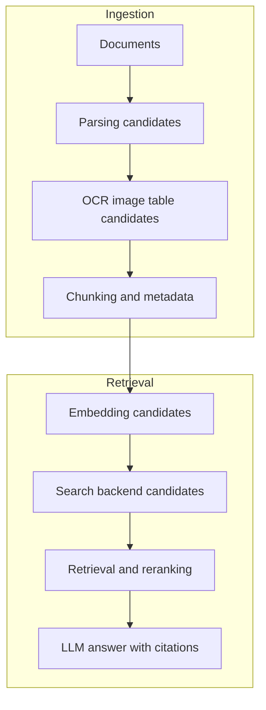
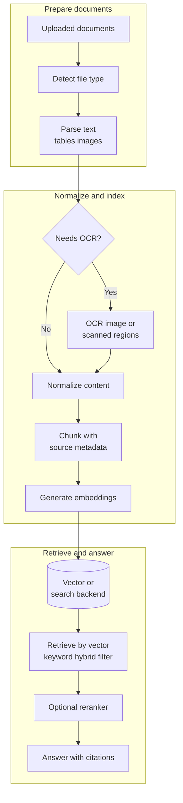
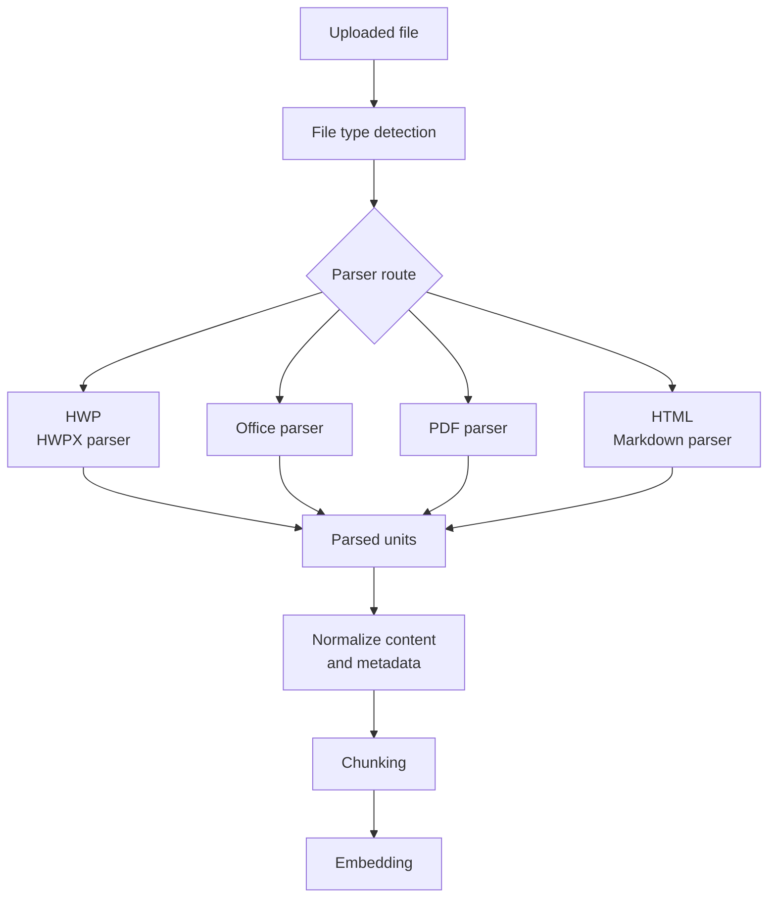
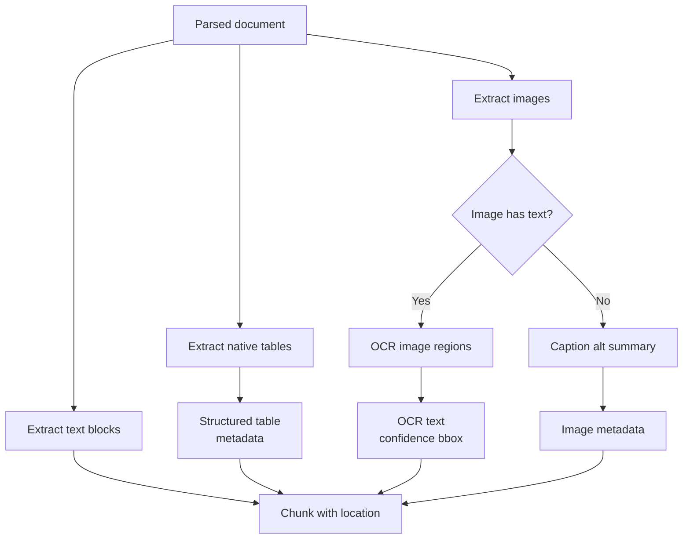
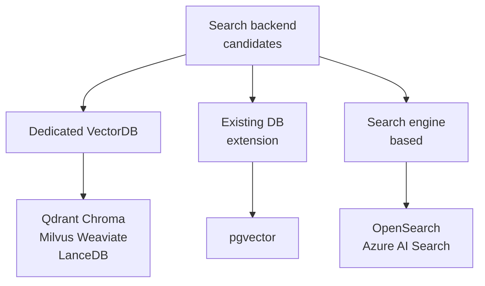

# RAG Pipeline Research Summary

작성일: 2026-05-18  
원문: [rag-pipeline-research.md](rag-pipeline-research.md)

## Purpose

이 문서는 RAG pipeline에 들어가는 주요 component 후보를 비교하기 위한 요약본이다. 목적은 특정 기술을 추천하거나 확정하는 것이 아니라, `parser`, `OCR/image/table 처리`, `embedding model`, `VectorDB/search backend`, `tuning parameter` 후보를 같은 기준으로 비교할 수 있게 정리하는 것이다.

예를 들어 VectorDB 영역에서는 `pgvector`, `Qdrant`, `OpenSearch`, `Azure AI Search` 같은 후보를 기술 특성, 운영 방식, 검색 기능, 튜닝 가능성 기준으로 비교한다.

## RAG Workflow

## 자세한 RAG Workflow

## 후보 비교

| Layer | 비교 후보 | 핵심 비교 기준 |
| --- | --- | --- |
| Document parsing | Docling, Unstructured, MarkItDown, Apache Tika, format-specific parsers | 파일 형식 coverage, table/image 보존, citation metadata, fallback 가능성 |
| OCR / image / table | Tesseract, OCRmyPDF, PaddleOCR, EasyOCR, docTR, LayoutParser, Surya, Azure AI Document Intelligence | OCR 정확도, 이미지 metadata, 표 구조 복원, 배포 비용, license |
| Embedding model | OpenAI embedding models, Qwen3, BGE-M3, Arctic Embed, E5, mxbai, nomic, MiniLM | 한국어/다국어 품질, dimension, context length, API/self-host 비용 |
| Search backend | Qdrant, Chroma, Milvus, Weaviate, LanceDB, pgvector, OpenSearch, Azure AI Search | vector search, keyword search, hybrid search, metadata filtering, 운영 난이도 |
| Tuning | HNSW, IVF, metric, quantization, filtering, sharding | recall, latency, memory, index build time, 운영 비용 |

## Parsing and Normalization

문서는 바로 embedding하지 않고, 먼저 RAG에 적합한 중간 표현으로 변환한다. 핵심은 `text`, `tables`, `images`, `metadata`, `source location`, `warnings`를 분리해서 저장하는 것이다.

| 문서 영역 | 주요 후보 | Key point |
| --- | --- | --- |
| Cross-format parser | Docling, Unstructured, MarkItDown, Apache Tika | 여러 포맷을 한 흐름으로 처리할 수 있으나, 복잡한 문서는 실제 샘플 검증 필요 |
| HWP/HWPX | pyhwp, extract-hwp, HWPX XML parser | 한국 문서 대응에 필요하며, 표/이미지/암호화 문서 edge case 검증 필요 |
| Word/PPT/Excel | python-docx, python-pptx, openpyxl, python-calamine | 구조 정보가 비교적 명확하므로 section, slide, sheet, cell range 보존 중요 |
| PDF | PyMuPDF, PyMuPDF4LLM, pdfplumber, Docling, Unstructured | born-digital PDF와 scanned PDF를 분리하고 table 품질을 별도 평가 |
| Markdown/HTML | markdown-it-py, frontmatter, BeautifulSoup, trafilatura | heading path, link, image alt, table을 metadata로 보존 |

## OCR, Image, and Table Handling

이미지와 표가 많은 문서는 text parser만으로 부족하다. OCR은 스캔 문서나 이미지 안 텍스트를 읽는 경로이고, 표 처리는 native table, PDF table, Excel table의 구조를 보존하는 경로다.

| 후보 | 제공 형태 | 비교 포인트 |
| --- | --- | --- |
| Tesseract | OSS | offline OCR baseline, 표 구조 복원은 약함 |
| OCRmyPDF | OSS | 스캔 PDF에 OCR text layer 추가, table extraction은 별도 필요 |
| PaddleOCR / PP-Structure | OSS | OCR, layout, table recognition을 함께 평가하기 좋음 |
| PaddleOCR-VL-1.6 | OSS model / document VLM | table, formula, chart, seal, text spotting을 포함한 document parsing 후보 |
| EasyOCR / docTR | OSS | OCR PoC 후보, table structure는 별도 pipeline 필요 |
| LayoutParser | OSS | OCR 전 layout region 분리에 유용 |
| LocateAnything-3B | NVIDIA research model | OCR text 추출보다 document/layout/text localization과 citation bbox 보조 후보 |
| Surya | OSS code, license 검토 필요 | OCR, layout, table, reading order 후보이나 license 확인 필요 |
| Azure AI Document Intelligence | Managed service / container option | OCR, layout, table extraction, Markdown output을 함께 제공하는 필수 비교 후보 |

## Search Feature Requirements

| Feature | RAG에서 필요한 이유 |
| --- | --- |
| Dense vector search | 표현이 달라도 의미가 비슷한 chunk를 찾기 위해 필요 |
| Keyword / full-text search | 정확한 용어, 코드, 제품명, 약어 검색에 필요 |
| Hybrid search | 의미 검색과 정확한 단어 검색을 함께 사용해 recall 개선 |
| Metadata filtering | 권한, tenant, source, 날짜, 문서 타입 제한에 필요 |
| Reranking | 1차 검색 결과의 precision을 높여 LLM context 품질 개선 |
| Citation support | 답변이 page, slide, sheet, heading, cell range로 돌아갈 수 있어야 함 |

## VectorDB 후보 비교

이 리서치의 핵심 비교 대상이다. 후보는 전용 VectorDB, 기존 DB 확장형, 검색엔진 기반으로 나누어 본다.

| Category | Candidates | 장점 | 단점 |
| --- | --- | --- | --- |
| 전용 VectorDB | Qdrant, Chroma, Milvus, Weaviate, LanceDB | vector search에 최적화, metadata filtering과 ANN index 기능이 풍부 | 업무 데이터 관리나 권한 모델은 별도 설계 필요 |
| 기존 DB 확장형 | pgvector | PostgreSQL 운영 경험, SQL/JOIN/transaction, 권한/metadata filtering 활용 가능 | 대규모 vector workload와 OLTP workload 리소스 격리 필요 |
| 검색엔진 기반 | OpenSearch, Azure AI Search | full-text, keyword, vector, hybrid search를 자연스럽게 결합 | 순수 vector DB보다 설정이 무겁거나 managed service 종속성 발생 |

### 후보 장단점

| Candidate | Category | 장점 | 단점 / 주의점 | 비교 포인트 |
| --- | --- | --- | --- | --- |
| Qdrant | 전용 VectorDB | Rust 기반으로 성능과 배포 모델이 단순하다. payload metadata filtering이 RAG 문서 검색에 잘 맞는다. dense/sparse/hybrid retrieval 구성이 가능하다. | 일반 업무 데이터까지 함께 관리하는 DB는 아니다. hybrid search와 reranking pipeline은 직접 설계해야 한다. | self-host OSS VectorDB 기준 후보. metadata filter가 많은 RAG에서 pgvector/OpenSearch/Azure AI Search와 비교한다. |
| Chroma | 전용 VectorDB | Python RAG ecosystem과 연동이 쉽다. local-first PoC 속도가 빠르다. document, metadata, embedding 저장 흐름이 단순하다. | 대규모 운영, backup, access control, multi-tenant 요구사항은 추가 검토가 필요하다. 장기 production 운영 전략을 별도로 확인해야 한다. | 빠른 PoC baseline 후보. production 후보보다는 개발 속도와 간단한 실험 편의성을 본다. |
| Milvus | 전용 VectorDB | 대규모 vector search에 특화되어 있다. 다양한 index type과 분산 배포 구성을 제공한다. 수천만~수억 vector 규모를 고려할 수 있다. | 작은 RAG 프로젝트에는 운영 구성이 무겁다. 구성 요소와 운영 개념이 많아 학습 비용이 있다. | 대규모 corpus 후보. Qdrant/pgvector 대비 scale-out과 운영 복잡도를 비교한다. |
| Weaviate | 전용 VectorDB | schema/object 중심 모델링이 가능하다. vector search, structured filtering, hybrid search, generative search 기능이 풍부하다. automatic vectorization과 외부 embedding import를 모두 지원한다. | schema/module 개념이 단순 chunk 저장보다 무겁다. embedding provider/module 설정에 따라 운영 복잡도가 올라간다. | domain object 중심 RAG 후보. 단순 chunk 검색보다 semantic object modeling이 필요한지 검토한다. |
| LanceDB | 전용 VectorDB | embedded/local workflow와 multimodal retrieval에 잘 맞는다. Rust 기반이고 Python/Node/Rust 연동이 가능하다. disk-based index와 ML data workflow에 강점이 있다. | 전통적인 client-server DB 운영 모델은 별도 검토가 필요하다. 일반 텍스트 RAG만 보면 강점이 특수할 수 있다. | local/edge/multimodal 후보. 서버형 VectorDB와 운영 모델을 비교한다. |
| pgvector | 기존 DB 확장형 | PostgreSQL의 SQL, JOIN, transaction, backup, 권한 모델을 활용할 수 있다. 별도 VectorDB 운영 부담이 작다. metadata filtering과 relational data 결합이 자연스럽다. | 초대형 vector search에서는 전용 VectorDB 대비 튜닝/확장성 한계가 있을 수 있다. OLTP와 vector workload가 같은 DB resource를 공유한다. | 기존 PostgreSQL 기반 시스템의 1차 후보. Azure AI Search/OpenSearch 대비 full-text/hybrid 구성의 구현 부담을 비교한다. |
| OpenSearch | 검색엔진 기반 | BM25/full-text search와 vector search를 함께 쓰기 좋다. keyword, filtering, hybrid search, analytics를 한 인프라에서 다룰 수 있다. | JVM 기반 운영이 무겁다. 순수 vector retrieval만 필요하면 설정과 리소스 비용이 크다. embedding/chunk lifecycle은 별도 pipeline이 필요하다. | 검색엔진 기반 OSS 후보. keyword-heavy 문서 검색에서 VectorDB 계열과 비교한다. |
| Azure AI Search | 검색엔진 기반 / Cloud managed | vector, keyword, hybrid search, semantic ranker를 managed service로 제공한다. Azure OpenAI, Blob Storage, indexer, skillset과 통합하기 쉽다. 운영 부담을 줄일 수 있다. | OSS가 아니며 self-host가 불가능하다. Azure 비용, region, quota, service limit에 종속된다. low-level ANN 튜닝은 전용 VectorDB보다 제한적일 수 있다. | Azure 필수 지원 후보. pgvector/OpenSearch/Qdrant 대비 managed 통합성과 lock-in/cost를 비교한다. |

- 각 후보별 튜닝 파라미터가 있어서 리서치가 필요할 듯 하다.

## Embedding Model 비교

Embedding model은 문서 chunk와 query를 같은 vector space에 올리는 component다. 모델과 dimension이 바뀌면 대개 전체 re-embedding과 index rebuild가 필요하다.

| Group | Candidates | 장점 | 주의점 |
| --- | --- | --- | --- |
| OpenAI API | `text-embedding-3-small`, `text-embedding-3-large`, `text-embedding-ada-002` | 운영이 단순하고 품질/성능 baseline으로 쓰기 좋음 | API 비용, rate limit, 외부 의존성, data policy 확인 필요 |
| OSS / open-weight | Qwen3, BGE-M3, Arctic Embed, E5, mxbai, nomic, MiniLM | self-host 가능, 비용/프라이버시 통제력 높음 | GPU/CPU serving, latency, 한국어 품질을 직접 검증해야 함 |

### OpenAI Embedding 후보 세부 비교

| Model | 차원 / 입력 길이 | 장점 | 단점 / 주의점 | 비교 포인트 |
| --- | --- | --- | --- | --- |
| `text-embedding-3-small` | 기본 1536d, max input 8192 tokens, `dimensions` 축소 가능 | 운영 인프라가 거의 필요 없다. 비용/품질 균형이 좋다. RAG baseline으로 빠르게 실험하기 좋다. | 외부 API 의존성이 있다. 대량 ingestion 시 비용, rate limit, network latency를 고려해야 한다. | OpenAI managed baseline. OSS self-host 후보와 품질/비용/운영 부담을 비교한다. |
| `text-embedding-3-large` | 기본 3072d, max input 8192 tokens, `dimensions` 축소 가능 | OpenAI embedding 중 품질 우선 후보이다. dimension 축소로 VectorDB 제한이나 저장 비용에 맞출 수 있다. | raw vector 크기와 index memory 비용이 커진다. `small` 대비 API 비용과 저장 비용을 더 신중히 봐야 한다. | 품질 우선 managed 후보. 3072d 그대로 쓸지 1024d/1536d로 줄일지 평가한다. |
| `text-embedding-ada-002` | 1536d, max input 8192 tokens | 기존 legacy index와 호환성이 좋다. 이미 구축된 1536d index migration 부담이 낮다. | 3세대 embedding보다 신규 구축 매력은 낮다. `dimensions` 축소 같은 최신 유연성이 부족하다. | 기존 시스템 호환 목적 후보. 신규 PoC에서는 3세대 모델과 비교 기준으로만 본다. |

### OSS / Open-weight Embedding 후보 세부 비교

| Model | License / 언어 | 차원 / 입력 길이 | 장점 | 단점 / 주의점 | 배포 포인트 |
| --- | --- | --- | --- | --- | --- |
| Qwen3-Embedding-0.6B | Apache 2.0, 100+ languages | 최대 1024d, 32K context, MRL, instruction-aware | 다국어/코드/긴 문서 retrieval에 강하다. 출력 차원을 32~1024 범위로 조절할 수 있다. 0.6B라 Qwen3 계열 중 가장 가볍다. | small encoder보다는 무겁다. query instruction, tokenizer, pooling 등 구현 세부를 맞춰야 한다. | GPU 권장, CPU도 PoC 가능. TEI, vLLM, sentence-transformers 후보. |
| Qwen3-Embedding-4B / 8B | Apache 2.0, 100+ languages | 4B: 2560d, 8B: 4096d, 32K context, MRL, instruction-aware | 품질 우선 OSS 후보이다. 다국어, code retrieval, long-context retrieval 평가에 적합하다. 같은 Qwen reranker와 조합하기 쉽다. | embedding만 위해 대형 GPU를 상시 쓰는 비용이 크다. 차원이 커서 VectorDB storage/index 비용도 증가한다. | 4B는 16GB+ VRAM, 8B는 24GB+ VRAM급부터 검토. 대량 ingestion은 batch/offline job으로 분리한다. |
| BAAI/bge-m3 | MIT, multilingual | 1024d, 8192 tokens | dense, sparse, multi-vector retrieval을 모두 지원한다. hybrid retrieval 실험에 좋다. 다국어 RAG baseline으로 많이 쓰기 좋다. | dense-only로 쓰면 장점 일부를 못 쓴다. sparse/multi-vector까지 쓰면 index/query pipeline이 복잡해진다. | GPU 권장, CPU 가능. FlagEmbedding 또는 sentence-transformers 기반 배포. |
| Snowflake Arctic Embed L v2.0 | Apache 2.0, 74 languages | 1024d, multilingual retrieval | 영어와 multilingual retrieval을 함께 고려한 후보이다. MRL/압축 친화적이라 저장 비용 최적화 실험에 좋다. | 568M급이라 경량 모델보다 리소스가 더 든다. 한국어 품질은 실제 corpus로 별도 검증해야 한다. | GPU 권장. TEI 또는 sentence-transformers 기반 배포. |
| intfloat/multilingual-e5-large | MIT, 94 languages | 1024d, 512 token 중심 | 널리 쓰이는 multilingual baseline이다. 구현이 단순하고 생태계 지원이 좋다. | 긴 chunk는 512 token 제한으로 잘릴 수 있다. `query:` / `passage:` prefix 규칙을 지켜야 품질이 안정적이다. | GPU 권장, CPU 가능. 짧은 chunk 중심 RAG baseline에 적합. |
| mixedbread-ai/mxbai-embed-large-v1 | Apache 2.0, English 중심 | 1024d 계열, MRL/quantization 지원 | 영어 retrieval 품질이 좋고 배포 옵션이 많다. Matryoshka와 binary quantization으로 저장 비용을 줄이기 좋다. GGUF/llama.cpp/Ollama/Transformers.js 선택지가 있다. | 한국어/다국어 중심 RAG에는 별도 평가가 필요하다. retrieval query prompt 규칙을 지켜야 한다. | GPU/CPU/로컬 실행 모두 검토 가능. 영어 문서 비중이 높을 때 후보로 본다. |
| nomic-ai/nomic-embed-text-v1.5 | Apache 2.0, English 중심 | 768d, 8192 tokens, MRL 64~768d | long-context English embedding에 강하다. MRL로 dimension을 줄여 저장 비용을 낮출 수 있다. open data/code 지향성이 강하다. | task prefix가 필수에 가깝다. 한국어 품질은 제한적일 수 있다. | CPU/GPU 모두 가능. 작은 서버에서는 256d/512d 축소 실험 가능. |
| sentence-transformers/all-MiniLM-L6-v2 | Apache 2.0, English | 384d, 256 word pieces truncate | 매우 작고 빠르다. CPU PoC와 edge/local 실험에 좋다. VectorDB 저장 비용이 낮다. | 영어/짧은 문장 중심이다. 긴 chunk와 한국어 RAG에는 한계가 크다. | CPU 2~4 vCPU급 PoC 가능. 품질 baseline보다는 저비용 baseline으로 본다. |

### Embedding 후보 비교 기준

| 기준 | 확인할 내용 |
| --- | --- |
| 언어 | 한국어/영어/다국어 문서 비율에 맞춰 실제 corpus retrieval eval을 수행한다. |
| chunk 길이 | 512 token 이하 chunk인지, 긴 조항/매뉴얼 chunk인지에 따라 모델 후보가 달라진다. |
| dimension | dimension이 커질수록 VectorDB 저장 공간, memory, index build time이 증가한다. |
| API vs self-host | OpenAI API는 운영이 단순하고, OSS self-host는 통제력이 높지만 serving 운영이 필요하다. |
| migration | embedding model이나 dimension 변경은 대부분 전체 re-embedding과 index rebuild를 요구한다. |
| hybrid retrieval | sparse/multi-vector 기능을 쓸지, dense-only로 단순화할지 PoC에서 분리 평가한다. |
