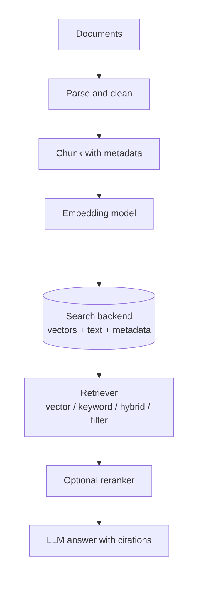
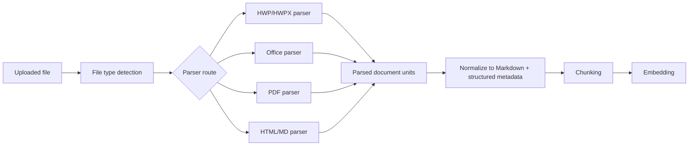
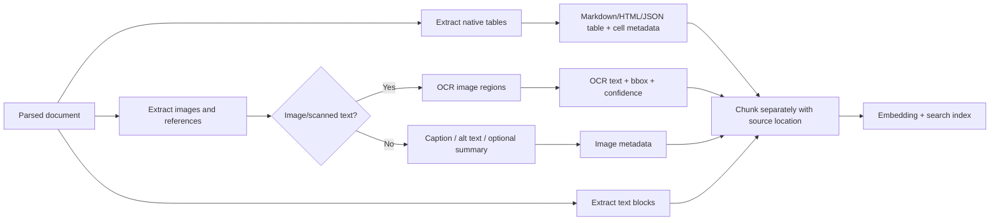

# RAG Pipeline Research: Search Backends and Embedding Models

작성일: 2026-05-14

## RAG Flow Visualization

## Document Parsing Strategy

첨부 문서는 바로 embedding하지 않고, 먼저 RAG에 적합한 중간 표현으로 변환한다. 중간 표현은 `text`, `tables`, `images`, `metadata`, `source location`을 분리해서 보관하는 것이 좋다.

### Parsing Output Schema

| Field | 설명 |
| --- | --- |
| `source_id` | 업로드 파일 또는 외부 문서의 고유 ID |
| `file_type` | `hwp`, `hwpx`, `docx`, `pptx`, `xlsx`, `pdf`, `md`, `html` 등 |
| `unit_type` | PDF page, PPT slide, Excel sheet/row range, Word section, HTML heading section 같은 chunk 이전 단위 |
| `unit_index` | page number, slide number, sheet name 등 citation에 필요한 위치 정보 |
| `text` | 검색과 embedding에 사용할 정규화 텍스트 |
| `tables` | 표 구조를 보존한 Markdown/JSON/CSV 표현 |
| `images` | 이미지 파일 참조, OCR 결과, alt text, caption |
| `metadata` | 제목, 작성자, 생성일, 수정일, 파일명, mime type, 권한/tenant 정보 |
| `warnings` | 암호화, OCR 필요, 깨진 파일, 누락된 이미지, parsing 실패 같은 상태 |
| `store_location` | 파싱된 컨텐츠의 저장소 위치 |

## Python Document Parsing Libraries

### Cross-format Parsers

| Library | 지원 범위 | 장점 | 단점 | 배포/운영 스펙 |
| --- | --- | --- | --- | --- |
| [Docling](https://github.com/docling-project/docling) | PDF, DOCX, PPTX, XLSX, HTML, Markdown, CSV, images 등 | 문서를 unified representation으로 변환하고 Markdown/JSON으로 내보내기 좋다. PDF에서 layout, table, reading order, OCR 같은 RAG 친화 기능이 강하다. Office와 HTML까지 하나의 API로 처리할 수 있다. | HWP/HWPX는 기본 지원 대상이 아니다. PDF/OCR/표 추출까지 켜면 CPU/GPU와 모델 의존성이 커질 수 있다. 단순 파일에는 format-specific library보다 무거울 수 있다. | Python package/CLI로 배포 가능. PDF OCR을 쓸 경우 Tesseract/EasyOCR 또는 관련 모델 의존성 확인 필요. 대량 처리에는 worker queue와 batch conversion 구조 권장. |
| Unstructured | PDF, DOC/DOCX, PPT/PPTX, XLS/XLSX, HTML, Markdown, images, email 등 | `partition()` 하나로 다양한 파일을 document elements로 나눌 수 있다. title, paragraph, table 같은 element type이 있어 chunking 전처리에 좋다. legacy Office까지 포함한 폭넓은 format coverage가 장점이다. | optional dependency가 많고 설치가 무거워질 수 있다. PDF `hi_res`/OCR 전략은 속도와 리소스 비용이 커진다. HWP는 문서/제품 경로별 지원 범위를 실제 샘플로 확인해야 한다. | `unstructured[pdf,docx,pptx,xlsx]` 식으로 필요한 extra만 설치 권장. OCR/hi_res 사용 시 별도 system dependency와 worker 격리 필요. |
| MarkItDown | PDF, DOCX, PPTX, XLSX, HTML, CSV, images 등 Markdown 변환 | LLM/RAG용 Markdown 변환이 목적이라 출력 형식이 단순하다. Office 문서를 빠르게 Markdown으로 바꾸는 PoC에 좋다. 선택적 extra 설치 방식이라 가볍게 시작할 수 있다. | 구조적 metadata나 page/slide/sheet 단위 제어는 Docling/Unstructured보다 약할 수 있다. 복잡한 PDF, 표, 이미지 중심 문서에서는 품질 검증이 필요하다. HWP/HWPX는 별도 경로가 필요하다. | Python library/CLI로 배포 가능. 파일별 extra 설치 필요: `[pdf]`, `[docx]`, `[pptx]`, `[xlsx]` 등. 가벼운 ingestion worker에 적합. |
| Apache Tika / tika-python | 매우 넓은 문서 format detection/extraction, Office, PDF, HTML 등 | format coverage가 넓고 metadata extraction에 강하다. legacy Office나 예외 파일 fallback으로 유용하다. Tika Server로 분리하면 Python app과 파서 runtime을 격리할 수 있다. | Java runtime 또는 Tika Server 운영이 필요하다. RAG용 세밀한 구조, layout, table 품질은 format-specific parser보다 약할 수 있다. 텍스트 추출 fallback 성격으로 보는 편이 안전하다. | JVM 필요. production은 Tika Server를 별도 container로 띄우고 timeout/file-size limit 적용 권장. |

### Format-specific Parsers

| 문서 종류 | 확장자 | Python library 후보 | 장점 | 단점/주의점 | RAG parsing 기준 |
| --- | --- | --- | --- | --- | --- |
| 한글 | `.hwp`, `.hwpx` | `pyhwp`, `extract-hwp`, HWPX custom parser(`zipfile` + `lxml`/`BeautifulSoup`) | 한국 공공/기업 문서에서 HWP/HWPX 대응이 가능하다. HWPX는 ZIP 안의 XML이라 Python 표준 라이브러리로도 기본 텍스트 추출이 가능하다. `pyhwp`는 HWP 5.0 binary 분석/텍스트 변환에 오래 쓰인 도구다. | HWP binary는 포맷이 복잡하고 암호화/압축/embedded object edge case가 많다. Python 생태계가 DOCX/PDF만큼 성숙하지 않다. 표/각주/머리말/꼬리말/이미지 보존 품질은 실제 샘플 테스트가 필요하다. | HWPX는 XML node 순서 기반으로 paragraph/table을 추출한다. HWP는 우선 text extraction을 안정화하고, citation은 section/paragraph offset 중심으로 설계한다. 실패 시 LibreOffice/Hancom 변환 또는 수동 fallback 경로를 둔다. |
| Word | `.docx`, `.doc` | `Docling`, `Unstructured`, `python-docx`, `mammoth`, `Apache Tika` | `.docx`는 OOXML이라 `python-docx`로 paragraph/table 추출을 직접 제어하기 좋다. Docling/MarkItDown을 쓰면 Markdown 변환이 빠르다. Unstructured/Tika는 `.doc` legacy fallback에 유리하다. | `python-docx`는 `.docx` 중심이고 `.doc`는 직접 지원하지 않는다. 복잡한 레이아웃, 텍스트 박스, 주석, 변경 추적, embedded object는 누락 가능성이 있다. legacy `.doc`는 Tika/LibreOffice 변환 fallback을 고려한다. | 제목 스타일, heading level, paragraph, table을 보존한다. metadata에 section index, heading path, table index를 넣는다. |
| PowerPoint | `.pptx`, `.ppt` | `Docling`, `Unstructured`, `python-pptx`, `Apache Tika` | slide 단위가 citation 단위와 잘 맞는다. `python-pptx`로 slide, shape, notes를 직접 순회할 수 있다. Docling/Unstructured는 Markdown/element 변환에 편하다. | `python-pptx`는 `.pptx` 중심이고 `.ppt` legacy는 fallback이 필요하다. 그림 안 텍스트는 OCR이 없으면 추출되지 않는다. 레이어/도형 순서 때문에 읽기 순서가 어색할 수 있다. | slide number, title, body, notes, table, image caption을 분리한다. 도형 좌표 기반 reading order 정렬을 검토한다. |
| Excel | `.xlsx`, `.xls`, `.xlsb`, `.csv` | `openpyxl`, `python-calamine`, `pandas`, `Docling`, `Unstructured` | sheet/table 구조가 명확하다. `openpyxl`은 `.xlsx` cell, formula, style, merged cell 제어가 좋다. `python-calamine`은 Rust 기반으로 `.xls`, `.xlsx`, `.xlsb`, `.ods`를 읽는 데 유리하다. `pandas`는 표 분석/정규화에 편하다. | Excel은 “문서”보다 “데이터”라 단순 텍스트화하면 의미가 무너질 수 있다. formula 결과는 파일에 저장된 cached value 의존성이 있다. merged cells, hidden sheets, pivot/charts, comments는 별도 처리해야 한다. | sheet별로 table range를 감지하고 Markdown table 또는 row JSON으로 변환한다. sheet name, cell range, header row, formula/cached value 여부를 metadata에 넣는다. |
| PDF | `.pdf` | `PyMuPDF`, `PyMuPDF4LLM`, `pdfplumber`, `Docling`, `Unstructured`, `pypdf` | PyMuPDF/PyMuPDF4LLM은 빠르고 Markdown 변환에 좋다. pdfplumber는 table과 layout debugging에 강하다. Docling/Unstructured는 OCR/layout/table pipeline까지 포함할 수 있다. pypdf는 가벼운 text extraction과 PDF 조작에 좋다. | PDF는 presentation format이라 읽기 순서와 표 복원이 어렵다. 스캔 PDF는 OCR 없이는 텍스트가 없다. 2단/다단, footnote, header/footer, 표가 많은 문서는 파서별 결과 차이가 크다. | born-digital PDF는 PyMuPDF4LLM/Docling으로 Markdown 추출한다. 표 중심 문서는 pdfplumber/Docling으로 table 추출을 별도 평가한다. 스캔 PDF는 OCR + page image reference를 metadata에 남긴다. |
| Markdown | `.md`, `.mdx` | `markdown-it-py`, `python-frontmatter`, `mistune`, plain text parser | 이미 RAG 친화 텍스트라 손실이 적다. heading 기반 chunking이 쉽다. front matter에서 title/tags/date/source metadata를 얻기 좋다. | Markdown flavor가 다양하다: CommonMark, GitHub Flavored Markdown, MDX, MyST 등. HTML block, code fence, table 처리 규칙을 정해야 한다. 이미지 alt text와 링크 target을 metadata로 남겨야 한다. | frontmatter를 metadata로 분리한다. heading path, code block language, table, link, image alt를 보존한다. |
| HTML | `.html`, `.htm` | `BeautifulSoup4`, `lxml`, `trafilatura`, `inscriptis`, `readability-lxml` | DOM 구조를 이용해 title, heading, table, link를 보존하기 쉽다. BeautifulSoup은 깨진 HTML에도 강하다. trafilatura는 웹페이지의 boilerplate 제거와 main content 추출에 유리하다. | 업로드 HTML인지 웹페이지 저장본인지에 따라 전략이 달라진다. script/style/nav/footer 제거가 필요하다. 동적 JS 렌더링 결과물은 별도 브라우저 렌더링이 필요할 수 있다. | 업로드 HTML은 DOM 기반으로 heading/table/link를 보존한다. 웹페이지 HTML은 trafilatura/readability로 main content를 우선 추출한다. URL, anchor, heading path를 citation metadata로 남긴다. |

## Parsing Pipeline Recommendation

| 단계 | 처리 내용 | 라이브러리 후보 |
| --- | --- | --- |
| 1. File detection | extension, MIME, magic bytes로 실제 타입 확인 | `python-magic`, `filetype`, Tika detector |
| 2. Primary parsing | 지원 format별 최우선 parser로 Markdown/JSON 추출 | Docling, format-specific libraries |
| 3. Fallback parsing | primary parser 실패 시 더 넓은 coverage의 parser로 텍스트 추출 | Unstructured, Apache Tika, LibreOffice conversion |
| 4. OCR | 이미지/스캔 PDF/슬라이드 이미지 텍스트 추출 | Docling OCR, Unstructured hi_res, Tesseract, EasyOCR |
| 5. Normalization | 공백, header/footer, page break, table, link, image ref 정규화 | custom Python pipeline |
| 6. Unit metadata | page/slide/sheet/heading/cell range 단위로 citation 정보 저장 | custom schema |
| 7. Quality gate | 빈 텍스트, 낮은 OCR confidence, 암호화 파일, 과대 파일 감지 | custom validation |

## OCR, Image, and Table Extraction

이미지와 표가 많은 문서는 일반 text parser만으로는 충분하지 않다. OCR은 스캔 PDF나 이미지 안의 텍스트를 읽는 경로이고, 표는 native table/PDF table/Excel table의 구조를 보존하는 경로로 별도 평가해야 한다.

| Tool / Service | License / 제공 형태 | 주요 기능 | 장점 | 단점/주의점 | 배포 스펙 |
| --- | --- | --- | --- | --- | --- |
| Tesseract OCR | Apache 2.0 OSS | 이미지 OCR, language pack 기반 다국어 인식 | 가장 오래 쓰인 OSS OCR 엔진이다. offline/self-host가 쉽고 비용이 없다. OCRmyPDF, LayoutParser 등 다른 도구의 backend로도 자주 쓰인다. | 표 구조 복원은 약하다. 스캔 품질, 회전, 왜곡, 작은 글자에 민감하다. 한글은 language pack 품질을 실제 샘플로 검증해야 한다. | CPU 배포 가능. 대량 처리 시 page image preprocessing, deskew, binarization 권장. Docker image에 language pack 포함 필요. |
| OCRmyPDF | MPL-2.0 OSS | 스캔 PDF에 OCR text layer 추가, searchable PDF/PDF-A 생성 | PDF batch OCR에 강하다. Tesseract 기반으로 multilingual OCR을 사용할 수 있다. 기존 PDF를 searchable PDF로 보존하는 workflow에 좋다. | table structure extraction 도구는 아니다. RAG용 Markdown/JSON table은 별도 parser가 필요하다. Ghostscript, Tesseract 같은 system dependency가 필요하다. | CPU 중심 배포. worker에서 `--deskew`, `--rotate-pages`, language option을 문서별로 조정. 긴 PDF는 timeout/page limit 필요. |
| PaddleOCR / PP-Structure | Apache 2.0 OSS | OCR, layout analysis, table recognition, key information extraction | 80+ languages와 Korean 모델을 지원한다. PP-Structure로 text/title/table/image/list 등 layout과 table structure를 다룰 수 있다. 이미지 OCR과 문서 layout/table extraction을 함께 평가하기 좋다. | PaddlePaddle runtime 의존성이 있다. CPU도 가능하지만 table/layout 처리에는 GPU가 유리하다. 표 구조 품질은 문서 도메인별 평가가 필요하다. | GPU 권장, CPU 가능. OCR worker image에 PaddlePaddle/PaddleOCR 모델 cache 포함. table-heavy 문서는 batch size와 page parallelism 튜닝 필요. |
| PaddleOCR-VL-1.6 | Apache 2.0 OSS model / document VLM | page-level document parsing, OCR, table, formula, chart, seal, text spotting, Markdown/JSON export | 0.9B급 document VLM으로 복잡한 표/수식/차트/도장 문서를 구조화하기 좋다. v1.5와 architecture가 호환되어 migration 부담이 낮다. 공식 PaddleOCR path와 vLLM serving path를 모두 제공한다. | 일반 OCR pipeline보다 무겁고 GPU serving을 전제로 평가해야 한다. VLM 계열이라 hallucination과 task prompt 안정성을 별도 검증해야 한다. 한국어 품질은 실제 corpus로 확인해야 한다. | GPU 권장. `paddleocr[doc-parser]>=3.6.0`, PaddlePaddle 3.2.1+ 기준. JSON/Markdown 결과와 bbox를 함께 저장하고 table-heavy page에 우선 적용. |
| EasyOCR | Apache 2.0 OSS | ready-to-use OCR, 80+ languages | 설치와 사용이 간단하다. 한글을 포함한 CJK 계열 OCR 실험에 빠르게 쓸 수 있다. PyTorch 기반이라 GPU 가속이 가능하다. | table structure recognition은 직접 제공하지 않는다. layout/table 복원은 LayoutParser나 custom post-processing이 필요하다. 대량 처리 latency는 Tesseract보다 클 수 있다. | CPU 가능, GPU 권장. 가벼운 OCR fallback 또는 이미지 caption/OCR 보조 경로로 적합. |
| docTR | Apache 2.0 OSS | deep learning OCR, PDF/image OCR, word-level detection/recognition | PyTorch 기반 end-to-end OCR pipeline을 제공한다. PDF와 image 입력을 모두 처리한다. word/block/page 구조를 JSON으로 export하기 좋다. | table structure recognition 자체가 핵심 기능은 아니다. 한국어/한글 성능은 실제 샘플 검증이 필요하다. GPU 없는 대량 처리에는 부담이 있다. | Python 3.10+, PyTorch 기반. GPU-ready Docker image 제공. OCR result를 layout/table parser와 결합하는 방식 권장. |
| LayoutParser | Apache 2.0 OSS | document layout detection, OCR agent integration | OCR 전에 table/text/title/figure 영역을 찾는 데 유용하다. Tesseract 등 OCR agent와 결합할 수 있다. 문서 이미지 분석 pipeline을 조립하기 좋다. | OCR engine 자체라기보다 layout analysis toolkit이다. Detectron2 등 모델 의존성이 무거울 수 있다. table cell 구조 인식은 별도 모델/후처리가 필요하다. | GPU 권장. layout detection 후 crop별 OCR을 수행하는 pipeline 구성에 적합. |
| Surya | GPL-3.0 code + model license 제한 | OCR, layout analysis, reading order, table recognition, LaTeX OCR | 90+ languages, reading order, table recognition까지 포함한다. 이미지/PDF의 table cell, row/column detection을 지원한다. complex document OCR 실험 후보로 좋다. | GPL-3.0 및 model license 조건을 제품 배포 전에 확인해야 한다. commercial self-hosting은 별도 라이선스가 필요할 수 있다. 프로덕션 도입 전 법무/라이선스 검토가 필요하다. | GPU 권장. 연구/PoC에서 table-heavy 문서 품질 비교 후보로 사용. |
| LocateAnything-3B | NVIDIA non-commercial research model | visual grounding, dense detection, document layout grounding, OCR/text localization | 특정 텍스트/표/도장/문서 영역을 자연어로 찾아 bbox/point로 반환하는 데 유용하다. OCR 결과 citation highlight와 layout grounding 보조 후보로 좋다. vLLM/SGLang/Transformers serving path를 제공한다. | OCR text extraction 엔진이라기보다 localization 모델이다. NVIDIA license가 non-commercial research 중심이라 production 사용 전 법무 검토가 필요하다. task prompt가 English 중심이라 한국어 OCR 자체는 별도 검증해야 한다. | NVIDIA GPU 권장. research benchmark에서 bbox quality, text grounding, layout grounding을 먼저 평가. 상용 route에는 기본 포함하지 않는다. |
| Azure AI Document Intelligence | Proprietary managed service / Azure container option | OCR, layout model, table extraction, selection marks, figures, paragraphs, Markdown output | `prebuilt-layout`이 OCR과 layout/table extraction을 함께 제공한다. Markdown output과 bounding region을 RAG citation에 활용하기 좋다. Azure AI Search / Blob Storage / Azure OpenAI와 통합하기 쉽다. Read/Layout container 옵션도 있다. | OSS가 아니며 Azure 비용, region, quota, network 의존성이 있다. 민감 문서는 data residency와 compliance 확인이 필요하다. 대량 문서 처리 비용을 반드시 산정해야 한다. | Cloud API 사용 시 GPU 불필요. container 사용 시 공식 container별 CPU/memory 요구사항과 connected/disconnected 조건 확인 필요. Azure key/endpoint, retry, rate limit, async polling 처리 필요. |

### OCR, Image, and Table Pipeline

## Search Feature Notes

| 기능 | 설명 | RAG에서의 역할 |
| --- | --- | --- |
| Dense vector search | 문서와 질문을 embedding vector로 변환한 뒤 유사한 vector를 찾는다. | 표현이 달라도 의미가 비슷한 문서를 찾는 데 유리하다. |
| Sparse vector search | BM25나 sparse embedding처럼 단어/토큰 기반 희소 표현을 사용한다. | 용어, 코드, 약어, 제품명, 에러 메시지처럼 정확한 단어 매칭이 중요한 검색에 유리하다. |
| Keyword / full-text search | inverted index 기반으로 텍스트 필드를 검색한다. | 문서 원문, 제목, 태그, 특정 문자열 검색에 유리하다. |
| Hybrid search | vector search와 keyword/sparse search를 함께 실행하고 결과를 병합한다. | 의미 기반 검색과 정확한 단어 검색을 동시에 활용해 recall을 높인다. |
| Metadata filtering | 문서 ID, 권한, 날짜, 카테고리, tenant, source 같은 metadata로 검색 범위를 제한한다. | 사용자별 접근 권한, 문서 범위 제한, 최신 문서 우선 검색에 필요하다. |
| Reranking | 1차 검색 결과를 cross-encoder, semantic ranker, LLM reranker 등으로 다시 정렬한다. | top-k 결과의 precision을 높이고 LLM에 넣을 context 품질을 개선한다. |
| Integrated vectorization | backend나 managed service가 chunking/embedding 생성 단계를 일부 처리한다. | pipeline 구현량을 줄일 수 있지만 model/provider 결합도가 생긴다. |
| Multimodal search | text 외에 image/audio 등 다른 modality의 embedding을 함께 검색한다. | 이미지 포함 문서, 스캔 자료, 시각 자료 기반 검색에 사용된다. |

## Backend Search Feature Summary

| Backend | 주요 검색 기능 |
| --- | --- |
| Qdrant | dense vector search, sparse vector search, hybrid retrieval, payload metadata filtering, reranking 연동 |
| Chroma | dense/sparse/hybrid search, full-text/regex search, document + metadata 저장 |
| Milvus | dense vector search, scalar filtering, hybrid search/BM25 구성, 다양한 vector type과 index |
| Weaviate | vector search, hybrid search, generative search, structured filtering, automatic vectorization |
| LanceDB | vector search, full-text search, scalar filtering, disk-based index, multimodal retrieval |
| pgvector | PostgreSQL 안에서 exact/approximate vector search, HNSW/IVFFlat index, SQL filtering/JOIN, PostgreSQL full-text search와 조합 |
| OpenSearch | keyword/full-text search, BM25, vector search, hybrid search, filtering, analytics |
| Azure AI Search | vector search, keyword/full-text search, hybrid search, semantic ranker, metadata filtering, integrated chunking/vectorization, multimodal/multilingual search |

## Vector Search Backend Comparison

### 1. 전용 VectorDB

| Backend | License / 제공 형태 | 장점 | 단점 |
| --- | --- | --- | --- |
| Qdrant | Apache 2.0 OSS self-host / cloud | Rust 기반이라 성능과 배포 모델이 단순한 편이다. REST/gRPC와 Python, TypeScript, Rust, Go 등 SDK 선택지가 좋다. payload 기반 metadata filtering이 RAG 문서 검색에 잘 맞는다. dense vector, sparse vector, hybrid retrieval, reranking 연동 흐름을 구성하기 좋다. | 일반 업무 데이터까지 함께 관리하는 relational/document DB는 아니다. 아주 큰 분산 클러스터 운영은 별도 설계 검토가 필요하다. RAG 품질 개선을 위한 hybrid search와 reranking 구성은 직접 설계해야 한다. |
| Chroma | Apache 2.0 OSS local / self-host / cloud | Python 기반 RAG 예제와 연동이 쉽다. document, metadata, embedding 저장 흐름이 단순하다. 로컬 개발 경험이 좋아서 PoC 속도가 빠르다. dense, sparse, hybrid search와 full-text/regex search를 제공한다. | 운영 규모가 커질 때 architecture, backup, access control, multi-tenant 요구사항을 더 검토해야 한다. Python 중심 워크플로가 편한 만큼 Rust 중심 시스템에는 별도 통합 계층이 필요할 수 있다. 장기 production 운영 관점에서는 전용 운영 전략을 따로 확인해야 한다. |
| Milvus | Apache 2.0 OSS self-host / Zilliz Cloud | 대규모 vector search에 특화된 성숙한 OSS 프로젝트다. 다양한 index/vector type과 분산 배포 구성을 제공한다. 수천만~수억 단위 벡터와 높은 throughput을 고려한 구성이 가능하다. managed 옵션으로 Zilliz Cloud를 사용할 수 있다. | 작은 RAG 프로젝트에는 운영 구성이 무겁다. 구성 요소와 운영 개념이 많아 학습 비용이 있다. 단순 문서 RAG PoC에서는 인프라 복잡도가 먼저 커질 수 있다. |
| Weaviate | BSD 3-Clause OSS self-host / cloud | vector search와 structured filtering을 함께 다루는 데이터 모델이 강하다. automatic vectorization과 외부 embedding import를 모두 지원한다. hybrid search, generative search 같은 RAG 친화 기능이 문서화되어 있다. schema 중심으로 domain object를 모델링하기 좋다. | schema/module 개념이 단순 VectorDB보다 무겁게 느껴질 수 있다. embedding provider/module 설정에 따라 운영 복잡도가 올라간다. 단순히 chunk 저장 후 검색만 필요하면 구조가 커질 수 있다. |
| LanceDB | Apache 2.0 OSS embedded / local / cloud | Rust로 작성되었고 Python, Node.js, Rust, REST API 연동을 제공한다. Lance columnar format 위에 있어 ML 데이터와 multimodal retrieval에 잘 맞는다. disk-based index 철학이라 local, edge, large file workflow에 유리하다. time-travel/versioned data 같은 RAG 실험에 장점이 있다. | 일반적인 client-server VectorDB 운영 경험은 Qdrant/Milvus보다 덜 표준적일 수 있다. 서버, API, 권한, 모니터링 중심의 DB 운영 모델이 필요하면 추가 검토가 필요하다. 텍스트 문서 RAG만 보면 강점이 다소 특수한 편이다. |

### 2. 기존 DB 확장형

| Backend | License / 제공 형태 | 장점 | 단점 |
| --- | --- | --- | --- |
| pgvector | PostgreSQL License OSS PostgreSQL extension | 기존 PostgreSQL 운영 경험, backup, transaction, SQL, JOIN을 그대로 활용할 수 있다. 별도 VectorDB를 운영하지 않아도 되어 작은 팀에서는 운영 부담이 낮다. metadata filtering, 권한 필터, relational data join이 자연스럽다. exact/approximate nearest neighbor search, HNSW, IVFFlat 등을 지원한다. | 초대형 벡터 검색만 놓고 보면 전용 VectorDB보다 튜닝과 확장성이 제한될 수 있다. Postgres에 OLTP와 vector workload가 같이 몰리면 리소스 격리가 어렵다. hybrid search와 reranking pipeline은 SQL/query 설계를 직접 해야 한다. |

### 3. 검색엔진 기반

| Backend | License / 제공 형태 | 장점 | 단점 |
| --- | --- | --- | --- |
| OpenSearch | Apache 2.0 OSS self-host / Amazon OpenSearch Service | full-text search와 vector search를 함께 쓰기 좋다. BM25 기반 keyword search, filtering, semantic search를 결합하기 좋다. RAG에서 중요한 hybrid search를 자연스럽게 구성할 수 있다. 검색, 로그, 분석 인프라를 이미 OpenSearch로 운영 중이면 재사용 가치가 있다. | JVM 기반 검색엔진 운영은 단순 VectorDB보다 무겁다. 순수 vector retrieval만 필요하면 설정과 리소스 비용이 크다. embedding/chunk lifecycle은 별도 pipeline으로 설계해야 한다. |
| Azure AI Search | Proprietary managed service Azure cloud managed | vector, keyword, hybrid search를 단일 search index 안에서 구성할 수 있다. hybrid search는 vector search와 full-text search를 병렬 실행하고 RRF로 결과를 병합한다. semantic ranker로 BM25/RRF 결과를 재정렬할 수 있다. Azure OpenAI, Blob Storage, indexer, skillset과 연동해 chunking/vectorization pipeline을 줄일 수 있다. metadata filtering, multilingual, multimodal search 시나리오를 지원한다. | OSS가 아니며 Azure 종속성이 생긴다. self-host가 불가능하고 비용/쿼터/region 제약을 Azure 정책에 맞춰야 한다. 세밀한 index internals나 low-level ANN 튜닝은 전용 VectorDB보다 제한적일 수 있다. Azure 밖의 embedding/model pipeline과 결합할 때는 네트워크, 인증, 운영 경계가 늘어난다. |

## Criteria Matrix

| Criteria | Qdrant | Chroma | Milvus | Weaviate | LanceDB | pgvector | OpenSearch | Azure AI Search |
| --- | --- | --- | --- | --- | --- | --- | --- | --- |
| Category | 전용 VectorDB | 전용 VectorDB | 전용 VectorDB | 전용 VectorDB | 전용 VectorDB | 기존 DB 확장형 | 검색엔진 기반 | 검색엔진 기반 / 클라우드 관리형 |
| OSS 여부 | OSS | OSS | OSS | OSS | OSS | OSS | OSS | 비OSS |
| Self-host | 가능 | 가능 | 가능 | 가능 | 가능 | 가능 | 가능 | 불가 |
| Cloud managed | 가능 | 가능 | 가능 | 가능 | 가능 | DBaaS에 따라 가능 | 가능 | 가능 |
| Vector search | 좋음 | 좋음 | 매우 좋음 | 좋음 | 좋음 | 좋음 | 좋음 | 좋음 |
| Keyword / full-text search | 제한적 또는 별도 구성 | 좋음 | 별도 구성 | 좋음 | 좋음 | PostgreSQL FTS와 조합 | 매우 좋음 | 매우 좋음 |
| Hybrid search | 좋음 | 좋음 | 좋음 | 좋음 | 보통 | 직접 설계 | 매우 좋음 | 매우 좋음 |
| Metadata filtering | 좋음 | 좋음 | 좋음 | 좋음 | 좋음 | 매우 좋음 | 매우 좋음 | 좋음 |
| Reranking 연동 | 외부 연동 | 외부 연동 | 외부 연동 | 내장/외부 연동 | 외부 연동 | 외부 연동 | 외부 연동 | Semantic ranker 내장 |
| 운영 복잡도 | 보통 | 낮음 | 높음 | 보통 | 보통 | 낮음 | 높음 | 보통 |
| Rust 친화성 | 매우 좋음 | 보통 | 보통 | 보통 | 매우 좋음 | 보통 | 낮음 | 낮음 |

## VectorDB Tuning Parameters

VectorDB 튜닝은 대개 recall, latency, memory, index build time 사이의 tradeoff를 조정하는 일이다. 특히 HNSW/IVF 같은 ANN index는 build-time parameter와 query-time parameter가 분리되어 있고, build-time parameter는 index rebuild가 필요한 경우가 많다.

### Common Tuning Axes

| 영역 | 대표 파라미터 | 튜닝 영향 | 주의점 |
| --- | --- | --- | --- |
| Vector schema | dimension, vector data type, named vectors, multi-vector | 저장 공간, index memory, query latency를 결정한다. | embedding model이나 dimension 변경은 보통 전체 re-embedding과 index rebuild가 필요하다. |
| Distance metric | cosine, dot product, inner product, L2/euclidean, hamming | ranking 기준을 결정한다. embedding normalize 방식과 맞아야 한다. | metric은 생성 후 변경 불가인 DB가 많다. |
| Index type | HNSW, IVF, Flat/exhaustive KNN, DiskANN, PQ/SQ index | 정확도/속도/메모리/빌드 시간의 기본 특성을 결정한다. | 작은 corpus는 exhaustive search가 더 단순하고 안정적일 수 있다. |
| HNSW graph density | `M`, `m`, `maxConnections`, `max_neighbors` | 그래프 연결 수를 늘려 recall을 높일 수 있으나 memory와 build time이 증가한다. | 대부분 index 생성 시점 파라미터라 변경하려면 재색인이 필요하다. |
| HNSW build breadth | `efConstruction`, `ef_construct`, `construction_ef` | index 품질을 높일 수 있으나 indexing 시간이 늘어난다. | ingestion throughput과 초기 색인 시간을 함께 측정한다. |
| HNSW search breadth | `ef`, `efSearch`, `ef_search`, `hnsw_ef` | query-time 후보 탐색 폭을 늘려 recall을 높인다. | 높일수록 latency와 CPU 사용량이 증가한다. |
| IVF partitioning | `nlist`, `lists`, `num_partitions` | vector space를 몇 개 cluster/bucket으로 나눌지 결정한다. | 너무 작으면 bucket 내부 탐색이 느리고, 너무 크면 training/search overhead가 커질 수 있다. |
| IVF query breadth | `nprobe`, `probes`, `nprobes` | query 때 몇 개 partition을 볼지 결정한다. | 높일수록 recall은 오르지만 latency가 증가한다. |
| Quantization/compression | scalar quantization, binary quantization, PQ, `num_sub_vectors`, `num_bits`, compression level | memory와 disk footprint를 줄이고 cache 효율을 높인다. | 정보 손실로 recall이 낮아질 수 있어 rescore/oversampling과 같이 평가한다. |
| Rescoring/oversampling | `rescore`, `oversample_factor`, `defaultOversampling`, `fetch_k` | 압축 index나 1차 후보를 full precision 또는 reranker로 재평가한다. | 후보 수가 늘어 latency가 증가한다. |
| Filtering strategy | payload/scalar index, prefilter/postfilter, ACORN/sweeping, partial index, partitioning | metadata filter가 있는 RAG query의 recall과 latency를 좌우한다. | 필터가 강하면 ANN 후보가 부족해질 수 있어 search breadth를 같이 조정한다. |
| Storage/cache | in-memory/on-disk vectors, mmap, vector cache size, payload index on disk | memory cost와 cold/warm latency를 조절한다. | on-disk 구성은 비용을 줄이지만 tail latency를 악화시킬 수 있다. |
| Sharding/replication | shard count, segment size, replica count, consistency | throughput, availability, rebuild time에 영향을 준다. | shard가 너무 많으면 fan-out overhead가 커질 수 있다. |
| Ingestion/indexing | batch size, sync/flush threshold, indexing threads, parallel workers | ingestion throughput과 index build stability를 조절한다. | query workload와 동시에 돌릴 때 resource contention을 측정한다. |
| Hybrid retrieval | BM25/vector weight, sparse+dense fusion, RRF, semantic reranker | keyword-heavy query와 semantic query의 균형을 조정한다. | VectorDB 내부 파라미터와 reranker 품질을 분리해서 평가한다. |

### Backend-specific Parameter Names

| Backend | 주요 튜닝 파라미터 | 평가 포인트 |
| --- | --- | --- |
| Qdrant | HNSW `m`, `ef_construct`, `full_scan_threshold_kb`, query `hnsw_ef`, `exact`, `quantization.rescore`, vector/HNSW `on_disk`, payload index, shard/replication | filtered search가 많으면 payload index를 먼저 만들고 HNSW graph를 생성하는 흐름을 평가한다. `hnsw_ef`로 query-time recall/latency curve를 측정한다. quantization + rescore와 on-disk 구성을 memory 절감 후보로 본다. |
| Chroma | `space`, `ef_construction`, `ef_search`, `max_neighbors`, `num_threads`, `resize_factor`, `batch_size`, `sync_threshold` | single-node PoC에서 HNSW parameter 변화가 recall/latency에 미치는 영향이 핵심이다. `space`는 embedding metric과 맞춰야 하며, 주요 HNSW build parameter는 collection 생성 시점에 고정될 수 있다. |
| Milvus | HNSW `M`, `efConstruction`, search `ef`; IVF `nlist`, `nprobe`; `metric_type`, index type, segment/index build threshold, mmap | 대규모 corpus에서는 HNSW와 IVF 계열을 모두 비교한다. IVF는 `nlist`/`nprobe` 조합을 반복 실험하고, HNSW는 `M`/`efConstruction`/`ef`의 memory와 latency를 함께 본다. |
| Weaviate | `distance`, `maxConnections`, `efConstruction`, `ef`, `dynamicEfMin`, `dynamicEfMax`, `dynamicEfFactor`, `filterStrategy`, `flatSearchCutoff`, `vectorCacheMaxObjects`, quantization `rq` | dynamic `ef`를 쓸지 고정 `ef`를 쓸지 비교한다. metadata filter가 많은 RAG라면 `filterStrategy`와 `flatSearchCutoff` 영향도 함께 본다. cache와 quantization은 memory budget 기준으로 평가한다. |
| LanceDB | `metric`, `num_partitions`, `num_sub_vectors`, `nprobe`, PQ `num_bits`, index type | local/embedded와 disk-based workflow에 맞춰 IVF-PQ recall/latency를 본다. `num_partitions`와 `nprobe`가 주된 recall/latency 축이고, `num_sub_vectors`/`num_bits`는 압축률과 정확도 tradeoff다. |
| pgvector | HNSW `m`, `ef_construction`, query `hnsw.ef_search`; IVFFlat `lists`, query `ivfflat.probes`; `hnsw.iterative_scan`, `ivfflat.iterative_scan`, `hnsw.max_scan_tuples`, `ivfflat.max_probes`, `hnsw.scan_mem_multiplier`, `halfvec`/binary vector | PostgreSQL filter/JOIN과 vector search를 같이 쓰는 경우 `WHERE` selectivity와 `hnsw.ef_search`를 함께 조정한다. OLTP workload와 index build/query workload가 충돌하지 않도록 DB resource를 측정한다. |
| OpenSearch | method `hnsw`/`ivf`, engine `lucene`/`faiss`, `space_type`, HNSW `m`, `ef_construction`, query `ef_search`, IVF `nprobes`, vector compression, `rescore`, `oversample_factor`, shard/segment 설정 | full-text + vector hybrid search를 함께 튜닝한다. engine별 지원 parameter가 다르므로 Lucene/Faiss 차이를 분리 평가한다. quantized/on-disk index는 rescore와 oversampling까지 포함해 본다. |
| Azure AI Search | HNSW `m`, `efConstruction`, `efSearch`, `metric`, `exhaustiveKnn`, scalar/binary compression, `defaultOversampling`, rescoring options, vector field `dimensions`/`stored`/`retrievable`, filterable metadata fields | managed service라 node-level 튜닝은 제한적이지만 index schema와 HNSW/compression parameter를 조정할 수 있다. HNSW와 exhaustive KNN을 비교해 recall ground truth를 만들고, compression + rescoring 비용을 평가한다. |

### Tuning Experiment Plan

| Step | 내용 | 측정값 |
| --- | --- | --- |
| 1. Ground truth 생성 | 작은 eval set에서 exhaustive KNN 또는 high-recall 설정으로 기준 결과를 만든다. | Recall@k, nDCG@k, MRR |
| 2. Baseline index | 기본 HNSW/IVF 설정으로 색인한다. | index build time, index size, memory, QPS, p95/p99 latency |
| 3. Search-time sweep | `efSearch`/`hnsw_ef`/`nprobe`/`probes`를 단계적으로 올린다. | recall-latency curve |
| 4. Build-time sweep | `M`/`efConstruction`/`nlist`/`num_partitions`를 바꿔 재색인한다. | build time, memory, recall, latency |
| 5. Filtered query test | tenant/project/source/date/file_type filter를 포함한 query를 별도 측정한다. | filtered recall, empty result rate, latency |
| 6. Compression test | quantization/PQ/binary compression과 rescore/oversampling을 조합한다. | memory 절감률, recall drop, latency |
| 7. Hybrid/rerank test | BM25/vector fusion, sparse+dense, semantic reranker 후보를 결합한다. | answer hit rate, precision@k, 비용 |

### Practical Defaults for PoC

- `k`는 답변 context에 실제로 넣을 chunk 수보다 크게 검색하고, reranker나 score threshold로 줄인다.
- HNSW는 먼저 기본값 또는 보수적 설정으로 시작하고, `efSearch` 계열 search-time parameter부터 조정한다.
- recall 부족이 search-time parameter로 해결되지 않을 때 `M`/`efConstruction` 같은 build-time parameter를 올려 재색인한다.
- metadata filter가 강한 query는 payload/scalar index, partial index, partitioning, search breadth를 함께 본다.
- quantization은 memory가 병목일 때만 켜고, 반드시 full precision baseline과 비교한다.
- 최종 설정은 corpus 크기, embedding dimension, query pattern, filter selectivity, p95 latency SLO를 함께 보고 결정한다.

## Embedding Model Notes

| 항목 | 설명 |
| --- | --- |
| 역할 | 원문 chunk와 query를 같은 embedding space의 vector로 변환한다. VectorDB는 이 vector를 저장하고 유사도 검색을 수행한다. |
| 같은 모델 사용 | 문서 embedding과 query embedding은 같은 모델, 같은 차원 수, 같은 normalize/prompt 규칙을 사용해야 한다. |
| 차원 수 고정 | 대부분의 VectorDB index는 vector dimension을 고정한다. 모델이나 dimension을 바꾸면 기존 corpus를 재-embedding하고 index를 다시 만들어야 한다. |
| 저장 비용 | float32 기준 raw vector 크기는 `dimension * 4 bytes`다. 384d는 약 1.5KB, 768d는 약 3KB, 1024d는 약 4KB, 1536d는 약 6KB, 3072d는 약 12KB다. 실제 VectorDB index overhead는 별도다. |
| chunk 길이 | embedding model의 max input보다 chunk가 길면 truncate되거나 에러가 난다. 긴 문서는 model max input보다 chunking 전략이 더 중요하다. |
| 평가 방식 | MTEB 점수는 참고용이다. 실제 문서 도메인, 언어, query 패턴, metadata filter, reranking 포함 여부로 별도 retrieval eval을 해야 한다. |

## OpenAI Embedding Models

| Model | 제공 방식 | 차원 / 입력 길이 | 장점 | 단점 | 배포 스펙 |
| --- | --- | --- | --- | --- | --- |
| text-embedding-3-small | OpenAI API | 기본 1536d max input 8192 tokens `dimensions`로 축소 가능 | 인프라 없이 바로 사용 가능하다. 비용/품질 균형이 좋다. RAG, semantic search, code search에 무난하다. 차원 축소로 저장 비용을 줄일 수 있다. | 외부 API 의존성이 있다. 대량 ingestion 시 rate limit, 비용, 네트워크 latency를 고려해야 한다. self-host 불가다. 민감 데이터는 데이터 처리 정책과 residency를 확인해야 한다. | GPU 불필요. API key와 outbound network 필요. ingestion worker에서 batch 호출 권장. VectorDB index dimension은 1536 또는 지정한 `dimensions` 값으로 생성. |
| text-embedding-3-large | OpenAI API | 기본 3072d max input 8192 tokens `dimensions`로 축소 가능 | OpenAI embedding 중 품질 우선 선택지다. 큰 차원으로 더 풍부한 semantic representation을 얻을 수 있다. 1024d, 1536d 등으로 줄여 VectorDB 제한에 맞출 수 있다. | small보다 비용과 저장 공간이 크다. 3072d float32는 raw vector만 약 12KB/vector라 index 비용이 커진다. API 의존성과 rate limit 고려가 필요하다. | GPU 불필요. API 기반 batch ingestion 구성. 대규모 corpus라면 dimension 축소, float16/quantization 지원 여부, VectorDB index overhead를 함께 검토. |
| text-embedding-ada-002 | OpenAI API | 1536d max input 8192 tokens | 기존 시스템과 호환성이 좋다. legacy index를 유지해야 할 때 migration 부담이 낮다. | OpenAI 공식 문서 기준 3세대 모델보다 성능 지표가 낮다. 신규 구축에서는 보통 3세대 모델을 우선 검토한다. `dimensions` 축소 같은 최신 유연성이 부족하다. | GPU 불필요. 기존 1536d index 유지 목적에 적합. 신규 index라면 3세대 모델과 재평가 필요. |

## OSS / Open-Weight Embedding Models

| Model | License / 언어 | 차원 / 입력 길이 | 장점 | 단점 | 배포 스펙 |
| --- | --- | --- | --- | --- | --- |
| Qwen3-Embedding-0.6B | Apache 2.0 100+ languages | 최대 1024d 32K context MRL 지원 | 최신 OSS 계열에서 품질/효율 균형이 좋다. 긴 context와 다국어/코드 retrieval에 강하다. instruction-aware라 task별 query instruction을 줄 수 있다. 32~1024d 사이로 output dimension 조절이 가능하다. | 0.6B라도 small encoder보다 무겁다. instruction format, padding, transformers 버전 같은 구현 세부사항을 맞춰야 한다. 긴 context를 실제로 쓰면 latency와 메모리 사용량이 커진다. | GPU 권장: 8GB VRAM 이상부터 실용적. CPU도 가능하지만 ingestion throughput은 낮다. TEI, vLLM, sentence-transformers로 배포 가능. 대량 ingestion은 batch size와 max tokens를 낮춰 튜닝. |
| Qwen3-Embedding-4B / 8B | Apache 2.0 100+ languages | 4B: 최대 2560d 8B: 최대 4096d 32K context | 품질 우선 OSS 선택지다. 다국어, code retrieval, long-context retrieval에 강하다. 같은 계열 reranker와 조합하기 쉽다. | 운영 비용이 커진다. embedding 전용 작업에 4B/8B GPU를 상시 할당하는 것은 비용 부담이 크다. 대부분의 일반 문서 RAG에는 과할 수 있다. | GPU 권장: 4B는 16GB+, 8B는 24GB+ VRAM부터 검토. production은 TEI/vLLM + GPU autoscaling 또는 batch ingestion job 구조 권장. 저장 공간도 2560d/4096d 기준으로 크게 증가한다. |
| BAAI/bge-m3 | MIT 100+ languages | 1024d 8192 tokens | dense, sparse, multi-vector retrieval을 모두 지원한다. 다국어와 긴 문서 chunk에 강하다. hybrid retrieval + reranking pipeline에 잘 맞는다. Milvus/Vespa 등 hybrid retrieval 예제가 풍부하다. | 모델이 가벼운 편은 아니다. sparse/multi-vector까지 쓰면 indexing 구조와 query pipeline이 복잡해진다. dense-only로 쓰면 장점 일부를 못 쓸 수 있다. | GPU 권장: 8GB VRAM 이상. CPU 배포 가능하지만 batch ingestion 속도는 제한적. FlagEmbedding, sentence-transformers, TEI로 배포 가능. long context 사용 시 batch size를 작게 잡아야 한다. |
| Snowflake Arctic Embed L v2.0 | Apache 2.0 74 languages | 1024d 최대 8192 tokens | multilingual retrieval과 English retrieval을 모두 고려한 모델이다. MRL/quantization 친화적이라 vector 저장 비용 최적화에 유리하다. enterprise retrieval 용도에 맞춰 문서화가 잘 되어 있다. | 568M급이라 작은 모델보다 리소스가 더 든다. 한국어 성능은 실제 corpus eval로 확인해야 한다. 라이브러리/엔진별 최적화 상태를 확인해야 한다. | GPU 권장: 8GB VRAM 이상. CPU 가능하나 batch ingestion은 느릴 수 있다. TEI 또는 sentence-transformers 배포. MRL 256d/quantization 적용 시 저장 비용 절감 가능. |
| intfloat/multilingual-e5-large | MIT 94 languages | 1024d 512 tokens | 널리 쓰이는 multilingual embedding baseline이다. 구현이 단순하고 Hugging Face ecosystem 지원이 좋다. 짧은 chunk 중심 RAG에 안정적이다. | max length 512라 긴 chunk에는 부적합하다. query/passage prefix 규칙을 지켜야 검색 품질이 나온다. 최신 Qwen3/BGE-M3 계열 대비 long-context 유연성이 낮다. | GPU 권장: 8GB VRAM 이상. CPU 배포 가능. TEI, sentence-transformers, transformers로 배포 가능. chunk size는 512 tokens 이하 중심으로 설계. |
| mixedbread-ai/mxbai-embed-large-v1 | Apache 2.0 English 중심 | 0.3B params MRL/quantization 지원 일반적으로 1024d 계열 | 영어 retrieval에서 품질이 좋고 모델 크기 대비 성능이 높다. Matryoshka와 binary quantization으로 저장 비용을 줄이기 좋다. llama.cpp, Ollama, Transformers.js 등 로컬 실행 옵션이 다양하다. | multilingual/Korean 중심 RAG에는 별도 평가가 필요하다. query prompt 규칙을 지켜야 한다. 긴 문서보다는 표준 chunk 길이 retrieval에 더 적합하다. | GPU 권장: 4~8GB VRAM. CPU/Apple Silicon/llama.cpp/GGUF 배포 가능. Infinity, TEI, sentence-transformers, Ollama 계열로 serving 가능. |
| nomic-ai/nomic-embed-text-v1.5 | Apache 2.0 English 중심 | 768d 8192 tokens MRL 64~768d | Apache 2.0, open weights/code/data 지향성이 강하다. long-context English embedding에 강하다. Matryoshka로 768, 512, 256, 128, 64d 같은 축소 운영이 가능하다. GGUF/llama.cpp 배포 선택지가 있다. | 다국어/Korean 성능은 제한적일 수 있다. task prefix를 정확히 넣어야 한다. 일부 배포 방식은 context length 설정을 별도로 맞춰야 한다. | GPU 없이 CPU/GGUF로도 운영 가능. 빠른 ingestion은 GPU 또는 optimized runtime 권장. 작은 서버에서는 256d/512d로 저장 비용 절감 가능. |
| sentence-transformers/all-MiniLM-L6-v2 | Apache 2.0 English | 384d 256 word pieces truncate | 매우 작고 빠르다. CPU 배포가 쉽고 edge/local PoC에 적합하다. 384d라 VectorDB 저장 비용이 낮다. semantic search baseline으로 쓰기 좋다. | 영어/짧은 문장 중심이다. 긴 chunk는 truncate된다. 최신 embedding model 대비 retrieval 품질 한계가 있다. | CPU 2~4 vCPU / 2~4GB RAM으로도 PoC 가능. GPU 없이 batch ingestion 가능. 고품질 RAG보다 저비용/저지연 baseline에 적합. |

## Embedding Deployment Sizing

| 배포 형태 | 적합한 모델 | 최소/권장 스펙 | 운영 포인트 |
| --- | --- | --- | --- |
| API managed | OpenAI embedding models | App server만 필요. GPU 불필요. outbound HTTPS, API key, retry/rate-limit handling 필요. | ingestion queue와 batch worker를 둔다. API 비용과 vector storage 비용을 같이 본다. 민감 데이터는 data residency와 retention 정책을 확인한다. |
| CPU self-host | all-MiniLM, nomic, small BGE 계열 | PoC: 2~4 vCPU, 4~8GB RAM. 운영: 8~16 vCPU, 16GB+ RAM. | latency보다 비용/프라이버시가 중요할 때 적합하다. 대량 초기 ingestion은 시간이 오래 걸릴 수 있다. |
| Single GPU self-host | Qwen3-0.6B, BGE-M3, E5-large, Arctic L, mxbai | 8GB VRAM부터 검토. 여유 운영은 12~24GB VRAM 권장. | TEI/Infinity/vLLM/sentence-transformers serving을 사용한다. batch size, max tokens, fp16/bf16, quantization을 튜닝한다. |
| Quality-first GPU | Qwen3-4B/8B 계열 | 4B: 16GB+ VRAM. 8B: 24GB+ VRAM 권장. | 품질은 좋지만 embedding 전용 GPU 비용이 커진다. offline ingestion job과 online query embedding endpoint를 분리하는 편이 좋다. |
| Edge/local app | all-MiniLM, nomic GGUF, mxbai GGUF | CPU 또는 Apple Silicon. RAM 4~16GB 범위. | privacy와 offline 동작에 유리하다. throughput과 품질은 서버형 배포보다 제한적이다. |

## Embedding Model Selection Criteria

| 기준 | 확인할 것 |
| --- | --- |
| 언어 | 한국어/영어/다국어 문서 비율을 먼저 본다. 한국어가 중요하면 multilingual model을 실제 문서로 eval한다. |
| chunk 길이 | 512 token 이하 chunk면 E5/mxbai 계열도 충분하다. 긴 조항/매뉴얼 chunk를 그대로 넣고 싶으면 8K~32K context model을 검토한다. |
| hybrid retrieval | sparse vector나 BM25를 함께 쓸 계획이면 BGE-M3, OpenSearch/Azure AI Search, 또는 VectorDB의 sparse 기능을 같이 검토한다. |
| 비용 | OpenAI API 비용, OSS GPU 비용, VectorDB 저장 비용을 같이 계산한다. dimension이 커질수록 저장/메모리/index 비용이 늘어난다. |
| migration | 모델 변경은 대개 전체 re-embedding이 필요하다. 초기 PoC 때 1~2개 모델을 고정하지 말고 작은 eval set으로 비교한다. |
| 운영 경계 | API managed는 단순하지만 외부 의존성이 있다. OSS self-host는 통제력이 높지만 serving, autoscaling, monitoring을 직접 맡아야 한다. |

## Sources

- Qdrant GitHub: <https://github.com/qdrant/qdrant>
- Qdrant Documentation: <https://qdrant.tech/documentation/>
- Qdrant Indexing Docs: <https://qdrant.tech/documentation/manage-data/indexing/>
- Qdrant Search Params: <https://qdrant.tech/documentation/concepts/search/>
- Qdrant Performance Optimization: <https://qdrant.tech/documentation/operations/optimize/>
- Docling Supported Formats: <https://docling-project.github.io/docling/usage/supported_formats/>
- Docling Document Converter: <https://docling-project.github.io/docling/reference/document_converter/>
- Unstructured Partitioning: <https://docs.unstructured.io/open-source/core-functionality/partitioning>
- Unstructured Supported File Types: <https://docs.unstructured.io/open-source/introduction/supported-file-types>
- MarkItDown GitHub: <https://github.com/microsoft/markitdown>
- Apache Tika Supported Formats: <https://tika.apache.org/3.2.2/formats.html>
- pyhwp GitHub: <https://github.com/mete0r/pyhwp>
- pyhwp Documentation: <https://pyhwp.readthedocs.io/en/latest/>
- python-docx Documentation: <https://python-docx.readthedocs.io/en/latest/>
- Mammoth GitHub: <https://github.com/mwilliamson/python-mammoth>
- python-pptx Documentation: <https://python-pptx.readthedocs.io/en/stable/>
- openpyxl Documentation: <https://openpyxl.readthedocs.io/>
- python-calamine PyPI: <https://pypi.org/project/python-calamine/>
- PyMuPDF Documentation: <https://pymupdf.readthedocs.io/>
- PyMuPDF4LLM GitHub: <https://github.com/pymupdf/pymupdf4llm>
- pdfplumber PyPI: <https://pypi.org/project/pdfplumber/>
- pypdf Documentation: <https://pypdf.readthedocs.io/>
- markdown-it-py PyPI: <https://pypi.org/project/markdown-it-py/>
- python-frontmatter Documentation: <https://python-frontmatter.readthedocs.io/>
- Beautiful Soup Documentation: <https://www.crummy.com/software/BeautifulSoup/bs4/doc/>
- Trafilatura Documentation: <https://trafilatura.readthedocs.io/>
- python-magic GitHub: <https://github.com/ahupp/python-magic>
- filetype.py GitHub: <https://github.com/h2non/filetype.py>
- Tesseract OCR GitHub: <https://github.com/tesseract-ocr/tesseract>
- Tesseract Documentation: <https://tesseract-ocr.github.io/tessdoc/>
- OCRmyPDF GitHub: <https://github.com/ocrmypdf/OCRmyPDF>
- OCRmyPDF Documentation: <https://ocrmypdf.readthedocs.io/>
- PaddleOCR PP-Structure: <https://www.paddleocr.ai/latest/en/version2.x/ppstructure/overview.html>
- EasyOCR GitHub: <https://github.com/JaidedAI/EasyOCR>
- docTR GitHub: <https://github.com/mindee/doctr>
- LayoutParser Documentation: <https://layout-parser.github.io/>
- Surya GitHub: <https://github.com/datalab-to/surya>
- Azure AI Document Intelligence Layout Model: <https://learn.microsoft.com/en-us/azure/ai-services/document-intelligence/prebuilt/layout?view=doc-intel-4.0.0>
- Azure AI Document Intelligence Containers: <https://learn.microsoft.com/en-us/azure/ai-services/document-intelligence/containers/install-run?view=doc-intel-4.0.0>
- PaddleOCR-VL-1.6: <https://huggingface.co/PaddlePaddle/PaddleOCR-VL-1.6>
- LocateAnything Project Page: <https://research.nvidia.com/labs/lpr/locate-anything/>
- LocateAnything-3B: <https://huggingface.co/nvidia/LocateAnything-3B>
- Chroma Open Source Docs: <https://docs.trychroma.com/docs/overview/oss>
- Chroma Introduction: <https://docs.trychroma.com/docs/overview/introduction>
- Chroma Collection Configuration: <https://docs.trychroma.com/docs/collections/configure>
- Chroma Configuration Cookbook: <https://cookbook.chromadb.dev/core/configuration/>
- pgvector GitHub: <https://github.com/pgvector/pgvector>
- Milvus Product FAQ: <https://milvus.io/docs/product_faq.md>
- Milvus RAG Docs: <https://milvus.io/docs/build-rag-with-milvus.md>
- Milvus HNSW Docs: <https://milvus.io/docs/hnsw.md>
- Milvus Performance FAQ: <https://milvus.io/docs/performance_faq.md>
- Weaviate GitHub: <https://github.com/weaviate/weaviate>
- Weaviate Quickstart/RAG Docs: <https://docs.weaviate.io/weaviate/quickstart>
- Weaviate Vector Index Docs: <https://docs.weaviate.io/weaviate/config-refs/indexing/vector-index>
- LanceDB GitHub: <https://github.com/lancedb/lancedb>
- LanceDB Indexing Docs: <https://docs.lancedb.com/indexing>
- LanceDB IVFPQ Docs: <https://lancedb.github.io/lancedb/concepts/index_ivfpq/>
- OpenSearch Vector Search Docs: <https://docs.opensearch.org/latest/vector-search/>
- OpenSearch k-NN Methods and Engines: <https://docs.opensearch.org/latest/field-types/supported-field-types/knn-methods-engines/>
- OpenSearch Approximate k-NN Search: <https://docs.opensearch.org/latest/search-plugins/knn/approximate-knn/>
- Azure AI Search Vector Search: <https://learn.microsoft.com/en-us/azure/search/vector-search-overview>
- Azure AI Search Vector Ranking: <https://learn.microsoft.com/en-us/azure/search/vector-search-ranking>
- Azure AI Search Create Vector Index: <https://learn.microsoft.com/en-us/azure/search/vector-search-how-to-create-index>
- Azure AI Search Hybrid Search: <https://learn.microsoft.com/en-us/azure/search/hybrid-search-overview>
- Azure AI Search RAG Overview: <https://learn.microsoft.com/en-us/azure/search/retrieval-augmented-generation-overview>
- OpenAI Embeddings Guide: <https://developers.openai.com/api/docs/guides/embeddings>
- Qwen3 Embedding 0.6B: <https://huggingface.co/Qwen/Qwen3-Embedding-0.6B>
- Qwen3 Embedding 4B: <https://huggingface.co/Qwen/Qwen3-Embedding-4B>
- Qwen3 Embedding 8B: <https://huggingface.co/Qwen/Qwen3-Embedding-8B>
- BGE-M3: <https://huggingface.co/BAAI/bge-m3>
- Snowflake Arctic Embed L v2.0: <https://huggingface.co/Snowflake/snowflake-arctic-embed-l-v2.0>
- multilingual-e5-large: <https://huggingface.co/intfloat/multilingual-e5-large>
- mxbai-embed-large-v1: <https://huggingface.co/mixedbread-ai/mxbai-embed-large-v1>
- nomic-embed-text-v1.5: <https://huggingface.co/nomic-ai/nomic-embed-text-v1.5>
- all-MiniLM-L6-v2: <https://huggingface.co/sentence-transformers/all-MiniLM-L6-v2>
- Hugging Face Text Embeddings Inference: <https://huggingface.co/docs/text-embeddings-inference>
