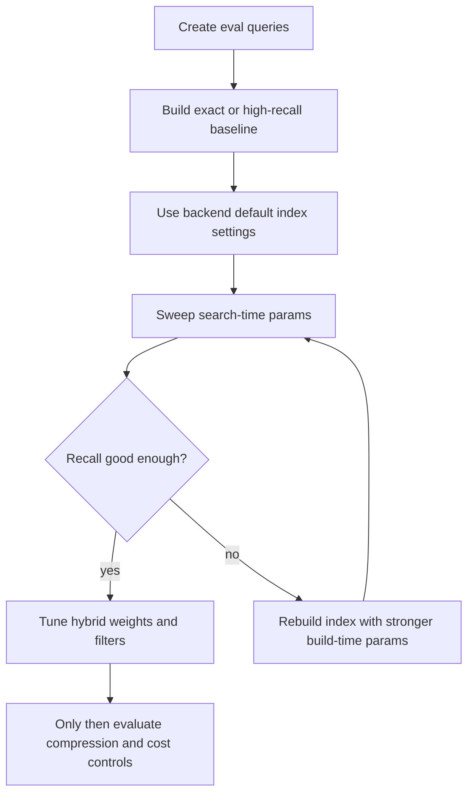

# VectorDB Tuning Parameters Guide

Research date: 2026-05-28

이 문서는 `axe-suite` data service에서 나중에 VectorDB별 index/search 옵션을 구현하기 위한
튜닝 파라미터 정리 문서다. 지금 단계에서는 개발을 하지 않고, 각 backend의 공식 용어,
추천 시작값, 조절 범위, tradeoff, use case를 정리한다.

현재 구현 방향은 다음과 같다.

- LanceDB는 service container 후보에서 제외한다.
- `pgvector`, `OpenSearch`, `Azure AI Search`, `Weaviate`는 native hybrid search를 우선 쓴다.
- `Qdrant`, `Chroma`, `Milvus`는 vector search를 담당하고 keyword search는 Postgres fallback을 쓴다.
- Postgres는 외부 VectorDB를 쓰더라도 index metadata, document metadata, ingest jobs, keyword text를 계속 보관한다.

## Quick Recommendation

| 상황 | 먼저 쓸 backend | 권장 시작값 |
| --- | --- | --- |
| local PoC, 운영 단순성 우선 | `pgvector` 또는 `Chroma` | 기본 HNSW, `cosine`, search-time breadth만 먼저 조절 |
| Docker 기반 OSS VectorDB 실험 | `Qdrant` | `m=16`, `ef_construct=100`, query `hnsw_ef=128` |
| keyword + vector hybrid가 중요 | `OpenSearch`, `Weaviate`, `Azure AI Search`, `pgvector` | hybrid weight/alpha를 명시하고 eval set으로 조정 |
| 대규모 vector corpus | `Milvus` 또는 `Qdrant` | HNSW baseline 후 IVF 계열도 비교 |
| Azure 생태계와 managed 운영 | `Azure AI Search` | Azure HNSW 기본값에서 시작하고 semantic ranker는 별도 평가 |

가장 안전한 순서는 다음이다.

1. 작은 eval set에서 exact search 또는 매우 높은 recall 설정으로 ground truth를 만든다.
2. 각 DB의 기본 HNSW 설정으로 baseline을 만든다.
3. 먼저 query-time parameter만 올려 recall-latency curve를 본다.
4. 부족하면 build-time parameter를 바꾸고 재색인한다.
5. 마지막에 quantization, compression, sharding, hybrid weight를 조정한다.



## Common Parameter Glossary

| 개념 | 흔한 이름 | 의미 | 조절 효과 |
| --- | --- | --- | --- |
| Distance metric | `cosine`, `ip`, `dotProduct`, `l2`, `euclidean` | vector 간 유사도 계산 기준 | embedding model의 학습/정규화 방식과 맞춰야 한다. |
| HNSW graph density | `m`, `M`, `maxConnections`, `max_neighbors` | HNSW graph에서 node가 유지하는 연결 수 | 높이면 recall이 오르지만 memory, build time이 증가한다. |
| HNSW build breadth | `ef_construction`, `efConstruction`, `construction_ef`, `ef_construct` | index 생성 중 후보를 얼마나 넓게 탐색하는지 | 높이면 index 품질이 좋아질 수 있지만 ingestion이 느려진다. |
| HNSW search breadth | `ef`, `efSearch`, `ef_search`, `hnsw_ef` | query 때 후보를 얼마나 넓게 탐색하는지 | 높이면 recall이 오르고 latency/CPU가 증가한다. |
| IVF partition count | `lists`, `nlist`, `num_partitions` | vector space를 나누는 cluster 수 | 너무 작으면 bucket이 커지고, 너무 크면 training/search overhead가 커진다. |
| IVF query breadth | `probes`, `nprobe`, `nprobes` | query 때 몇 개 partition을 볼지 | 높이면 recall이 오르고 latency가 증가한다. |
| Exact search | `exact`, `exhaustive`, `exhaustiveKnn` | ANN index 대신 전체 scan | 작은 corpus나 ground truth 생성에 좋다. |
| Compression | scalar, binary, PQ, SQ, RQ | vector/index memory를 줄이는 기법 | cost와 cache 효율은 좋아지지만 recall 손실이 생길 수 있다. |
| Oversampling/rescore | `oversampling`, `rescore`, `fetch_k` | 더 많은 후보를 뽑고 원본 vector나 reranker로 재평가 | compression 손실을 줄이지만 latency가 증가한다. |
| Filter index | payload index, scalar index, GIN, filterable field | metadata filter를 빠르게 적용 | tenant/source/date/file_type filter가 많으면 우선순위가 높다. |
| Hybrid weight | `alpha`, query weights, RRF, score normalization | keyword score와 vector score를 섞는 비율 | query 유형에 따라 answer quality를 크게 바꾼다. |

## Baseline Profiles

아래 값은 "구현 기본값"이라기보다 PoC와 benchmark를 시작하기 위한 보수적 추천값이다.
공식 기본값과 다를 수 있으므로 DB별 section에서 구분한다.

### Profile A: Local Dev

| 항목 | 추천 |
| --- | --- |
| Corpus size | 10k to 100k chunks |
| Metric | text embedding은 `cosine` 우선 |
| Index | 기본 HNSW 또는 exact |
| Search breadth | 기본값 또는 `efSearch` 계열 64 to 128 |
| Hybrid | `alpha=0.5` 또는 keyword/vector 동일 가중치 |
| 목적 | 통신, schema, ingest/search 흐름 확인 |

### Profile B: Balanced Production Start

| 항목 | 추천 |
| --- | --- |
| Corpus size | 100k to 5M chunks |
| HNSW density | `m/M/maxConnections` 16 to 32 |
| HNSW build | `efConstruction` 계열 100 to 256 |
| HNSW search | `efSearch` 계열 100 to 200 |
| IVF | `lists/nlist`는 corpus 크기 기반, `probes/nprobe`는 `sqrt(lists)` 근처부터 |
| Hybrid | native hybrid backend에서는 weight/alpha 명시 |
| 목적 | recall과 p95 latency 균형 |

### Profile C: High Recall

| 항목 | 추천 |
| --- | --- |
| HNSW density | 32 to 64, DB별 upper limit 확인 |
| HNSW build | 200 to 500 |
| HNSW search | 200 to 500, Azure는 500 to 1000 |
| IVF probes | `sqrt(lists)`보다 높게 sweep |
| Compression | 꺼두고 full precision baseline 확보 |
| 목적 | benchmark, 법무/정책/기술문서처럼 누락 비용이 큰 검색 |

### Profile D: Low Latency / Low Cost

| 항목 | 추천 |
| --- | --- |
| HNSW search | 32 to 100 |
| HNSW density | 8 to 16, 단 recall 저하 확인 |
| Compression | scalar/binary/PQ 후보 평가 |
| Oversampling | compression 사용 시에만 최소한으로 추가 |
| Filter | metadata index를 적극 생성 |
| 목적 | interactive UX, 많은 QPS, memory budget 제한 |

## pgvector

### Fit

Postgres 하나로 metadata, keyword search, vector search를 같이 다루고 싶을 때 가장 단순하다.
별도 VectorDB 운영이 부담스러운 팀의 1차 후보로 적합하다. 단, OLTP workload와 vector workload가
같은 DB resource를 공유한다는 점은 반드시 측정해야 한다.

### Parameters

| Parameter | 공식 기본값 또는 추천 시작값 | 실험 범위 | 조절 기준 |
| --- | --- | --- | --- |
| Metric operator | `vector_cosine_ops` 추천 | `vector_l2_ops`, `vector_ip_ops`, `vector_cosine_ops` | text embedding은 보통 cosine, 모델이 dot product를 권장하면 inner product를 쓴다. |
| HNSW `m` | 공식 기본값 `16` | 8 to 64 | recall이 부족하고 memory 여유가 있으면 32부터 실험한다. |
| HNSW `ef_construction` | 공식 기본값 `64` | 64 to 256 | index build가 느려져도 recall을 높이고 싶을 때 올린다. |
| Query `hnsw.ef_search` | 공식 기본값 `40` | 40 to 400 | 가장 먼저 sweep할 search-time parameter다. |
| IVFFlat `lists` | 공식 권장: 1M rows 이하는 `rows / 1000`, 1M 초과는 `sqrt(rows)` | 10 to 수천 | 데이터가 충분히 들어간 뒤 index를 만들어야 한다. |
| Query `ivfflat.probes` | 공식 권장: `sqrt(lists)` | 1 to `lists` | 높이면 recall 상승, `lists`와 같으면 exact에 가까워져 planner가 index를 안 쓸 수 있다. |
| Full-text index | GIN on `tsvector` 추천 | language config별 비교 | keyword/hybrid 검색을 Postgres에서 처리할 때 필수다. |

### Recommended Defaults for Axe Suite

```yaml
vector_db: pgvector
index:
  metric: cosine
  hnsw:
    m: 16
    ef_construction: 64
search:
  hnsw_ef_search: 100
  hybrid:
    rrf_k: 60
```

### Use Cases

- 작은 팀이 Docker container 하나로 state store와 vector store를 같이 운영할 때
- document metadata, ingest jobs, permission filter를 SQL로 함께 처리해야 할 때
- exact search와 ANN search를 같은 DB에서 쉽게 비교해야 할 때

### Cautions

- 한국어 keyword search는 기본 Postgres full-text config만으로 품질이 낮을 수 있다.
  한국어 문서가 주 corpus라면 OpenSearch/Azure AI Search/Weaviate native hybrid와 비교해야 한다.
- HNSW/IVFFlat index build는 memory와 CPU를 크게 쓰므로 ingestion job과 query traffic을 분리해서 측정한다.

## Qdrant

### Fit

Qdrant는 Docker로 띄우기 쉽고 payload metadata filtering이 강한 전용 VectorDB다.
현재 Axe Suite 구조에서는 vector upsert/search를 Qdrant가 담당하고, keyword search는 Postgres fallback이 담당한다.

### Parameters

| Parameter | 추천 시작값 | 실험 범위 | 조절 기준 |
| --- | --- | --- | --- |
| `distance` | `Cosine` | `Cosine`, `Dot`, `Euclid`, `Manhattan` | embedding model과 맞춘다. text RAG는 cosine부터 시작한다. |
| HNSW `m` | 16 | 16 to 48 | recall 부족 시 32를 실험한다. memory가 부족하면 16 유지. |
| HNSW `ef_construct` | 100 | 100 to 256 | ingestion 속도보다 recall이 중요하면 올린다. |
| `full_scan_threshold` 또는 `full_scan_threshold_kb` | 기본값 유지 | 1,000 to 100,000 KB | 아주 작은 filtered result는 full scan이 더 빠를 수 있다. |
| HNSW `on_disk` | `false` | `false`, `true` | RAM이 부족하면 켠다. tail latency는 별도 측정한다. |
| Vector `on_disk` | `false` | `false`, `true` | vector 자체를 disk에 둘지 결정한다. memory 절감 후보. |
| Search `hnsw_ef` | 128 | 64 to 512 | Qdrant에서 가장 먼저 sweep할 query-time parameter다. |
| Search `exact` | `false` | `false`, `true` | eval ground truth 또는 작은 corpus에서만 켠다. |
| Quantization `rescore` | `true` when compressed | `true`, `false` | quantization을 켰을 때 recall 손실을 줄인다. |
| Payload index | 자주 쓰는 filter field에 생성 | field별 | tenant, source, file_type, created_at filter가 많으면 우선 생성한다. |

### Recommended Defaults for Axe Suite

```yaml
vector_db: qdrant
index:
  metric: cosine
  hnsw:
    m: 16
    ef_construct: 100
search:
  hnsw_ef: 128
  exact: false
hybrid:
  keyword_backend: postgres
```

### Use Cases

- self-host VectorDB를 단순하게 운영하고 싶을 때
- metadata filter가 많고, vector search latency를 낮추고 싶을 때
- native keyword/hybrid를 당장 DB 안에 넣지 않고 adapter fallback으로 충분할 때

### Cautions

- Qdrant 자체도 sparse vector/hybrid 구성이 가능하지만, 현재 Axe Suite 구현 방향은 Postgres keyword fallback이다.
  나중에 Qdrant native sparse retrieval을 쓰려면 embedding pipeline에 sparse vector 생성이 추가되어야 한다.
- `hnsw_ef`를 올려도 filtered query에서 후보가 부족하면 payload index와 filter 전략을 같이 봐야 한다.

## Chroma

### Fit

Chroma는 Python RAG 생태계에서 빠른 PoC에 강하다. 운영 규모가 커질 때는 backup, auth,
multi-tenancy, server deployment 전략을 별도로 확인해야 한다.

### Parameters

| Parameter | 공식/관용 기본값 또는 추천 시작값 | 실험 범위 | 조절 기준 |
| --- | --- | --- | --- |
| `hnsw:space` | 기본 `l2`, text RAG 추천 `cosine` | `l2`, `cosine`, `ip` | collection 생성 시 embedding metric과 맞춘다. |
| `hnsw:M` | 16 | 16 to 48 | recall이 부족하면 32. memory 제한이면 16. |
| `hnsw:construction_ef` | 100 | 100 to 256 | ingestion이 느려져도 index 품질을 높이고 싶을 때 올린다. |
| `hnsw:search_ef` | 100 | 50 to 300 | query recall/latency를 제일 먼저 조절한다. |
| `hnsw:num_threads` | CPU core 기반 | 1 to CPU cores | ingest/indexing throughput을 조절한다. |
| `hnsw:batch_size` | 100 | 100 to 1,000 | memory 여유가 있으면 ingest throughput 향상을 위해 올린다. |
| `hnsw:sync_threshold` | 1,000 | 1,000 to 10,000 | disk sync 빈도를 낮춰 ingest를 빠르게 할 수 있다. 장애 복구 tradeoff가 있다. |

### Recommended Defaults for Axe Suite

```yaml
vector_db: chroma
index:
  metric: cosine
  hnsw:
    M: 16
    construction_ef: 100
search:
  search_ef: 100
hybrid:
  keyword_backend: postgres
```

### Use Cases

- local-first RAG PoC
- 빠르게 parser/chunker/embedding 품질을 실험할 때
- 작은 corpus에서 vector search plumbing을 확인할 때

### Cautions

- HNSW 관련 collection 옵션은 생성 후 변경이 제한될 수 있다. 바꾸려면 collection 재생성이 필요하다고 보고 설계한다.
- production 후보로 쓰려면 persistent volume, backup, auth, version upgrade 절차를 먼저 정의해야 한다.

## Milvus

### Fit

Milvus는 대규모 vector search와 다양한 index type이 강점이다. 대신 단순 RAG PoC에는 운영 요소가
많다. 현재 Axe Suite에서는 vector search를 Milvus가 담당하고 keyword search는 Postgres fallback을 쓴다.

### Parameters

| Parameter | 추천 시작값 | 실험 범위 | 조절 기준 |
| --- | --- | --- | --- |
| `metric_type` | `COSINE` | `COSINE`, `IP`, `L2` | text embedding은 cosine부터 시작한다. |
| HNSW `M` | 16 | 공식 범위 5 to 100 | recall 부족 시 32, high recall이면 48 이상도 비교한다. |
| HNSW `efConstruction` | 200 | 공식 범위 100 to 500 | index quality가 중요하면 올린다. ingestion은 느려진다. |
| Search `ef` | 128 | `top_k` to 32768 | query-time recall/latency sweep의 핵심이다. |
| IVF `nlist` | 1,024 또는 `sqrt(N)` 근처 | 128 to 65,536 | corpus가 커질수록 올린다. 너무 크면 overhead가 증가한다. |
| IVF `nprobe` | 16 to 64 또는 `sqrt(nlist)` 근처 | 1 to `nlist` | 높이면 recall 상승, latency 증가. |
| Index type | HNSW first | `HNSW`, `IVF_FLAT`, `IVF_SQ8`, `IVF_PQ` | HNSW baseline 후 memory/cost 때문에 IVF/SQ/PQ를 평가한다. |
| mmap / disk options | off first | on/off | memory가 병목일 때만 비교한다. |

### Recommended Defaults for Axe Suite

```yaml
vector_db: milvus
index:
  metric: cosine
  type: HNSW
  params:
    M: 16
    efConstruction: 200
search:
  params:
    ef: 128
hybrid:
  keyword_backend: postgres
```

### Use Cases

- 수백만에서 수천만 chunk 이상을 장기적으로 고려할 때
- 다양한 index type을 실험해야 할 때
- vector workload가 커서 Postgres나 Chroma만으로는 부족할 때

### Cautions

- Milvus native hybrid/BM25 경로를 쓰려면 sparse field/schema/query pipeline을 따로 설계해야 한다.
  현재 구조에서는 Postgres fallback이 더 단순하다.
- index type별 parameter가 다르므로 Axe Suite adapter에는 backend-specific option validation이 필요하다.

## Weaviate

### Fit

Weaviate는 object schema, vector search, filter, hybrid search가 잘 결합되어 있다.
단순 chunk table보다 domain object modeling이 필요하거나 native hybrid를 DB 안에서 처리하고 싶을 때 좋다.

### Parameters

| Parameter | 공식 기본값 또는 추천 시작값 | 실험 범위 | 조절 기준 |
| --- | --- | --- | --- |
| `distance` | `cosine` 추천 | `cosine`, `dot`, `l2-squared`, `hamming` 등 | text embedding은 cosine부터 시작한다. |
| `maxConnections` | 공식 기본값 계열 `32` | 16 to 64 | recall이 부족하고 memory 여유가 있으면 48 또는 64. |
| `efConstruction` | 공식 기본값 계열 `128` | 128 to 512 | index quality를 높이고 싶을 때 올린다. |
| `ef` | dynamic mode 추천 | fixed 64 to 500 또는 `-1` dynamic | dynamic ef가 기본 운영에 좋다. fixed ef는 benchmark 때 비교한다. |
| `dynamicEfMin` | 100 | 64 to 200 | 낮추면 latency 중심, 높이면 recall 중심. |
| `dynamicEfMax` | 500 | 200 to 1,000 | high recall query에서 상한을 올린다. |
| `dynamicEfFactor` | 8 | 4 to 16 | top-k 대비 후보 폭을 조절한다. |
| `flatSearchCutoff` | 기본값 유지 | 10k to 100k | 작은 filtered set은 flat search가 더 나을 수 있다. |
| `filterStrategy` | 기본 sweeping, filter-heavy는 ACORN 검토 | `sweeping`, `acorn` | metadata filter가 강하면 ACORN을 benchmark한다. |
| `vectorCacheMaxObjects` | memory budget 기반 | corpus/cache budget 기반 | warm latency를 줄이지만 memory 사용량이 커진다. |
| Quantization | off first | RQ/SQ/BQ option | memory가 병목일 때만 baseline과 비교한다. |
| Hybrid `alpha` | Axe Suite 추천 `0.5` | 0.0 to 1.0 | 0은 keyword 중심, 1은 vector 중심이다. |

### Recommended Defaults for Axe Suite

```yaml
vector_db: weaviate
index:
  metric: cosine
  hnsw:
    maxConnections: 32
    efConstruction: 128
    ef: -1
    dynamicEfMin: 100
    dynamicEfMax: 500
    dynamicEfFactor: 8
search:
  hybrid:
    alpha: 0.5
```

### Use Cases

- native hybrid search를 VectorDB 안에서 처리하고 싶을 때
- chunk뿐 아니라 document, section, entity 같은 object schema가 필요할 때
- filter-heavy RAG와 semantic retrieval을 같이 실험할 때

### Cautions

- Weaviate는 schema/index config가 풍부한 만큼 단순 chunk 저장에는 구조가 커질 수 있다.
- hybrid `alpha`는 corpus/query 성격에 따라 품질 차이가 크다. keyword-heavy 기술문서와 의미 중심 질문을 분리해서 측정한다.

## OpenSearch

### Fit

OpenSearch는 BM25/full-text와 vector search를 한 index에서 함께 처리하기 좋다.
이미 검색엔진 운영 경험이 있거나 keyword-heavy 문서 검색이 중요한 경우 강한 후보가 된다.

### Parameters

| Parameter | 공식 기본값 또는 추천 시작값 | 실험 범위 | 조절 기준 |
| --- | --- | --- | --- |
| `engine` | `lucene` 또는 `faiss` 비교, 현재 adapter는 `nmslib` | `lucene`, `faiss`, `nmslib` | version별 기능, memory, filter 지원이 달라서 engine을 명시적으로 비교한다. |
| `space_type` | `cosinesimil` | `cosinesimil`, `l2`, `innerproduct` | text embedding은 cosine부터 시작한다. |
| HNSW `m` | 공식 기본값 계열 `16` | 16 to 48 | recall 부족 시 32. |
| HNSW `ef_construction` | 공식 기본값 계열 `100` | 100 to 512 | index quality를 높이고 싶을 때 올린다. |
| Query/index `ef_search` | 공식 기본값 계열 `100` | 64 to 512 | search-time recall/latency를 조절한다. |
| IVF `nlist` | engine별 확인 | 128 to 65,536 | IVF를 선택할 때 partition 수를 조정한다. |
| IVF `nprobes` | engine별 확인 | 1 to `nlist` | 높이면 recall 상승, latency 증가. |
| Compression / mode | off first | on-disk, compression level | memory와 storage가 병목일 때만 비교한다. |
| `rescore`, `oversample_factor` | compression 사용 시 검토 | 1.0 to 4.0 | 압축으로 빠진 후보를 재평가한다. |
| Hybrid weights | keyword 0.5, vector 0.5부터 | 0.2 to 0.8 | OpenSearch search pipeline normalization과 함께 평가한다. |
| Shards/replicas | 1 shard dev, production은 corpus/QPS 기반 | workload 기반 | shard fan-out과 rebuild 시간을 함께 본다. |

### Recommended Defaults for Axe Suite

```yaml
vector_db: opensearch
index:
  metric: cosine
  engine: lucene
  method: hnsw
  params:
    m: 16
    ef_construction: 100
search:
  ef_search: 128
  hybrid:
    keyword_weight: 0.5
    vector_weight: 0.5
```

### Use Cases

- BM25 keyword search와 vector search를 같은 backend에서 처리해야 할 때
- 기존 OpenSearch 운영 경험, observability, snapshot 정책을 재사용하고 싶을 때
- 검색 결과 explain/debug, field boosting, analyzer 구성이 중요할 때

### Cautions

- OpenSearch는 JVM 기반이라 단순 VectorDB보다 운영 비용이 크다.
- 한국어 keyword 품질은 analyzer 선택에 크게 좌우된다. Nori analyzer 등 언어별 analyzer 검토가 필요하다.
- hybrid scoring은 단순 `should` query보다 normalization/search pipeline을 넣어야 production 품질을 안정화하기 쉽다.

## Azure AI Search

### Fit

Azure AI Search는 managed keyword/vector/hybrid search와 semantic ranker를 함께 제공한다.
Azure OpenAI, Blob Storage, Document Intelligence와 결합하면 ingestion/search 운영을 줄일 수 있다.

### Parameters

| Parameter | 공식 기본값 또는 추천 시작값 | 실험 범위 | 조절 기준 |
| --- | --- | --- | --- |
| `metric` | 공식/추천 `cosine` | `cosine`, `euclidean`, `dotProduct`, `hamming` | embedding model과 맞춘다. |
| HNSW `m` | 공식 기본값 `4` | 공식 범위 4 to 10 | Azure는 다른 DB보다 범위가 좁다. recall 부족 시 6 또는 8. |
| HNSW `efConstruction` | 공식 기본값 `400` | 공식 범위 100 to 1,000 | index quality가 중요하면 600 to 1,000. |
| HNSW `efSearch` | 공식 기본값 `500` | 공식 범위 100 to 1,000 | latency를 줄이면 100 to 300, high recall이면 700 to 1,000. |
| `exhaustiveKnn` | off in production | on/off | ground truth 생성, 작은 corpus 검증에 사용한다. |
| Vector field `dimensions` | embedding dimension과 동일 | model별 | 모델 또는 dimension이 바뀌면 re-embedding/reindex가 필요하다. |
| Vector field `stored`/`retrievable` | 필요 최소화 | true/false | raw vector 반환이 필요 없으면 storage/cost를 줄인다. |
| Filterable fields | tenant/source/date 등 | field별 | filter가 필요한 metadata는 index schema에서 미리 filterable로 둔다. |
| Vector query `weight` | 공식 기본값 `1.0` | 0.5 to 2.0 시작 | 여러 vector query나 keyword/vector balance를 조절한다. |
| Oversampling/rescoring | compression 사용 시 검토 | service option 기반 | scalar/binary compression을 켤 때 recall 손실을 보완한다. |
| Semantic ranker | off baseline, optional rerank | on/off | answer quality가 중요하면 BM25/vector hybrid 뒤에 별도 평가한다. |

### Recommended Defaults for Axe Suite

```yaml
vector_db: azure-ai-search
index:
  metric: cosine
  hnsw:
    m: 4
    efConstruction: 400
    efSearch: 500
search:
  vector_weight: 1.0
  exhaustive: false
  semantic_ranker: false
```

### Use Cases

- Azure 기반 managed RAG를 빠르게 구축할 때
- keyword, vector, semantic ranker를 한 서비스에서 쓰고 싶을 때
- 운영팀이 self-host VectorDB보다 managed service를 선호할 때

### Cautions

- self-host가 불가능하고 region, quota, billing, network 정책에 묶인다.
- low-level ANN tuning freedom은 전용 VectorDB보다 제한적이다.
- 한국어/다국어 문서는 analyzer, semantic ranker 지원 범위, embedding model을 같이 검증해야 한다.

## Tuning by Query Pattern

| Query pattern | 우선 조절할 값 | 이유 |
| --- | --- | --- |
| "정확한 용어가 들어간 문서 찾아줘" | BM25/analyzer, hybrid keyword weight, field boost | keyword match가 vector similarity보다 더 중요할 수 있다. |
| "비슷한 의미의 설명 찾아줘" | vector metric, `efSearch` 계열, reranker | semantic recall이 핵심이다. |
| tenant/source/date filter가 많은 질문 | payload/scalar/filter index, filtered recall, `efSearch` | filter 후 후보가 너무 적어지면 ANN recall이 떨어진다. |
| 긴 기술문서/정책문서 | chunking, top-k, reranker, high recall profile | chunk boundary와 reranking 품질 영향이 크다. |
| interactive chat UX | search-time breadth, compression, cache | p95 latency가 answer UX를 좌우한다. |
| offline ingest batch | build-time params, batch size, indexing threads | indexing throughput과 resource contention이 중요하다. |

## Future Implementation Shape

나중에 개발에 적용할 때는 모든 adapter에 억지로 같은 parameter를 넣기보다, 공통 옵션과 backend-specific 옵션을
분리하는 편이 안전하다.

```python
platform.data.create_index(
    name="docs",
    dimensions=768,
    metric="cosine",
    backend_options={
        "hnsw": {"m": 16, "ef_construction": 100},
        "hybrid": {"alpha": 0.5},
    },
)

platform.data.search(
    index_name="docs",
    query="vector db tuning parameter",
    top_k=10,
    search_options={
        "hnsw_ef": 128,
        "exact": False,
        "hybrid_weight": {"keyword": 0.5, "vector": 0.5},
    },
)
```

Adapter별 mapping 예시는 다음과 같다.

| Common option | pgvector | Qdrant | Chroma | Milvus | Weaviate | OpenSearch | Azure AI Search |
| --- | --- | --- | --- | --- | --- | --- | --- |
| `metric=cosine` | `vector_cosine_ops` | `Cosine` | `hnsw:space=cosine` | `COSINE` | `cosine` | `cosinesimil` | `cosine` |
| `hnsw.m` | `m` | `m` | `M` | `M` | `maxConnections` | `m` | `m` |
| `hnsw.ef_construction` | `ef_construction` | `ef_construct` | `construction_ef` | `efConstruction` | `efConstruction` | `ef_construction` | `efConstruction` |
| `search.ef` | `hnsw.ef_search` | `hnsw_ef` | `search_ef` | `ef` | `ef` or dynamic ef | `ef_search` | `efSearch` |
| `ivf.lists` | `lists` | not primary | not primary | `nlist` | not primary | `nlist` | not exposed |
| `ivf.probes` | `ivfflat.probes` | not primary | not primary | `nprobe` | not primary | `nprobes` | not exposed |
| `hybrid.alpha` | RRF SQL weights | Postgres fallback | Postgres fallback | Postgres fallback | `alpha` | search pipeline weights | vector query `weight` plus keyword query |

## Evaluation Checklist

- Recall@5, Recall@10, nDCG@10, MRR
- p50, p95, p99 latency
- index build time
- ingest throughput
- memory usage and disk size
- empty result rate under metadata filter
- answer citation hit rate
- keyword-heavy vs semantic-heavy query quality
- Korean query quality if target corpus is Korean
- cost per 1M vectors and cost per 1k queries

## Sources

- pgvector README: <https://github.com/pgvector/pgvector/blob/master/README.md>
- Qdrant indexing docs: <https://qdrant.tech/documentation/manage-data/indexing/>
- Qdrant search docs: <https://qdrant.tech/documentation/concepts/search/>
- Chroma collection/configuration docs: <https://cookbook.chromadb.dev/core/configuration/>
- Milvus HNSW docs: <https://milvus.io/docs/hnsw.md>
- Milvus IVF_FLAT docs: <https://milvus.io/docs/ivf-flat.md>
- Weaviate vector index docs: <https://docs.weaviate.io/weaviate/config-refs/indexing/vector-index>
- Weaviate hybrid search docs: <https://docs.weaviate.io/weaviate/concepts/search/hybrid-search>
- OpenSearch approximate k-NN docs: <https://docs.opensearch.org/latest/vector-search/vector-search-techniques/approximate-knn/>
- OpenSearch k-NN methods and engines: <https://docs.opensearch.org/latest/field-types/supported-field-types/knn-methods-engines/>
- OpenSearch normalization processor docs: <https://docs.opensearch.org/docs/2.19/search-plugins/search-pipelines/normalization-processor/>
- Azure AI Search create vector index docs: <https://learn.microsoft.com/en-us/azure/search/vector-search-how-to-create-index>
- Azure AI Search vector query docs: <https://learn.microsoft.com/en-us/azure/search/vector-search-how-to-query>
- Azure AI Search hybrid search overview: <https://learn.microsoft.com/en-us/azure/search/hybrid-search-overview>
